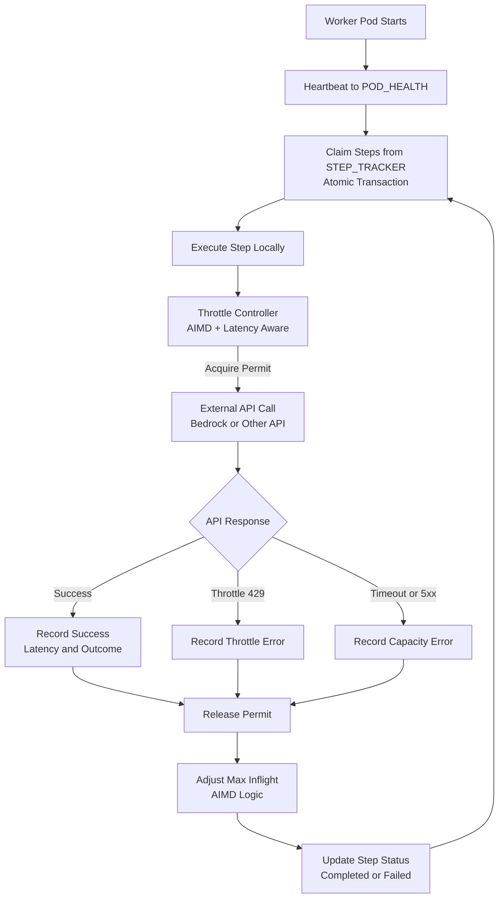
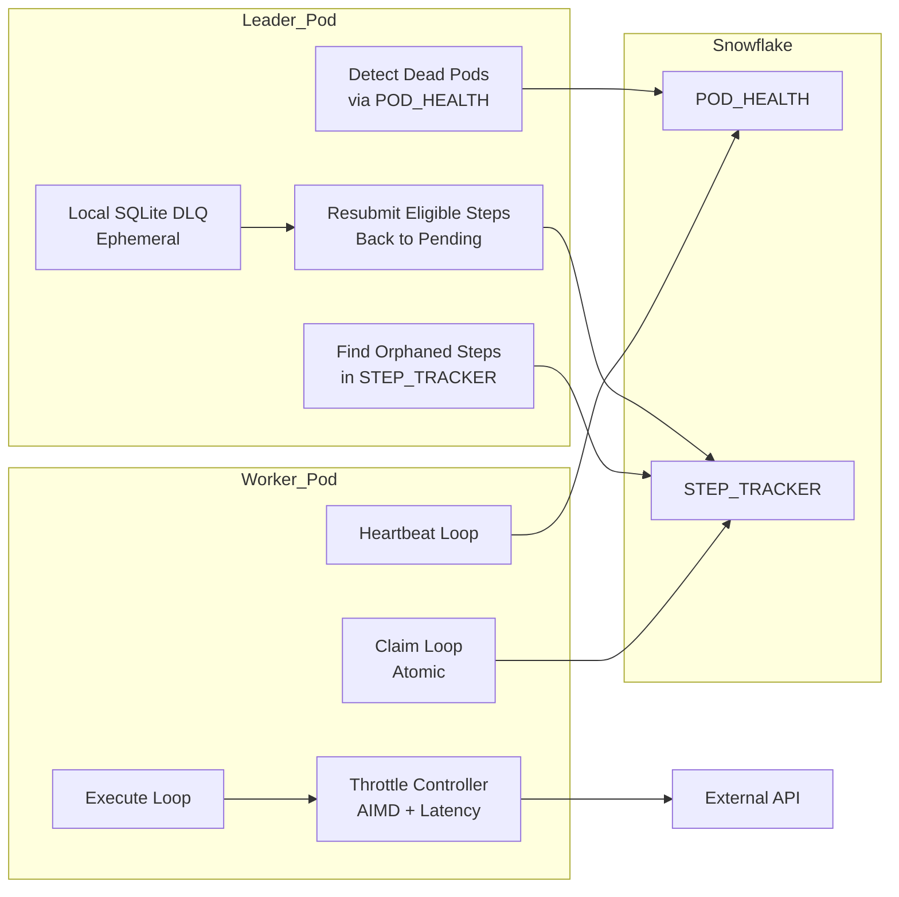

_Distributed, resilient, and broker-free task orchestration — powered only by Snowflake and local state._

---
## **🚀 1) Problem: Why FLEET-Q Exists**

Imagine you have a **FastAPI app** running across many **EKS pods** 🤖 — and these pods _cannot_ communicate directly with each other (no pod-to-pod networking). You need to build a **distributed task queue** where:

- Multiple workers can process tasks concurrently
- Tasks aren’t lost if a worker dies
- You don’t use Redis, RabbitMQ, Kafka, or any external message broker
- You _only_ use **Snowflake**/**Postgres** as a global shared memory store
- And you can use **SQLite locally per pod** for ephemeral state 

Classic distributed queues typically rely on brokers such as Redis or Kafka, where workers can push/pop tasks reliably. But here you _can’t_ use those, so we need a different architecture. 

---
## **🧠 2) What Is a Distributed Task Queue?**

At its core, a distributed task queue:

📌 **Decouples task producers from task consumers**

📌 Lets workers pull tasks and work in parallel

📌 Improves reliability and workload distribution

📌 Helps with retries and failure handling

_(This is a conceptual flow  — worker nodes independently pull work from a queue and report back status.)_

💡 In most systems, a **message broker** (Redis, Kafka, SQS) mediates these interactions. But FLEET-Q uses _Snowflake as its shared coordination layer_.

---
## **🧱 3) FLEET-Q at a Glance**
 

🎯 **Full Name:** _Federated Leaderless Execution & Elastic Tasking Queue_

✨ **Key Goal:** A scalable distributed task queue that:

- Distributes work across pods
- Handles worker failures gracefully
- Avoids race conditions with atomic claims
- Uses **leader only for recovery**, not scheduling
- Operates with just Snowflake + SQLite

---
## **🗂️ 4) Core Components & Tables**

FLEET-Q relies on **two Snowflake tables**:

---
### **🟦** **1. Pod_Health — Track Alive Pods**

|**Column**|**Purpose**|
|---|---|
|pod_id|Unique identifier for each pod|
|birth_timestamp|Pod start time for deterministic leader election|
|last_heartbeat|Most recent heartbeat timestamp|
|status|up / down|

👉 This table lets all pods know who’s alive and elects a leader deterministically.

---
### **🟨** **2. Step_Tracker — The Task Queue**

|**Column**|**Purpose**|
|---|---|
|task_id|Unique ID|
|status|pending / claimed / completed / failed|
|claimed_by|Which pod claimed it|
|last_update|Last status change timestamp|
|retry_count|Number of retry attempts|
|payload|JSON task metadata|
👉 This is your **global task store** that workers claim from and update in atomic transactions.

---
## **📈 5) How Distributed Workers Work**

### **🕐 Every Worker Does:**

💡 **A. Heartbeat Upsert**

Every X seconds/minutes, each worker updates its heartbeat:

|**Action**|**Example Logic**|
|---|---|
|Publish own status|Upsert into Pod_Health|
|Mark self as alive|status = 'up'|

This lets other workers and the leader know this pod is healthy and processing tasks.

---
### **🚀** **B. Claim Tasks Atomically**

  Workers look at Step_Tracker to pull work. Instead of separate SELECT then UPDATE (which can race), we use _transactional claims_:

```
BEGIN TRANSACTION;

SELECT task_id
FROM Step_Tracker
WHERE status='pending'
ORDER BY priority DESC, created_at ASC
LIMIT <available_capacity>
FOR UPDATE;

UPDATE Step_Tracker
SET status='claimed', claimed_by='<pod_id>', last_update = CURRENT_TIMESTAMP()
WHERE task_id IN (<claimed_ids>);

COMMIT;
```

Why this matters:

✔ Ensures no two pods claim the same task
✔ Leverages Snowflake’s transaction isolation to prevent races 

Workers compute how many tasks to claim based on _capacity_ (e.g., available threads or CPU). This makes FLEET-Q _elastic_ — workers don’t over-consume work.

---
## **🧪 6) Execution & Reporting**

Once claimed, a worker:
1. Processes the task locally 
2. Updates the Step_Tracker status to completed or failed
3. Optionally writes local progress to SQLite for local durability


No other pod interferes with execution status — every task’s lifecycle is clearly stored.

---
## **👑 7) The Leader — Just One for Recovery**

Even though tasks are claimed in a _leaderless_ fashion, we **still elect a leader** to handle rare but critical recovery tasks.

🧠 **Leader’s Roles:**

|**Responsibility**|**Why It Matters**|
|---|---|
|Detect dead pods|Prevent stuck tasks left assigned to dead workers|
|Recover orphaned tasks|Requeue tasks claimed by failed workers|
|Rebuild local Dead Letter Queue (DLQ)|Keep failure logs locally, not globally|
|Apply retry policies|Make task failures observable and recoverable|

Unlike systems where a leader _assigns all tasks_, in FLEET-Q the leader only handles **failure scenarios** — everything else is decentralized.

---
## **🗳️ 8) Leader Election**

Leader election is done by choosing the _oldest healthy pod_:

📌 Every pod has a unique birth_timestamp logged when it starts.
📌 A deterministic query picks the leader based on the earliest birth time among alive pods:

```
SELECT pod_id
FROM Pod_Health
WHERE status='up'
ORDER BY birth_timestamp
LIMIT 1;
```

This ensures **everyone agrees on the leader without direct communication**. 

---
## **🩹 9) Handling Failures & Reassigning Tasks**

When a pod dies, its tasks might be stuck in claimed status. The leader is responsible for:

### **🛠 Rebuild Local DLQ (SQLite)**

The leader:
1. Queries Step_Tracker for tasks claimed by dead pods 
2. Inserts them into a _local SQLite DLQ_
3. Applies retry logic and policies
4. Requeues or marks tasks permanently failed

💡 This keeps your global state clean and local recovery policy flexible.

---
### **🔄 Requeue Tasks in Snowflake**

```
UPDATE Step_Tracker
SET status='pending', claimed_by=NULL
WHERE claimed_by IN (<dead_pod_ids>);
```

Now these tasks are available for other workers to claim again.

---

## **🤝 10) FLEET-Q’s Behavior Summary**

|**Feature**|**What FLEET-Q Delivers**|
|---|---|
|Distributed Work Claims|Workers claim tasks in parallel|
|Elastic Capacity|Workers pick up only what they can handle|
|Safe Concurrency|Atomic transactions prevent duplicates|
|Leader for Recovery|Leader doesn’t schedule, only rescues|
|No External Broker|Only Snowflake + local SQLite|

---
## **🔄 11) Putting It All Together — Workflow Story**

✨ _Imagine this sequence:_

1. A task is submitted — it lands in Step_Tracker as pending.
2. Worker pods heartbeat and watch for work.
3. Worker A sees pending tasks, claims a set atomically.
4. Worker B does the same — no overlap, thanks to transactions.
5. Worker A processes tasks, updates completed/failed.
6. Worker C dies mid-task — its heartbeats stop.
7. The leader detects the dead pod via Pod_Health.
8. Leader rebuilds DLQ locally and requeues unfinished tasks.
9. Remaining workers pick up the requeued tasks.
    
Every task is eventually processed without duplication or loss — even under failures.

---
## **🧭 Architectural Summary & Deep Dive on FLEET-Q - Why FLEET-Q Matters**
  
Let’s take a bird’s-eye view of the FLEET-Q architecture and what sets it apart.

---
### **🧱 What Makes FLEET-Q Simple & Unique ?**

At its core, every pod in FLEET-Q acts as a **worker first**, and optionally one also becomes a **leader** for recovery tasks. This hybrid model blends **leaderless task claiming** with **leader-assisted cleanup**, giving you the best of both worlds.

FLEET-Q demonstrates that **you don’t need a separate brokering system** to build a distributed, fault-tolerant job processing system. Instead:

✔ You _leverage the transactional capabilities of Snowflake_
✔ You use **leaderless work claiming** for scale
✔ You reserve **leader intervention only for recovery**

This design reduces complexity while retaining the safety and resilience required in production systems.

---
### **🔍 Key Architectural Principles**

|**Principle**|**Description**|
|---|---|
|🚀 **Distributed Claiming**|Workers independently claim available tasks using atomic transactions.|
|📊 **Elastic Capacity**|Workers calculate their own available threads/cores and claim tasks up to ~80% load.|
|🔐 **Safe Concurrency via Transactions**|Snowflake row-level guarantees prevent double claiming.|
|👑 **Leader for Recovery**|Leader handles dead workers, orphaned tasks, and dead-letter logic locally.|
|🗃 **Minimal Global State**|Only Pod_Health + Step_Tracker tables are global — DLQs are local.|

> Claiming remains _distributed_: every pod independently tries to claim tasks — winners are enforced by Snowflake transactional locks. This keeps distributed claims safe and race-free.

---
## **⏱ Exponential Backoff — Making Task Claiming Robust**

In distributed systems, when many workers try to claim tasks _at the same time_, contention can occur. Instead of hammering the database with retries, FLEET-Q uses **exponential backoff**, which reduces load and improves fairness:

👉 Each worker wraps its claim logic inside a retry loop with increasing wait times, e.g.:

```
Base Wait: 50ms  
Retry #1: ~100–150ms  
Retry #2: ~200–300ms  
Retry #3: ~400–650ms
```

This pattern helps in two big ways:

✅ **Fewer collisions** — Workers back off automatically when contention spikes

✅ **Smooth scaling with load** — As workers join/leave the cluster, contention spikes diminish quickly

This technique — inspired by general distributed queue and networking backoff strategies — helps the system stabilize under load and prevents thundering herd effects.

---
## **🧠 Leaderless Task Claims + New Pods = Auto-Scaling**

One of the _core strengths_ of FLEET-Q’s design is how it _naturally integrates with Elastic environments_ such as Kubernetes:

### **🔹 How New Pods Influence Load**

When a new pod starts:
1. It upserts itself into Pod_Health with its birth timestamp.
2. It begins heartbeating on schedule.
3. It competes for work along with others using the same atomic claim logic.
    
Since **claiming is leaderless and distributed**, adding more pods automatically increases system throughput. There’s no need for the leader to assign work explicitly — the **transactional nature of claims** (SELECT…FOR UPDATE → UPDATE) ensures that tasks are sharded across workers _proportionally_, depending on how fast each worker claims tasks.

📈 This means your system **scales horizontally with more pods** — each new pod naturally shares the next wave of pending tasks without coordination overhead.

✔ No need to reconfigure central scheduler
✔ No single bottleneck — workers always pull based on capacity

---
## **⚖️ Leader-Assisted vs Leaderless — Why This Hybrid?**

Distributed systems research often weighs _leaderless_ and _leader-coordinated_ architectures:

|**Feature**|**Leaderless**|**Leader-Assisted (FLEET-Q)**|
|---|---|---|
|Task Distribution|Fully distributed|Distributed claiming + leader cleanup|
|Coordination Overhead|Low|Low-medium (only leader cleanup)|
|Failure Handling|Heuristic timeouts|Explicit detection with leader|
|Race Conditions|Higher (needs careful guard logic)|Lower (single recovery leader)|
|Complexity|Harder to reason under failures|Easier — single responsibility leader|
🔹 **Leaderless systems** can work well when tasks are short and can be retried on timeout. But _long-running tasks_ make timeout heuristics brittle — you could prematurely reclaim tasks that are still running, causing duplicate execution.

🔹 **Leader-assisted systems** like FLEET-Q keep _normal work claiming distributed_, but use a **single coordinator for failure recovery**. This reduces race conditions while preserving scalability. The leader does **only recovery and orchestration logic**, not task assignment, minimizing its load and bottleneck risk.

---
## **🧪 Datastore Options — Snowflake Today, Postgres or Mongo Tomorrow?**

FLEET-Q is designed to use Snowflake as your **shared coordination store**, as snowflake offers the best database capabilities compared to other systems. Snowflake’s cloud-native architecture gives you:

✨ Separate compute and storage
✨ Elastic warehouse scaling
✨ High transactional guarantees for DML
✨ Support for structured and semi-structured data (VARIANT)   

However, as your workload evolves and based on enterprise architectural requirement, you might consider other stores for similar patterns:

---
### **🛠 Comparisons of Coordination Store Choices**

| **DB**         | **Strengths**                                                         | **Tradeoffs**                                                                                       |
| -------------- | --------------------------------------------------------------------- | --------------------------------------------------------------------------------------------------- |
| **Snowflake**  | Scales with workloads, cloud-native, centralized shared store         | Designed for analytics — may have higher latency for frequent small writes relative to OLTP DBs     |
| **PostgreSQL** | Strong ACID transactional support, excellent for short OLTP workloads | Can be vertically scaled well, but horizontal scaling requires sharding                             |
| **MongoDB**    | Flexible document model, horizontal sharding                          | Transactional guarantees improve with newer versions, but complex multi-document ACID adds overhead |

👉 In systems where **transactional performance and low latency** matter most (e.g., sub-millisecond claim latencies), Postgres (or distributed SQL stores like CockroachDB) can outperform cloud warehouses for small-write OLTP patterns.

👉 MongoDB’s document model and horizontal transparency can _also_ support distributed queues. By using change streams or atomic updates, you can implement queue semantics — though you’ll need careful retry and consistency logic.

---
# 🚀 Dynamic Throttling in FLEET-Q

### (Adaptive Flow Control for Bedrock & External APIs)

> **Goal**  
> Prevent downstream APIs (e.g., Bedrock, OpenAI, internal services) from being overwhelmed,  
> while **maximizing throughput without triggering throttling errors**.

We want to:

- 🔻 Throttle _down_ aggressively when throttling/errors appear
- 🔺 Throttle _up_ cautiously when capacity frees up
- 🧠 Learn continuously from response behavior
- ⚙️ Apply this centrally in **FLEET-Q**, not individually per task

This is **not retry logic** — this is **rate adaptation logic**.

---
## 🧠 Core Mental Model (Rocket Nozzle Analogy)

Think of FLEET-Q as a **pressure-aware nozzle**:

|Signal|Meaning|
|---|---|
|🔥 Throttle exception|Downstream pressure too high|
|🟢 Fast successful responses|Available bandwidth|
|🟡 Increased latency|Approaching saturation|
|🔴 Sustained errors|Backpressure required|

Instead of blindly retrying, **we reshape the flow itself**.

---
## 🧩 Where Throttling Lives in FLEET-Q

Dynamic throttling should live **between task execution and external API calls**, not at the queue layer.

```
STEP EXECUTION
   ↓
[ THROTTLE CONTROLLER ]  ←—— shared state
   ↓
BEDROCK / EXTERNAL API
```

Key idea:

- Tasks may be abundant
    
- **API capacity is scarce**
    
- FLEET-Q must _shape concurrency + rate_ centrally

---
## 🧭 Design Principles for Throttling

|Principle|Why it matters|
|---|---|
|Feedback-driven|Static limits fail under bursty load|
|Gradual ramp-up|Avoid oscillations|
|Fast ramp-down|Protect downstream systems|
|Shared state|Prevent N pods from overwhelming API|
|Stateless tasks|Throttling must be orthogonal to task logic|

---

## 🧠 Core Throttling Strategies (What Works)

Below are **proven mechanisms**, ranked from simplest → most adaptive.

---
## 1️⃣ Adaptive Concurrency Limiter (Highly Recommended)

Instead of limiting _requests per second_, you limit **in-flight requests**.

### How it works

- Maintain a global or per-API **max_inflight** value
    
- Only allow that many concurrent calls
    
- Adjust dynamically based on feedback
    

### Signals

|Signal|Action|
|---|---|
|Throttle exception|Decrease inflight aggressively|
|Success|Increase inflight slowly|
|High latency|Pause increase|
|Sustained success|Gradual increase|

### Control Logic (AIMD – Additive Increase, Multiplicative Decrease)

This is the same principle used by TCP congestion control.

```text
On success:
    inflight += +1   (slow)

On throttle error:
    inflight = inflight * 0.5  (fast)
```

### Why this is powerful

- No need to guess QPS limits
    
- Automatically adapts to real capacity
    
- Stable under bursty workloads
    

> 💡 Netflix, Envoy, and gRPC all use variants of this

---

## 2️⃣ Token Bucket with Dynamic Refill Rate

Classic rate limiting — but **with adaptive refill**.

### Concept

- Bucket holds tokens
    
- Each request consumes 1 token
    
- Tokens refill at a rate that **changes over time**
    

### Dynamic behavior

|Condition|Action|
|---|---|
|Throttle errors|Reduce refill rate|
|Stable success|Increase refill rate|
|Idle time|Allow burst|

### When this helps

- APIs with known _soft_ rate limits
    
- Smooths bursts better than concurrency alone
    

⚠️ On its own, token buckets react slower than concurrency limiters.

---

## 3️⃣ Latency-Aware Throttling (Pressure Sensing)

Latency is often an **early signal** before throttling.

### Rule of thumb

- Rising p95 / p99 latency = system under stress
    

### Usage

- Track rolling latency window
    
- Pause throttle-up if latency increases
    
- Combine with concurrency limiter
    

This prevents “happy path overload” before errors appear.

---

## 4️⃣ Error-Weighted Feedback (Smart Signals)

Not all failures are equal.

|Error Type|Meaning|
|---|---|
|Throttling / 429|Immediate backpressure|
|Timeout|Possibly saturation|
|5xx|Downstream instability|
|Client error|Do not affect throttle|

Throttle controller should:

- React strongly only to **capacity-related signals**
    
- Ignore logical or input errors
    

---

## 🧠 Recommended FLEET-Q Throttle Architecture when using Adaptive Throttling

### 🔧 Throttle Controller (Per External API)

A reusable component inside FLEET-Q:

```text
ThrottleController
 ├── max_inflight
 ├── current_inflight
 ├── success_window
 ├── error_window
 ├── latency_window
 └── control_loop()
```

### Execution Flow

```
task execution
   ↓
await throttle.acquire()
   ↓
call external API
   ↓
throttle.release(success | throttle_error | latency)
```

---

## 🧰 Throttle Controller Logic (Conceptual)

### On acquire

- Block or async-wait if `current_inflight >= max_inflight`
    

### On release

|Outcome|Adjustment|
|---|---|
|Success|record success|
|Throttle error|halve max_inflight|
|High latency|pause growth|
|Sustained success|slowly increase max_inflight|

---
## 🔁 Relationship to Exponential Backoff

|Backoff|Throttling|
|---|---|
|Reacts after failure|Shapes load proactively|
|Per-request|System-wide|
|Time-based|Capacity-based|
|Stateless|Stateful|

**Best practice:**  
Use **both together**.

- Throttling controls _how much_ load you send
    
- Backoff controls _how fast retries happen_
    

---
## 🧩 Where State Lives in FLEET-Q

We have two good options:

### Option A: Local Throttle per Pod (Simpler)

- Each pod adapts independently
- Works well if Bedrock limits are high

### Option B: Leader-Coordinated Throttle (More Stable)

- Leader computes target inflight
    
- Publishes it via Snowflake / Pod_Health metadata
    
- Workers conform to shared limit
    

This prevents **N pods each thinking they can use full capacity**.

> 💡 Hybrid: local control + leader-published upper bound

---

## 📈 Scaling Behavior with New Pods

With throttling in place:

- New pods do **not** increase API pressure linearly
- Total inflight remains bounded
- Throughput increases only if downstream allows it
    

This is critical for **elastic Kubernetes scaling**.

---
### ⭐ Recommended Overall Stack for FLEET-Q

| Component     | Choice                           |
| ------------- | -------------------------------- |
| Core throttle | Adaptive concurrency limiter     |
| Error signal  | Throttle exceptions + timeouts   |
| Safety net    | Exponential backoff              |
| Smoothing     | Latency-aware ramp-up            |
| Coordination  | Optional leader-published limits |

---
# 🚀 Adaptive Throttling in FLEET-Q

## How Local Pods Learn to Respect Downstream Capacity

When FLEET-Q calls downstream systems like **Bedrock** or other APIs, it enters a very different world from task scheduling.

Task queues deal with _abundance_ — there are always more tasks.  
External APIs deal with _scarcity_ — limited concurrency, rate limits, and shared capacity.

The hardest problem here is not retries.

It is **knowing how much pressure is “just right.”**

To solve this, FLEET-Q adopts a **feedback-driven throttling model**, inspired by decades of distributed systems research — particularly the same ideas that keep the internet itself stable.

---

## 🧠 The Core Insight

> **Don’t guess limits. Learn them.**

Hard-coding rate limits (e.g., “50 requests/sec”) fails because:

- Limits change over time
    
- Capacity varies by region, account, and load
    
- Latency rises before errors appear
    
- Multiple pods amplify pressure unintentionally
    

Instead, FLEET-Q uses **adaptive control**, where each pod continuously observes outcomes and adjusts its behavior.

This is where **Adaptive Concurrency Limiting** comes in.

---
## 📊 High-Level Execution & Throttling Flow






# 1️⃣ Option 1: Adaptive Concurrency Limiting (AIMD)

### 🌊 From Rate Limiting to Pressure Limiting

Most developers think in terms of **rate limits**:

> “Send no more than X requests per second.”

But for APIs like Bedrock, **concurrency matters more than rate**.

A slow request occupies capacity longer than a fast one.  
Ten concurrent slow calls can be worse than fifty fast ones.

So instead of limiting _rate_, we limit **in-flight requests**.

---

## 🔐 What Is Adaptive Concurrency?

Each pod maintains two simple numbers:

|Variable|Meaning|
|---|---|
|`current_inflight`|Requests currently in progress|
|`max_inflight`|Upper bound allowed at any time|

Before making a request:

- If `current_inflight < max_inflight` → proceed
    
- Else → wait
    

This alone enforces safety.  
But the real power comes from **how `max_inflight` changes over time**.

---

## ⚖️ AIMD: Additive Increase, Multiplicative Decrease

FLEET-Q uses a proven control law called **AIMD**.

This is not theoretical — it is the reason **TCP congestion control** works at internet scale.

### 📈 Additive Increase (Careful Exploration)

When things are going well:

- Requests succeed
    
- No throttling errors
    
- Latency is stable
    

We **increase capacity slowly**:

```
max_inflight = max_inflight + 1
```

Why slow?

- We are _probing_ for extra capacity
    
- Small steps avoid overshooting
    

---

### 📉 Multiplicative Decrease (Fast Protection)

When the downstream system pushes back:

- Throttling error (429)
    
- Capacity-related timeout
    

We **cut aggressively**:

```
max_inflight = max_inflight * 0.5
```

Why aggressive?

- Throttling means we crossed the limit
    
- Fast reduction prevents cascading failure
    
- Protects both your system and the API
    

---

## 🧪 How This Feels in Practice

Imagine `max_inflight` evolving over time:

```
2 → 3 → 4 → 5 → 6 → 7
           ↓ throttle
7 → 3 → 4 → 5 → 6
```

This oscillation is **healthy**.

You are continuously:

- Discovering available bandwidth
    
- Backing off when pressure increases
    
- Settling near the true capacity
    

No configuration needed.  
No guessing limits.  
No global coordination.

---

## ✅ Why AIMD Is Ideal for Local Pod Throttling

|Property|Why It Matters|
|---|---|
|Stable|Avoids oscillations|
|Reactive|Responds instantly to throttling|
|Conservative|Probes capacity gently|
|Stateless|No coordination required|
|Proven|Used by TCP, Envoy, Netflix|

This makes AIMD the **default recommendation** for per-pod throttling in FLEET-Q.

---

# 2️⃣ Option 2: Latency-Aware Adaptive Concurrency

### (Pressure Sensing Before Failure)

AIMD reacts **after** something goes wrong.

But in well-designed systems, we can do better.

Latency is often an **early warning signal**.

---

## ⏱ Why Latency Matters

Before an API starts throwing throttling errors:

- Queues fill up
    
- Processing slows
    
- Response times increase
    

This means:

> **Latency rises before throttling appears**

If we wait for errors, we are already late.

Latency-aware throttling lets FLEET-Q _sense pressure earlier_.

---

## 🧠 Adding Latency Awareness (Without Complexity)

We don’t need complex math or PID controllers.

A simple heuristic works extremely well.

Each pod tracks:

- Rolling p95 or p99 latency (short window)
    

Then applies one rule:

> **If latency is rising, stop increasing concurrency.**

---

## 🛑 What Changes Compared to Pure AIMD

### Pure AIMD:

- Increase on success
    
- Decrease on throttle
    

### Latency-Aware AIMD:

- Increase only if latency is stable or decreasing
    
- Pause increase if latency rises
    
- Still decrease aggressively on throttling
    

---

## 📊 Behavior Comparison

|Scenario|Pure AIMD|Latency-Aware AIMD|
|---|---|---|
|Stable API|Gradual ramp-up|Gradual ramp-up|
|Near saturation|Keeps probing|Stops probing|
|Throttle burst|Reactive cut|Fewer throttles|
|Oscillation|Moderate|Reduced|

Latency awareness makes the system **more polite**.

---

## 🧠 Why This Works So Well

Latency-aware AIMD creates **three layers of protection**:

1. **Concurrency cap** → hard safety
    
2. **Latency sensing** → early warning
    
3. **Throttle reaction** → emergency brake
    

Together, they form a **self-regulating feedback loop**.

This is exactly how real-world flow systems behave:

- Water pressure
    
- Traffic flow
    
- Network congestion
    
- Rocket nozzles 🚀
    

---

## ⚠️ Why Not Use Gradient or PID Controllers?

PID controllers try to optimize mathematically.

But for local pod throttling:

- Signals are noisy
    
- Errors are bursty
    
- Multiple pods act independently
    
- Debugging becomes extremely hard
    

AIMD + latency heuristics give you:

- Predictability
    
- Stability
    
- Transparency
    

In distributed systems, **boring and reliable beats clever and fragile**.

---

## 🧩 How This Fits Into FLEET-Q

In FLEET-Q:

- **Task claiming** controls _what work exists_
    
- **Adaptive throttling** controls _how fast external APIs are called_
    

These layers are independent but complementary.

|Layer|Responsibility|
|---|---|
|Queue|Fair, elastic work distribution|
|Throttle|Respect downstream capacity|
|Backoff|Retry behavior on failures|
|Leader|Recovery from dead workers|

---
## **🧠 Other Thoughts & Food for Future Consideration**

### **🧩 Alternative Ways to Track Task Progress**

- We can use **Snowflake Streams** + **Tasks** to detect new pending tasks and trigger processing logic    
- We can use **change data capture (CDC)** to propagate state changes into faster transactional stores

### **🧩 Observability & Metrics**

- Track **claim latency**, **claim contention errors**, and **backoff retries** per node    
- Use heartbeat lag and leader detection latency as SLO metrics
    
### **🧩 Unique ID Generation**

Using globally unique time-ordered IDs (like _Snowflake IDs_) helps with sorting, prioritization, and distributed deduction of oldest vs newest tasks without coordination. 

### **🧩 Swapping Datastores**

- In future, you might introduce a **hybrid model** where an OLTP store (e.g., Postgres) fronts the queue for faster claims, with Snowflake _replicating_ queue state for analytics and auditing.   

---
## 🧪 Advanced Ideas for Dynamic Throttling (Optional, Powerful)

### 🔹 Gradient-Based Control

Adjust inflight based on rate of change of errors (PID-like controller)

### 🔹 Priority-Aware Throttling

Reserve capacity for:
- retries
- high-priority tasks
- control-plane calls
### 🔹 Circuit Breaker Integration

If error rate exceeds threshold → hard stop for cooling period

---
## **📦 Other Task Queue Libraries in the Python Ecosystem**

Before we dive deeper into how **FLEET-Q** works and what makes it unique, it’s useful to understand the landscape of **existing task queue packages** in the Python world — what problems they solve, how they solve them, and where FLEET-Q fits in that spectrum.

The Python ecosystem includes several well-established and emerging task queue libraries — each designed to offload work from application servers and process jobs asynchronously. These range from **feature-rich distributed systems** to **simple lightweight queues**. 

---
### **🧠 Popular Python Task Queue Libraries**

|**Library**|**Key Characteristics**|**Typical Broker/Backend**|
|---|---|---|
|**Celery**|Mature, highly extensible distributed task queue with built-in retry, scheduling, workflows|Redis, RabbitMQ, SQS|
|**RQ (Redis Queue)**|Simple, minimal API queue; easy to get started|Redis|
|**Dramatiq**|Lightweight alternative to Celery with focus on reliability|Redis, RabbitMQ|
|**Huey**|Lightweight queue with scheduler support and retries|Redis|
|**ARQ**|Async Redis-based queue designed for asyncio ecosystems|Redis|
|**Tasq**|Broker-less queue for simple use cases|SQL, filesystem, or in-memory|
|**TaskTiger / WakaQ**|Other community projects exploring task queue paradigms|Varies|

---
### **🔍 What These Libraries Do**

Most of the libraries above follow a similar _producer/consumer_ pattern:
1. **Enqueue tasks** — usually via a Python API 
2. **Persist tasks in a broker/backend** — like Redis or a message queue
3. **Workers pick up tasks** — run them asynchronously
4. **Retry/failure handling** — built-in or configurable

For example:

- **Celery** is the most widely used — it supports complex workflows, retries, scheduling, chaining, and **multiple brokers**. It’s production-ready and battle-tested in large systems. 
    
- **RQ (Redis Queue)** is simpler and focuses on ease of use with Redis. It doesn’t have as many bells and whistles as Celery but is easy to integrate and operate. 
    
- **Dramatiq** offers a simpler, more modern alternative to Celery with reliable delivery and automatic retries, while still using traditional brokers like Redis and RabbitMQ. 
    
- **Huey** and **ARQ** are other lightweight frameworks that cover common use cases without requiring a complex setup. 
    
- **Tasq** pursues a _brokerless approach_ for simple task queues backed by SQL or file systems — though its use cases don’t typically extend into _multi-node fault-tolerant distributed queuing_ for long-running tasks. 

Each of these has **strengths and trade-offs** in terms of complexity, scalability, reliability, deployment and operational overhead.

---
### **🧩 How FLEET-Q Is Different**

While the existing libraries are great for many scenarios, they _assume the presence of a reliable broker or messaging layer_ (e.g., Redis, RabbitMQ, or SQS). They also assume that workers can coordinate through that broker, and that connectivity is reliable.

In contrast, **FLEET-Q** is designed for a _unique environment_:

🚫 **No pod-to-pod networking**

📊 **Only Snowflake as a shared state store**

🧠 **Leader only for recovery, not task assignment**

⚙️ **Distributed workers claim tasks via atomic SQL transactions**

📈 **Elastic capacity with automatic scaling as pods join/leave**

Because of this, FLEET-Q’s architecture doesn’t rely on external brokers — instead it uses **database-backed transactions for safe distributed claims**, and a **coordinated leader** for failure detection and recovery.

|**Aspect**|**Traditional Queue Libraries**|**FLEET-Q**|
|---|---|---|
|Broker required|Yes (Redis, RabbitMQ, SQS, etc.)|No — uses Snowflake|
|Distributed coordination|Through broker|Through shared DB + leader for cleanup|
|Leader role|No|Yes (for recovery)|
|Multi-pod without networking|Hard|Built-in|
|Elastic scaling|Depends on broker|Automatic via claims|
This makes FLEET-Q a _specialized but powerful pattern_ suitable for scenarios where conventional broker-based task queues can’t be used directly.

---
### **🧠 When You Might Choose Each**

📦 **Celery / Dramatiq / RQ / Huey**

✔ When you have a broker available (Redis, RabbitMQ, SQS)

✔ When you want robust features (scheduling, chaining, retries)

✔ When tasks are short-lived and networked broker access is reliable

📌 **FLEET-Q**

✔ When pods can’t communicate directly

✔ When you need to rely on a shared database only

✔ When long-running tasks and resilient recovery are required

✔ When you want minimal operational overhead — no brokers to manage

---
💡 **Inspiration From Other Patterns**

There are also frameworks that push the boundaries further:
- **Workflow orchestrators** like _Apache Airflow_ and _Prefect_ provide DAG-based pipelines for complex workflows, with scheduling and monitoring.  
- Parallel computing frameworks like **Dask** provide distributed task scheduling across clusters — but are aimed at data-parallel workloads rather than general background job queues. 
    
---
### **🧠 Key Takeaway**

The Python ecosystem has **many excellent task queue solutions**, designed around reliable brokers and networked workers. FLEET-Q sits in a _different niche_ — one where **shared database state + local execution + hybrid leaderless execution with recovery** are the rules of engagement.

By understanding what’s available and what each approach assumes, you can appreciate the **unique trade-offs made in FLEET-Q’s design** — especially its ability to operate without traditional brokers or networking.

There is only one Python Package out there - that thinks and tries to propose a simple solution like FLEET-Q, with _Simple and elegant Job Queues for Python using Single SQL Table - you can check it out at [vduseev/raquel](https://github.com/vduseev/raquel)_

---
## **📦 What** **Raquel** **Is (and Isn’t)**

🧠 **Raquel** is a Python library that implements a **simple job queue using SQL tables** — relying entirely on an SQL database for persistence and coordination. It is _explicitly designed to be simple, reliable, and broker-agnostic_ (works with SQLite, PostgreSQL, etc.) without needing a separate message broker like Redis, RabbitMQ, or Kafka. 
### **Core Traits of Raquel**

|**Attribute**|**Description**|
|---|---|
|🛠 Backend|Any SQL database via SQLAlchemy|
|🧱 Requirement|**Only one table** (jobs)|
|🔁 Task flow|SQL transactions for enqueue & dequeue|
|🧪 Reliability|SQL transactions ensure _at least once_ execution|
|📊 Visibility|You can inspect job status directly via SQL|
|💡 Simplicity|No external brokers, no complex framework|

The package is intentionally minimal and keeps its abstraction surface small: you define jobs and let workers pull them from a SQL table using atomic transactions. 

---
## **🧠 How Raquel Works: Inside the Queue**

Let’s look at **how Raquel structures job handling**, because these ideas can inspire parts of FLEET-Q:
### **🔹 1. A Single Jobs Table**

Instead of multiple tables for different states, Raquel uses _just one_. The job table typically includes:

| **Column**     | **Meaning**                    |
| -------------- | ------------------------------ |
| Job ID         | Unique job identifier          |
| Status         | Pending, running, failed, etc. |
| Payload        | JSON or pickled task data      |
| Other metadata | Timestamps, retries            |
Workers use this to coordinate work strictly via SQL.

**Why this matters for FLEET-Q:**

The idea of a **single source of truth** for tasks and using SQL transactions to change state directly aligns really well with FLEET-Q’s atomic claiming logic. This reduces table fragmentation and simplifies bookkeeping while still enabling strong transactional guarantees. 

---
### **🔹 2.** **enqueue()**  **and** **dequeue()**

###  **APIs**

Raquel exposes simple APIs such as:

```
rq = Raquel("postgresql://...")
rq.enqueue('payload')
```

You can also directly insert into the database and let workers pick it up using:

```
with rq.dequeue() as job:
    if job:
        do_work(job.payload)
```

When workers call dequeue(), Raquel runs a transaction to “take” one job from the table (mark it as running or remove it depending on strategy), then yields it for processing. 

**What you can borrow for FLEET-Q:**

- Build **simple enqueue/dequeue abstractions** over Snowflake DML
    
- Provide a worker API that hides underlying SQL and simplifies how developers schedule and execute jobs
    
- Use _SQL transactions to claim jobs_ safely (exactly what FLEET-Q does with atomic transactions)
    
---
### **🔹 3. Retry & Exception Handling**

Raquel mentions that it handles retries and exceptions gracefully, using SQL transactions to ensure:

✔ Jobs are not lost if the worker crashes mid-execution

✔ Failed jobs can be retried or marked with errors

✔ Work is logged via database state

This aligns nicely with FLEET-Q’s desire to handle failures via a _Dead Letter Queue_ and retry logic.

---
## **🧠** **Raquel** **vs** **FLEET-Q** **— What’s Different?**

Raquel is a **useful conceptual reference** for some parts of FLEET-Q — but it’s not built for _multi-pod distributed execution with partial failures and leader-assisted cleanup_. Here’s a comparison:

|**Feature**|**Raquel**|**FLEET-Q**|
|---|---|---|
|Broker-less|Yes|Yes|
|Single or shared DB|Yes|Yes (Snowflake)|
|Distributed claims across multiple nodes|No (single consumer context)|Yes|
|Leader election / health tracking|❌|✅|
|Dead worker recovery|❌|✅|
|Local DLQ logic|❌|✅|
|Elastic capacity awareness|❌|✅|
|High contention safe|Single transaction|Distributed claim + backoff + recovery|

So: **Raquel excels as a simple SQL-backed queue model** — and some of its principles (transactions for job claims, simple job state table, retry semantics) are directly useful for us — but FLEET-Q extends those ideas into the **distributed, multi-node orchestration domain**. 

---
## **📌 What We Can Learn From Raquel**  


### **🧩 1. Use of SQL Transactions for Claiming Jobs**

Raquel’s entire job lifecycle is backed by SQL transactions. It doesn’t rely on in-memory brokers or messaging systems. That’s the origin of what FLEET-Q does with Snowflake’s BEGIN TRANSACTION / SELECT FOR UPDATE → UPDATE pattern. 

### **🧩 2. Unified Job Table**

Raquel suggests that a **single jobs table well-designed** can hold the state of _pending, claimed, running, and failed jobs_. For FLEET-Q, this reinforces the design of Step_Tracker as the _only global queue table_ — preserving simplicity and visibility. 

### **🧩 3. Abstractions Over DB Connections**

Raquel wraps its SQL into Python functions like enqueue() and dequeue(), abstracting away SQL details. You can build similar abstractions for FLEET-Q (e.g., claim_tasks(), release_tasks(), reschedule()) with Snowflake connectors. 

### **🧩 4. Explicit Handling of Exceptions and Retries**

Although the package is simple, it _explicitly handles job retries_ and propagation of failure information through SQL state. This reinforces FLEET-Q’s _Dead Letter Queue (DLQ) local recovery logic_.

---
## **🛠 What Raquel Doesn’t Do (but FLEET-Q Does)**

| **Capability**                             | **Raquel** | **FLEET-Q** |
| ------------------------------------------ | ---------- | ----------- |
| Multi-worker distributed claim             | ❌          | ✅           |
| Leader election                            | ❌          | ✅           |
| Health tracking                            | ❌          | ✅           |
| Cluster-wide load balancing                | ❌          | ✅           |
| Local failure recovery based on node death | ❌          | ✅           |
| Elastic scaling                            | ❌          | ✅           |

Raquel does **not attack the distributed coordination problem** — it assumes a simple environment where a central SQL server is used but not contested by many nodes running concurrently with failover concerns. FLEET-Q extends this idea into a _true distributed design_ with **leader-assisted cleanup and elastic scaling** on top of SQL transaction foundations.

---
## **📌 Summary — What You Can Bring Into FLEET-Q**

Here’s a quick checklist of _Raquel-inspired ideas you could incorporate into FLEET-Q_:

- 🗃 Keep a **single job table** with clear status transitions 
- 🔁 Use **SQL transactions for all job lifecycle changes** 
- 🛠 Provide **simple Python APIs** for enqueue / claim / complete patterns 
- 📊 Expose full visibility into pending / claimed / failed job states 
- 🧪 Build reusable abstractions around DB connectivity into your own task queue utilities 
    
---
## **🚀 Final Words**

FLEET-Q is an elegant answer to a modern problem:

> **How do you build a scalable, resilient, distributed task queue when pods can’t talk and you only have a shared database?**

By combining:

- Federated task claiming,    
- Elastic worker capacity,
- Minimal leader role for cleanup,
- Snowflake as the only global state store,
    
… you get a queue that’s **robust, simple, and scalable**. 
 

In one snapshot:

- 🧑‍🤝‍🧑 **All pods act as workers first.**    
- 🔐 They use **atomic claim transactions** to claim tasks from the shared queue (Snowflake).
- ⚙️ After claiming, they execute tasks locally up to their capacity (e.g., 80% threads). 
- 🧠 Claiming remains _distributed and race-free_ thanks to transactional locks.
- 👑 Only the **leader handles recovery**, detection of dead pods, and orphaned task requeueing.
- 🔁 **Exponential backoff** smooths contention and reduces heavy retry loads.
- 📈 New pods are auto-integrated — they claim new tasks immediately, providing elastic scaling.
    
This hybrid — distributed task claiming with a _minimal orchestrator for recovery_ — gives you **scalability, reliability, and clarity of execution**, without the need for external brokers or heavy coordination layers.

---
