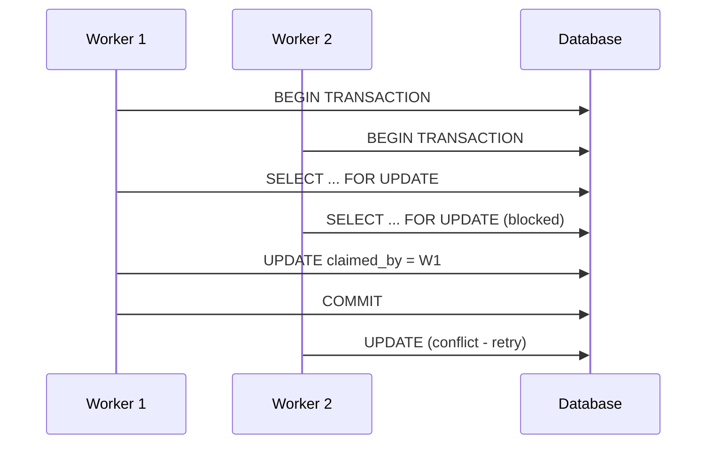

# Why FLEET-Q?

This document explains the design decisions behind FLEET-Q and why it was created to solve specific challenges in modern containerized environments.

## The Problem Space

### Traditional Task Queue Limitations

Most existing task queue solutions were designed for environments with different constraints than modern Kubernetes deployments:

#### Message Broker Dependencies

**Traditional Approach:**
```
┌─────────────┐    ┌─────────────┐    ┌─────────────┐
│   Worker    │    │   Redis/    │    │   Worker    │
│    Pod      │◄──►│  RabbitMQ   │◄──►│    Pod      │
│             │    │   Broker    │    │             │
└─────────────┘    └─────────────┘    └─────────────┘
```

**Problems:**
- Additional infrastructure to manage and scale
- Single point of failure (broker)
- Network complexity (pod-to-broker communication)
- Operational overhead (broker monitoring, backup, scaling)

#### Direct Pod Communication

**Traditional Approach:**
```
┌─────────────┐                    ┌─────────────┐
│   Leader    │◄──────────────────►│   Worker    │
│    Pod      │    Direct Network  │    Pod      │
│             │   Communication    │             │
└─────────────┘                    └─────────────┘
```

**Problems:**
- Requires pod-to-pod networking
- Complex service discovery
- Network policies become complicated
- Difficult to secure and monitor

### EKS-Specific Constraints

Modern Kubernetes environments, especially in enterprise settings, often have strict constraints:

#### Network Isolation
- **Pod-to-pod communication disabled** for security
- **Egress restrictions** limiting external connections
- **Service mesh complexity** for inter-service communication

#### Infrastructure Minimization
- **Reduce operational overhead** by minimizing components
- **Leverage existing infrastructure** (databases already in use)
- **Avoid additional failure points** (no brokers to manage)

#### Compliance and Security
- **Audit trails** for all task processing
- **Data residency** requirements (keep data in existing systems)
- **Access control** through existing database permissions

## FLEET-Q's Solution

### Database-Mediated Coordination

FLEET-Q uses the database as the coordination mechanism:

```
┌─────────────┐    ┌─────────────┐    ┌─────────────┐
│   Worker    │    │  Snowflake  │    │   Worker    │
│    Pod      │◄──►│  Database   │◄──►│    Pod      │
│             │    │             │    │             │
└─────────────┘    └─────────────┘    └─────────────┘
```

**Benefits:**
- **No additional infrastructure** - uses existing database
- **Strong consistency** - ACID transactions prevent race conditions
- **Audit trail** - all operations logged in database
- **Scalability** - database handles scaling concerns
- **Security** - existing database access controls apply

### Leaderless Task Distribution

Unlike traditional leader-worker patterns, FLEET-Q uses distributed claiming:



**Benefits:**
- **No single point of failure** - no leader bottleneck
- **Automatic load balancing** - workers claim based on capacity
- **Elastic scaling** - new workers automatically participate
- **Conflict resolution** - database handles race conditions

### Hybrid Leadership for Recovery

While task distribution is leaderless, FLEET-Q uses a leader for recovery operations:

**Why This Hybrid Approach?**

1. **Task Distribution**: Leaderless is optimal for high throughput
2. **Failure Recovery**: Leader coordination prevents conflicts
3. **Operational Clarity**: Single recovery coordinator is easier to reason about
4. **Minimal Overhead**: Leader only active during failures

## Design Principles

### 1. Operational Simplicity

**Goal**: Make it easy to deploy, monitor, and troubleshoot

**Implementation**:
- Single container process (no separate components)
- Environment variable configuration
- Clear logging and metrics
- Minimal schema (only 2 tables)

**Example**:
```bash
# Simple deployment
docker run -e FLEET_Q_SNOWFLAKE_ACCOUNT=... fleet-q

# Clear monitoring
curl http://localhost:8000/admin/queue
```

### 2. Database-First Design

**Goal**: Leverage database capabilities for coordination

**Implementation**:
- Atomic operations via transactions
- Consistent state through ACID properties
- Scalability through database scaling
- Durability through database persistence

**Example**:
```sql
-- Atomic step claiming
BEGIN TRANSACTION;
SELECT step_id FROM STEP_TRACKER WHERE status='pending' FOR UPDATE;
UPDATE STEP_TRACKER SET status='claimed', claimed_by='pod-123';
COMMIT;
```

### 3. Resilient Recovery

**Goal**: Handle failures gracefully without data loss

**Implementation**:
- Dead pod detection via heartbeat monitoring
- Orphaned task recovery through leader coordination
- Local DLQ for operational visibility
- Retry policies with exponential backoff

**Example**:
```python
# Recovery cycle
dead_pods = await detect_dead_pods()
orphaned_steps = await find_orphaned_steps(dead_pods)
await requeue_eligible_steps(orphaned_steps)
```

### 4. Elastic Capacity Management

**Goal**: Automatically adapt to changing workloads

**Implementation**:
- Capacity-aware claiming (80% of max parallelism)
- Dynamic pod participation
- Automatic load balancing
- No manual work distribution

**Example**:
```python
# Automatic capacity calculation
available_capacity = int(max_parallelism * 0.8) - current_inflight
steps_to_claim = min(available_capacity, pending_steps)
```

## Comparison with Alternatives

### vs. Celery

| Aspect | Celery | FLEET-Q |
|--------|--------|---------|
| **Broker** | Required (Redis/RabbitMQ) | None (uses database) |
| **Networking** | Pod-to-broker | Database-only |
| **Scaling** | Manual broker scaling | Database handles scaling |
| **Failure Recovery** | Broker-dependent | Database-coordinated |
| **Operational Overhead** | High (broker + workers) | Low (workers only) |

### vs. RQ (Redis Queue)

| Aspect | RQ | FLEET-Q |
|--------|-----|---------|
| **Dependencies** | Redis required | Snowflake (often existing) |
| **Persistence** | Redis persistence | Database durability |
| **Monitoring** | Redis monitoring tools | Database monitoring tools |
| **Scaling** | Redis cluster complexity | Database scaling |
| **Security** | Redis security model | Database access controls |

### vs. AWS SQS

| Aspect | AWS SQS | FLEET-Q |
|--------|---------|---------|
| **Vendor Lock-in** | AWS-specific | Database-agnostic |
| **Cost** | Per-message pricing | Database costs only |
| **Visibility** | CloudWatch metrics | Database queries |
| **Integration** | AWS ecosystem | Any database ecosystem |
| **Compliance** | AWS compliance | Your database compliance |

### vs. Kubernetes Jobs

| Aspect | Kubernetes Jobs | FLEET-Q |
|--------|-----------------|---------|
| **Resource Usage** | Pod per task | Shared worker pods |
| **Startup Time** | Pod creation overhead | Immediate processing |
| **Monitoring** | Kubernetes resources | Application metrics |
| **Failure Handling** | Pod restart policies | Application-level retry |
| **Throughput** | Limited by pod scheduling | Limited by worker capacity |

## When to Choose FLEET-Q

### Ideal Use Cases

#### 1. EKS Environments with Network Restrictions
- Pod-to-pod communication disabled
- Egress restrictions to external services
- Service mesh complexity to avoid

#### 2. Existing Database Infrastructure
- Snowflake already in use
- Database team manages scaling and backup
- Compliance requirements met by database

#### 3. Operational Simplicity Requirements
- Minimal components to manage
- Clear troubleshooting path
- Existing monitoring infrastructure

#### 4. High Reliability Needs
- Strong consistency requirements
- Audit trail for all operations
- Guaranteed task processing

### Not Ideal For

#### 1. High-Frequency, Low-Latency Tasks
- Database round-trip adds latency
- Message brokers may be faster for simple tasks

#### 2. Complex Workflow Orchestration
- FLEET-Q is designed for simple task processing
- Workflow engines like Airflow may be better

#### 3. Environments Without Database Access
- Requires database connectivity
- May not work in highly restricted environments

#### 4. Very Small Scale Deployments
- Database overhead may be excessive
- Simple in-memory queues might suffice

## Real-World Scenarios

### Scenario 1: Financial Services

**Requirements:**
- Strict compliance and audit requirements
- No external dependencies allowed
- High reliability for payment processing
- Network isolation between services

**Why FLEET-Q:**
- All operations logged in existing database
- No additional compliance surface area
- Strong consistency for financial operations
- Works within network restrictions

### Scenario 2: Healthcare Data Processing

**Requirements:**
- HIPAA compliance for data handling
- Existing Snowflake data warehouse
- Batch processing of medical records
- Audit trail for all processing

**Why FLEET-Q:**
- Data stays within existing compliant infrastructure
- Leverages existing Snowflake investment
- Built-in audit trail through database logging
- Handles large batch processing efficiently

### Scenario 3: Enterprise Analytics

**Requirements:**
- Integration with existing data pipeline
- Snowflake as primary data store
- Variable workload (batch processing)
- Minimal operational overhead

**Why FLEET-Q:**
- Natural integration with Snowflake workflows
- Elastic scaling matches variable workloads
- Minimal additional infrastructure
- Database team can manage scaling

## Evolution and Future

### Current State

FLEET-Q v1.0 focuses on:
- Core distributed task processing
- Snowflake integration
- Basic recovery mechanisms
- Simple deployment model

### Planned Enhancements

#### Multi-Database Support
- PostgreSQL backend support
- MySQL compatibility
- Database abstraction layer

#### Advanced Features
- Task dependencies and workflows
- Priority queues with SLA guarantees
- Advanced retry policies
- Metrics and observability improvements

#### Ecosystem Integration
- Kubernetes operator
- Helm charts
- Prometheus metrics
- Grafana dashboards

### Design Philosophy Continuity

Future enhancements will maintain core principles:
- **Operational simplicity** over feature complexity
- **Database-first design** over external dependencies
- **Clear failure modes** over hidden complexity
- **Elastic behavior** over manual configuration

## Conclusion

FLEET-Q was designed to solve real problems in modern containerized environments:

1. **Eliminate broker dependencies** while maintaining reliability
2. **Work within network restrictions** common in enterprise environments
3. **Leverage existing database infrastructure** rather than adding components
4. **Provide operational clarity** through simple, understandable design

The result is a task queue that feels natural in database-centric architectures while providing the reliability and scalability needed for production workloads.

**FLEET-Q is the right choice when you need:**
- Reliable task processing without additional infrastructure
- Strong consistency and audit trails
- Simple operations and troubleshooting
- Integration with existing database systems
- Compliance with enterprise security requirements

**Consider alternatives when you need:**
- Ultra-low latency task processing
- Complex workflow orchestration
- Environments without database access
- Very simple, single-node deployments

The key insight behind FLEET-Q is that **the database is often the most reliable, scalable, and well-managed component in modern architectures** - so why not use it for task coordination too?