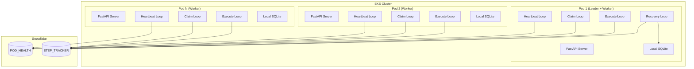
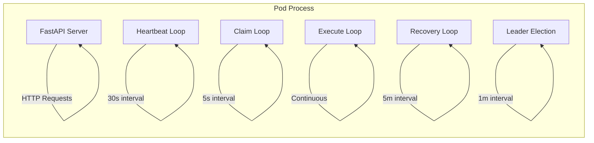
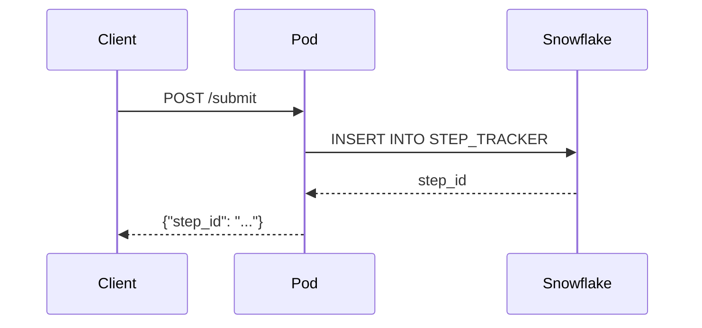
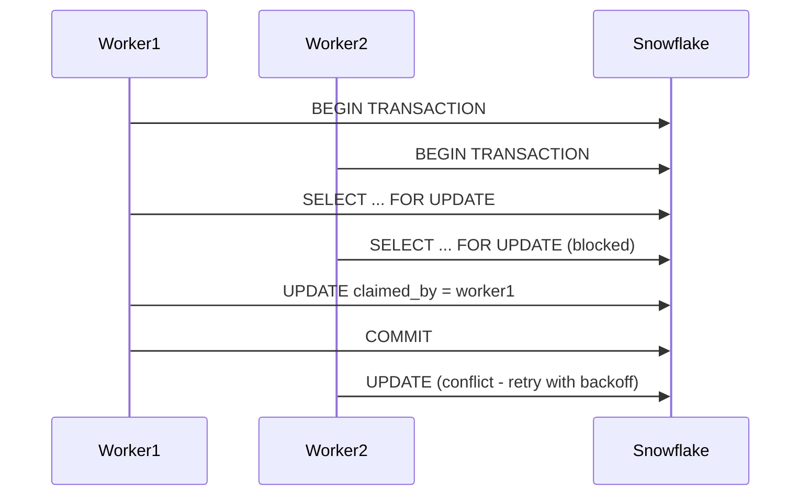
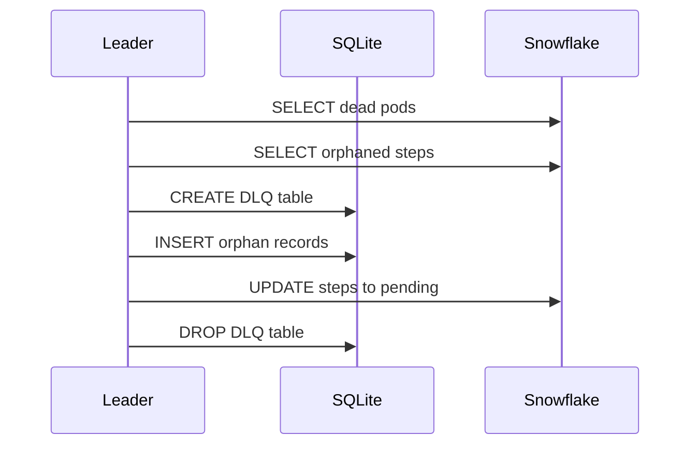

# Architecture Overview

FLEET-Q implements a unique distributed task queue architecture designed for environments where traditional message brokers cannot be used and pods cannot communicate directly with each other.

## Design Philosophy

FLEET-Q is built on several key principles:

### Database-Mediated Coordination
All inter-pod communication occurs through Snowflake database transactions, eliminating the need for message brokers or direct networking between pods.

### Atomic State Transitions
Every step state change uses database transactions to prevent race conditions and ensure data consistency across the distributed system.

### Elastic Capacity Management
Pods dynamically adjust their workload based on available resources, automatically scaling up or down as needed.

### Resilient Recovery
A leader-based recovery system handles pod failures without data loss, ensuring all tasks are eventually processed.

### Operational Simplicity
Minimal configuration, clear observability, and easy troubleshooting make FLEET-Q simple to operate in production.

## System Architecture

## Core Components

### Pods
Individual EKS containers running the FLEET-Q service. Each pod contains:

- **FastAPI Server**: REST API for external interaction
- **Background Loops**: Heartbeat, claiming, execution, and recovery processes
- **Local SQLite**: Ephemeral storage for recovery operations
- **Storage Clients**: Connections to Snowflake and local SQLite

### Snowflake Coordination Store
The single source of truth for all system coordination:

- **POD_HEALTH Table**: Tracks pod status and enables leader election
- **STEP_TRACKER Table**: Manages the complete task lifecycle
- **Transactional Guarantees**: Ensures atomic operations across pods

### Leader Election System
Deterministic leader selection based on:

- **Eldest Pod Rule**: Pod with earliest birth timestamp becomes leader
- **Health Validation**: Only pods with fresh heartbeats are eligible
- **Automatic Failover**: New leader elected when current leader fails

## Architectural Patterns

### Event Loop Architecture
Each pod runs multiple concurrent loops:

### Database-First Design
The system treats Snowflake as the single source of truth:

- **No In-Memory State**: All critical state is persisted in the database
- **Atomic Operations**: All coordination happens through database transactions
- **Local Ephemeral Data**: SQLite used only for temporary recovery data

### Hybrid Leadership Model
Combines the benefits of leaderless and leader-coordinated architectures:

| Aspect | Leaderless | FLEET-Q Hybrid |
|--------|------------|----------------|
| Task Distribution | Fully distributed | Distributed claiming + leader cleanup |
| Coordination Overhead | Low | Low-medium (only leader cleanup) |
| Failure Handling | Heuristic timeouts | Explicit detection with leader |
| Race Conditions | Higher risk | Lower risk (single recovery leader) |
| Complexity | Harder to reason about failures | Easier - single responsibility leader |

## Data Flow

### Step Submission Flow

### Step Claiming Flow

### Recovery Flow

## Scalability Characteristics

### Horizontal Scaling
- **Linear Throughput**: Adding pods increases processing capacity linearly
- **No Central Bottleneck**: Distributed claiming prevents single points of failure
- **Elastic Capacity**: Pods automatically adjust to available resources

### Database Scaling
- **Snowflake Elasticity**: Warehouse scaling handles increased load
- **Minimal Schema**: Only two tables reduce complexity
- **Efficient Queries**: Optimized for common operations

### Network Efficiency
- **No Pod-to-Pod Communication**: Eliminates network complexity
- **Batch Operations**: Multiple steps claimed in single transactions
- **Heartbeat Optimization**: Configurable intervals balance freshness and overhead

## Fault Tolerance

### Pod Failures
- **Automatic Detection**: Stale heartbeats trigger dead pod detection
- **Work Recovery**: Orphaned tasks automatically requeued
- **Leader Failover**: New leader elected within one heartbeat interval

### Database Failures
- **Connection Retry**: Exponential backoff for transient failures
- **Circuit Breaker**: Prevents cascade failures during outages
- **Graceful Degradation**: Continue operation with reduced functionality

### Network Partitions
- **Database-Only Communication**: No direct pod communication to partition
- **Heartbeat Tolerance**: Configurable thresholds handle temporary issues
- **Recovery Resilience**: Leader recovery handles extended partitions

## Performance Characteristics

### Latency
- **Claim Latency**: Typically 10-50ms for database round-trip
- **Recovery Latency**: 3-5 minutes for dead pod detection
- **API Response**: Sub-millisecond for cached operations

### Throughput
- **Per-Pod Throughput**: Limited by configured parallelism
- **System Throughput**: Scales linearly with pod count
- **Database Throughput**: Limited by Snowflake warehouse capacity

### Resource Usage
- **Memory**: ~100MB base + 10MB per max parallelism
- **CPU**: Low baseline, scales with task execution
- **Storage**: Minimal (ephemeral SQLite only)

## Comparison with Traditional Architectures

### vs. Message Broker Architectures

| Aspect | Message Broker | FLEET-Q |
|--------|----------------|---------|
| Infrastructure | Requires Redis/RabbitMQ | Only needs database |
| Networking | Pod-to-broker communication | Database-only communication |
| Failure Modes | Broker single point of failure | Database handles failures |
| Operational Complexity | Broker + workers | Workers only |
| Consistency | Eventually consistent | Strongly consistent |

### vs. Fully Leaderless Systems

| Aspect | Leaderless | FLEET-Q |
|--------|------------|---------|
| Task Assignment | Distributed consensus | Distributed claiming |
| Failure Recovery | Timeout-based | Leader-coordinated |
| Split Brain Risk | Higher | Lower |
| Operational Clarity | Complex failure scenarios | Clear recovery process |

## Next Steps

Learn more about specific architectural components:

- **[Components](components.md)** - Detailed component descriptions
- **[Data Flow](data-flow.md)** - Complete data flow diagrams
- **[State Management](state-management.md)** - State transition details