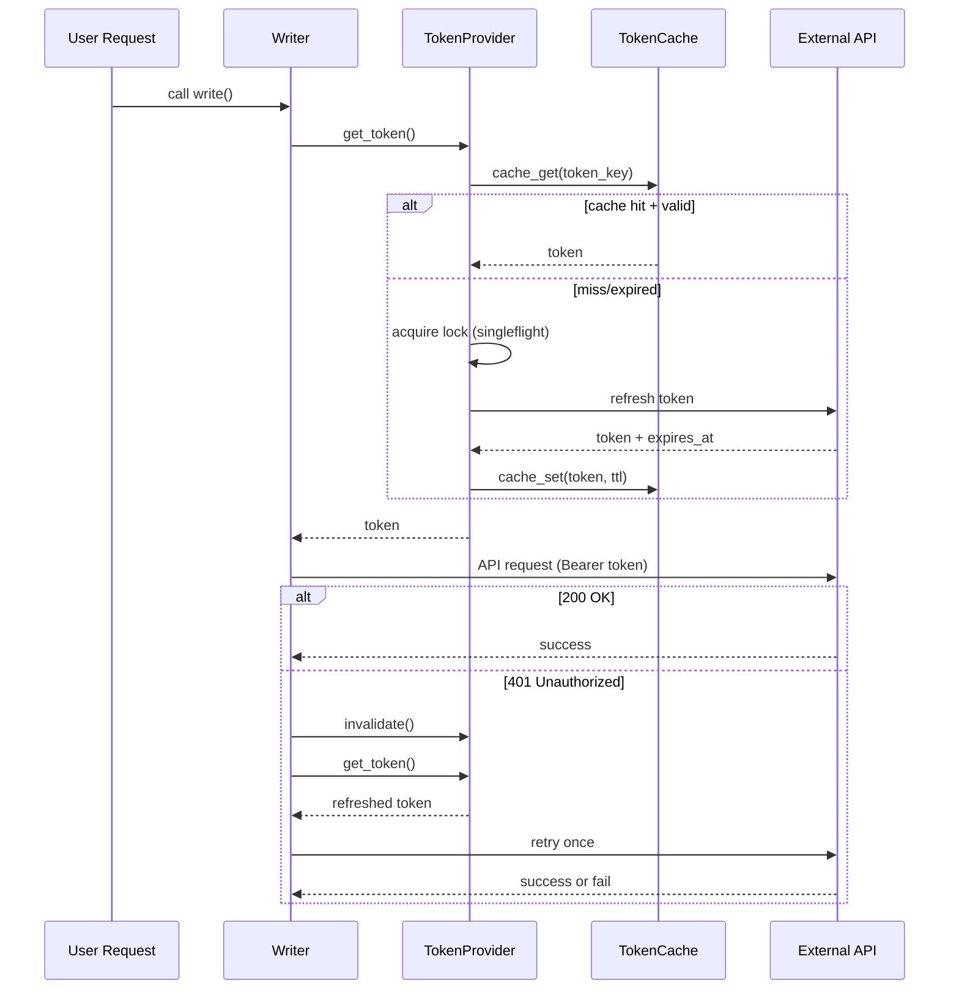
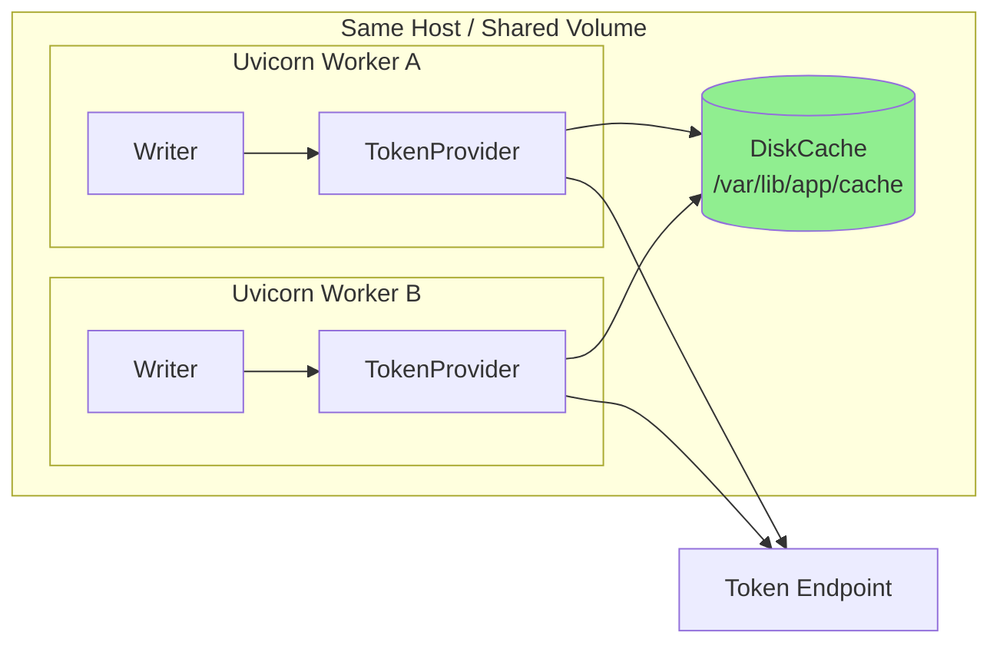
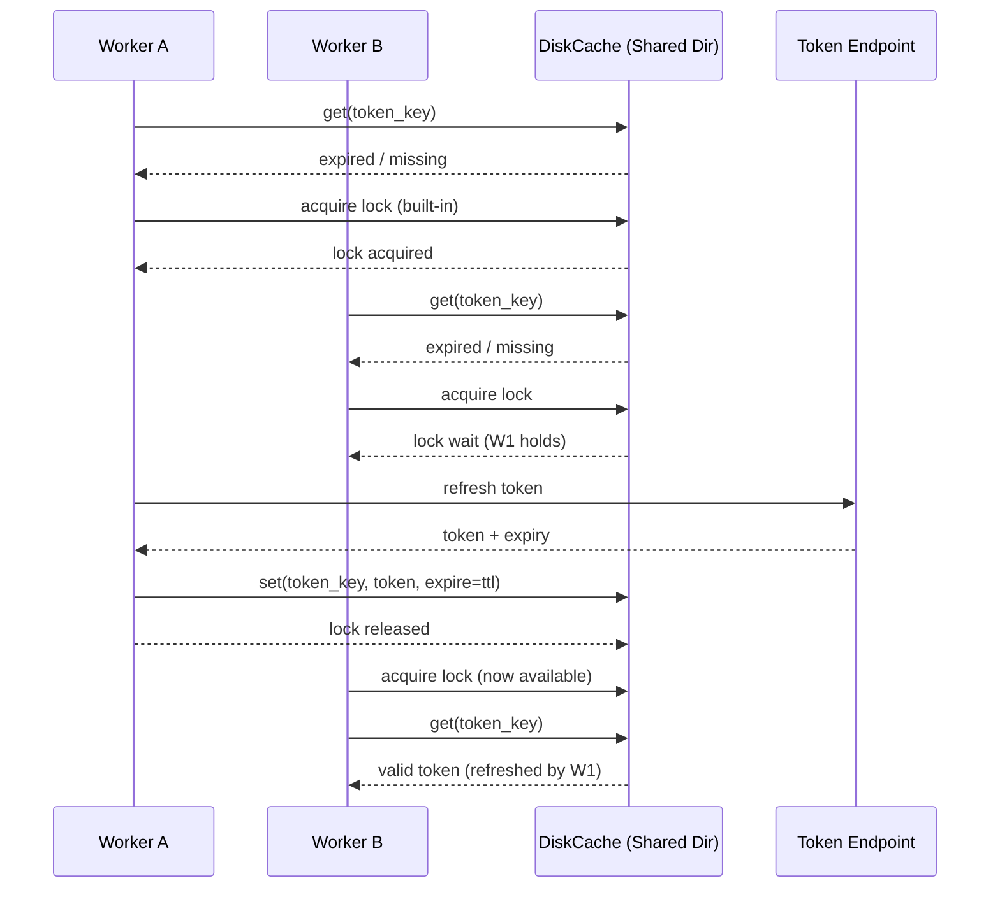
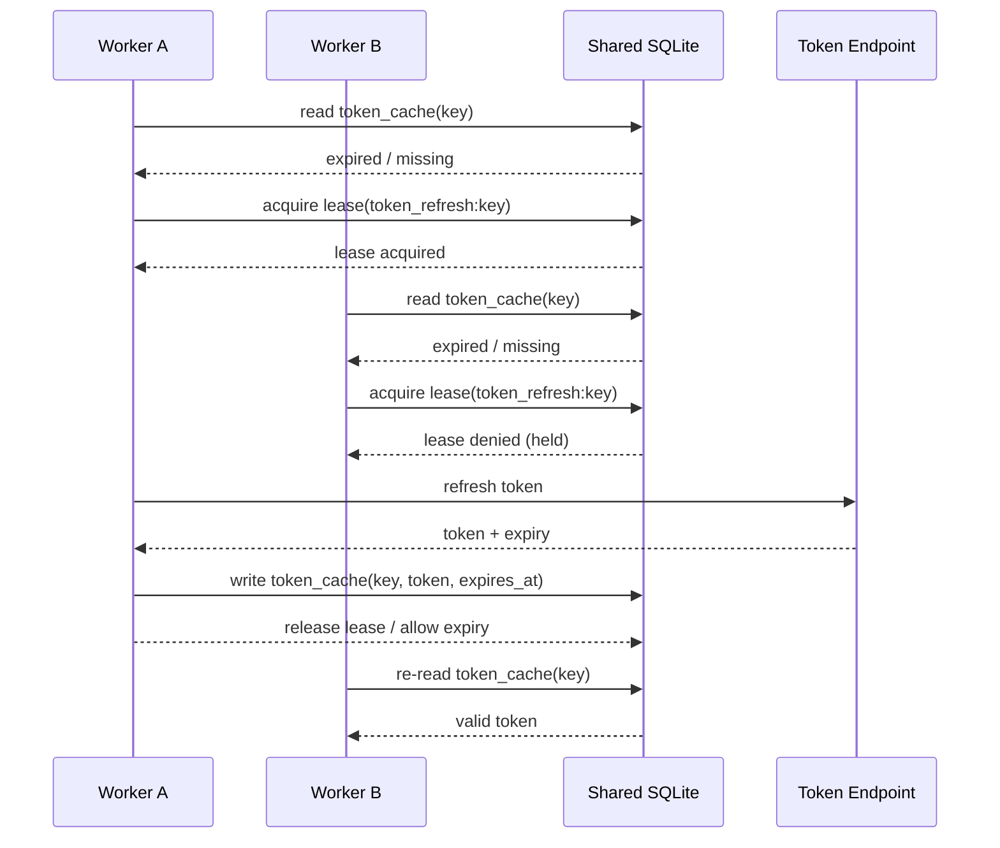

# Token Management & Auth Refresh Architecture

## 1) Problem Statement 🎯

Our FastAPI app integrates with multiple external systems (SharePoint, Snowflake, internal APIs). Each integration requires auth tokens/credentials that expire. We currently keep long-lived “writer/client objects” in a context loader and attempt to refresh tokens periodically (e.g., via APScheduler). This approach has produced intermittent **token expired** failures due to:

* Multi-worker / multi-pod process isolation (each worker has its own memory)
* Clients caching stale Authorization headers
* Race conditions during refresh
* Expiry edge cases (clock skew, near-expiry calls)
* Token invalidation outside our schedule (revocation, rotation)

## 2) Target Outcomes ✅

We want a design that:

* Avoids refreshing “every request”
* Ensures any request always uses a valid token (or auto-recovers)
* Prevents refresh storms under load
* Works reliably in multi-worker / multi-pod deployments
* Makes auth behavior explicit, testable, and observable

---

# 3) Proposed Solution Overview 🧩

## 3.1 Core Pattern: TokenProvider + Expiring Cache (Lazy Refresh)

Instead of storing tokens inside clients, introduce a `TokenProvider` per integration:

* Caches token + expiry metadata
* Auto-refreshes when expired (or near expiry)
* Uses a **singleflight lock** so only one coroutine refreshes
* Supports `invalidate()` to force refresh after a 401

### Key Rule 🔑

**Writer/client objects do not “own” tokens.**
They always obtain a token “just in time” from a provider.

---

## 3.2 Safety Net Pattern: Retry-on-401 Once 🔁

Even with proactive refresh, tokens can be invalidated unexpectedly. Standard resilience behavior:

1. Make request with token
2. If 401 (expired/invalid_token), call `invalidate()` + refresh
3. Retry once
4. If still failing, raise error

This ensures “token expired” issues do not leak to user flows.

---

# 4) Architecture Components 🏗️

## 4.1 Modules to Add

Create a dedicated auth package:

```
app/
  auth/
    __init__.py
    providers/
      base.py
      oauth2_client_credentials.py
      msal_sharepoint.py
      internal_jwt.py
    cache/
      diskcache_backend.py
      sqlite_backend.py
      duckdb_backend.py
      memory.py
    locking/
      local_singleflight.py
      file_lock.py
    policies/
      refresh_policy.py
      retry_policy.py
```

## 4.2 Core Interfaces (Contract-First)

### TokenProvider Interface

* `async get_token() -> str`
* `async invalidate() -> None`
* Optional: `async get_headers() -> dict`

### TokenCache Interface

* `get(key) -> token_record | None`
* `set(key, token_record, ttl_seconds)`
* (Optional) `compare_and_set` / versioning for rotation

### Lock Interface

* `async acquire(key, ttl)`
* `async release(key)`

---

# 5) Refresh Semantics & Policies ⚙️

## 5.1 Refresh Buffer

Refresh early to avoid edge expiry:

* `is_valid := now < expires_at - buffer_seconds`
* Default buffer: `120s` (tunable)

## 5.2 Jitter (Optional)

For multi-instance deployments, add jitter to refresh time to avoid synchronized refresh spikes:

* `buffer = 120s + random(0..30s)`

## 5.3 Token Sources

Per integration, implement loaders:

* SharePoint: MSAL / OAuth2 token endpoint
* Snowflake: preferred auth method (key pair / OAuth)
* Internal APIs: OAuth2 or JWT exchange service

---

# 6) Context Loader Changes 🧠

## 6.1 Before

Context loader builds long-lived writers with embedded tokens; APScheduler refreshes those tokens periodically.

## 6.2 After (Proposed)

Context loader builds:

* `TokenProvider`s
* `Writer`s that depend on providers

Writers remain stateless with respect to token lifetime.

### Dependency Layout

* `ContextLoader` -> constructs providers (SharePointTokenProvider, InternalApiTokenProvider)
* `Writer` -> uses provider on each call: `token = await provider.get_token()`

---

# 7) APScheduler Role (Optional) ⏰

## 7.1 When to Use APScheduler

Keep APScheduler only for:

* Prewarming tokens (optional)
* Periodic health checks
* Cache cleanup / telemetry heartbeat

## 7.2 Avoid Using APScheduler To

* “Keep tokens fresh” by mutating in-memory clients
* Refresh objects across multi-workers (doesn’t propagate)

**If we keep scheduled refresh**, it should refresh the **shared cache** (Redis/DB), not per-process in-memory state.

---

# 8) Multi-Worker / Multi-Pod Strategy 🌐

## 8.1 Recommended: DiskCache (Best for Most Cases)

**Primary recommendation** for multi-worker on same host:

* Use **DiskCache** with shared directory path
* Built-in cross-process locking
* TTL expiration handled automatically
* No external dependencies (Redis/etc)

**Pros:**
* ✅ Works out of the box for Gunicorn/Uvicorn workers
* ✅ Built-in refresh storm prevention
* ✅ Minimal configuration

**Cons:**
* ⚠️ Requires shared filesystem (same host or EFS/NFS)
* ⚠️ Not ideal for very high QPS (> 10k/sec)

## 8.2 Alternative: SQLite with WAL Mode

For more control or audit requirements:

* Shared SQLite file with `PRAGMA journal_mode=WAL`
* Custom lease table for distributed locking
* Explicit token versioning

## 8.3 Advanced: DuckDB (Analytical Workloads)

If you need token analytics or historical tracking:

* DuckDB supports concurrent reads very well
* Can analyze token refresh patterns
* Excellent for observability dashboards

## 8.4 In-Memory Baseline (Development Only)

Each worker maintains its own in-memory token cache + local lock.

* Pros: simplest for local development
* Cons: higher refresh frequency across workers in production

---

# 9) Error Handling & Observability 📈

## 9.1 Structured Logging

Emit logs for:

* token_refresh_started / token_refresh_succeeded / token_refresh_failed
* 401_retry_triggered
* cache_hit / cache_miss
  Include:
* integration name (sharepoint/snowflake/internal_api)
* token expiry remaining seconds
* refresh duration

## 9.2 Metrics

* token_refresh_count{integration}
* token_refresh_failures{integration}
* token_cache_hit_ratio{integration}
* request_retries_401{integration}
* refresh_lock_wait_seconds{integration}

## 9.3 Tracing (Optional)

Propagate trace context through refresh calls to correlate auth incidents with downstream failures.

---

# 10) Testing Plan ✅🧪

## 10.1 Unit Tests

* TokenProvider returns cached token when valid
* Refresh occurs when token near expiry
* Only one refresh occurs with concurrent callers (singleflight)
* Invalidate forces refresh next call

## 10.2 Integration Tests (with mocked endpoints)

* 401 triggers refresh and single retry
* Refresh token rotation persists new refresh token (if applicable)
* Redis cache + distributed lock correctness under concurrency

## 10.3 Load / Concurrency Tests

* 100 concurrent requests when token expires → only one refresh
* No “refresh storm” across N workers (Redis mode)

---

# 11) Rollout Plan 🚀

## Phase 1: Implement Provider + Retry Skeleton

* Add TokenProvider base + ExpiringValue logic
* Update one integration (SharePoint) end-to-end

## Phase 2: Migrate Remaining Integrations

* Snowflake provider (based on chosen auth)
* Internal APIs provider(s)

## Phase 3: Add Shared Cache (if multi-worker/pods)

* Redis token cache + distributed lock
* Configurable via env flags

## Phase 4: Observability + Hardening

* Metrics + dashboards
* Alerting on refresh failures / 401 spikes

---

# 12) Configuration & Operational Notes 🔧

## 12.1 Config

* `TOKEN_REFRESH_BUFFER_SECONDS=120`
* `TOKEN_CACHE_BACKEND=diskcache|sqlite|duckdb|memory`
* `TOKEN_CACHE_DIR=/var/lib/app/token_cache`  # For DiskCache
* `TOKEN_CACHE_DB_PATH=/var/lib/app/tokens.db`  # For SQLite/DuckDB
* `TOKEN_LOCK_TTL_SECONDS=30`
* `TOKEN_CACHE_SIZE_LIMIT=104857600`  # 100MB for DiskCache
* Integration-specific env vars (client_id, tenant, scopes)

## 12.2 Security

* Never log token strings
* Encrypt refresh tokens at rest if stored
* Consider secret managers (AWS Secrets Manager)
* Minimize token scopes

---

# 13) Mermaid Diagrams 📌

## 13.1 Request Flow with Lazy Refresh + Retry-on-401



## 9.3 Multi-Worker Shared Cache (DiskCache/SQLite) Architecture



---Yes — you can absolutely use **shared SQLite** as the “token cache + distributed lock” *if* you treat it like a **small coordination database** and deploy it correctly.

The key is: **SQLite only helps if all workers/pods can see the same SQLite file.**
If your workers are in the *same host* and share a filesystem path → great.
If you’re on EKS with multiple pods → SQLite typically becomes **per-pod local** unless you mount a shared volume (EFS/NFS). If you *do* have a shared volume, it can work, but you must be careful about locking + latency.

Below is a repo-ready plan for **SQLite-based token cache + lease locking** (no Redis).

---

# Using SQLite as a Shared Token Cache + Lock (Repo Plan)

## 1) When SQLite is a Good Fit ✅

SQLite shared token coordination works well when:

* You run multiple **uvicorn/gunicorn workers on one VM/host**, and all workers point to the same DB file path.
* Or you have a **shared filesystem** mount that all app instances can access (NFS/EFS), and you accept some latency.

## 2) When SQLite is Risky ⚠️

* Multiple pods on Kubernetes with **no shared volume** → each pod has its own SQLite file → no coordination.
* Shared filesystem with high latency or intermittent locks → can cause refresh contention.
* Very high QPS token reads/writes without WAL/journal tuning.

---

# 3) The Design: “Token Table + Lease Table” 🔐

## 3.1 Tables

### `token_cache`

Stores the latest token (and optional refresh token / metadata) for each integration key.

| Column          | Type             | Notes                                    |
| --------------- | ---------------- | ---------------------------------------- |
| `key`           | TEXT PRIMARY KEY | e.g., `sharepoint:tenantA:scopeX`        |
| `access_token`  | TEXT             | encrypted/encoded if needed              |
| `refresh_token` | TEXT NULL        | if applicable                            |
| `expires_at`    | INTEGER          | epoch seconds                            |
| `updated_at`    | INTEGER          | epoch seconds                            |
| `version`       | INTEGER          | increment on refresh to handle rotations |

### `leases`

Provides a distributed “only one refresher at a time” mechanism.

| Column         | Type             | Notes                                |
| -------------- | ---------------- | ------------------------------------ |
| `lease_key`    | TEXT PRIMARY KEY | e.g., `token_refresh:sharepoint:...` |
| `owner_id`     | TEXT             | unique per process/pod               |
| `leased_until` | INTEGER          | epoch seconds                        |
| `updated_at`   | INTEGER          | epoch seconds                        |

---

# 4) Refresh Algorithm (SQLite Singleflight) 🧠

## 4.1 TokenProvider.get_token()

1. **Read token_cache** for key
2. If token valid (with buffer) → return
3. Else attempt to acquire lease:

   * `INSERT` lease if not exists, or
   * `UPDATE` lease if expired (`leased_until < now`)
4. If lease acquired:

   * Refresh token from provider
   * Write token_cache atomically
   * Release lease (or let it expire quickly)
5. If lease not acquired:

   * Wait briefly + re-read token_cache (another worker likely refreshed)

## 4.2 Always keep “Retry-on-401 once”

Even with this, do:

* request
* on 401 → invalidate (set expires_at=0) → get_token() → retry once

This is what prevents edge cases from leaking.

---

# 5) SQLite Configuration Best Practices ⚙️

Use these PRAGMAs at connection startup:

* `PRAGMA journal_mode=WAL;` ✅ (improves concurrency)
* `PRAGMA synchronous=NORMAL;` (usually good trade-off)
* `PRAGMA busy_timeout=5000;` ✅ (wait for locks)
* `PRAGMA foreign_keys=ON;`

Important: Use **one connection per thread** or a proper pool if using an async driver.

### Python driver choice

* If you’re async-first: **aiosqlite** is the simplest
* If you want best concurrency: consider SQLAlchemy + sqlite + proper pooling rules

---

# 6) Deployment Reality Check (Critical) 🧷

## 6.1 Single machine, multi-worker

✅ Works great:

* All workers share the same DB file path: `/var/lib/app/auth_cache.sqlite`

## 6.2 Kubernetes

You need one of:

* **Shared volume** mounted into all pods (EFS/NFS), same path
* Or **single replica** (not ideal)
* Or accept per-pod caching (still works, just more refreshes)

If pods do not share the same SQLite file, SQLite won’t solve coordination.

---

# 7) Security Notes 🔒

* Avoid storing tokens in plaintext if the SQLite file is on shared storage
* Prefer encrypting tokens before writing:

  * use envelope encryption with KMS if on AWS, or
  * app-level AES-GCM key from secrets manager
* Never log token values

---

# 8) Repo Deliverables 📦

## 8.1 New modules

```
app/auth_sqlite/
  schema.sql
  sqlite_cache.py
  sqlite_lease.py
  token_provider_sqlite.py
  settings.py
```

## 8.2 Docs

* `docs/auth/sqlite-token-cache.md`
* `adr/ADR-00xx-sqlite-token-cache.md`

## 8.3 Tests

* `tests/test_token_provider_sqlite_singleflight.py`
* `tests/test_lease_expiry.py`
* concurrency test with 50 tasks calling get_token()

---

# 9) Mermaid Diagrams 📌

## 9.1 DiskCache Token Refresh Flow (Recommended)



## 9.2 SQLite Token Refresh Flow (Alternative)



---

## Package comparison table

| Option / Package                        | What it solves                       | Token refresh behavior                                  | Cross-process safe (Gunicorn workers)?  | Storage backend                                                                            | Built-in “single refresher” (anti refresh-storm)      | Works well with FastAPI async                              | Best for                                           | Key pitfalls / notes                                                                                                       |
| --------------------------------------- | ------------------------------------ | ------------------------------------------------------- | --------------------------------------- | ------------------------------------------------------------------------------------------ | ----------------------------------------------------- | ---------------------------------------------------------- | -------------------------------------------------- | -------------------------------------------------------------------------------------------------------------------------- |
| **MSAL (`msal`)**                       | Microsoft identity tokens (Azure AD) | Automatic *silent* refresh using cache                  | ✅ *if cache is persisted & shared*      | In-memory by default; can serialize; often paired with `msal-extensions` for file/OS cache | ✅ (effectively, if using shared cache properly)       | ⚠️ Usually sync-ish patterns; can still work in async apps | **SharePoint / Graph / Azure AD** auth             | If you don’t persist the cache, each worker refreshes independently. Must avoid “token baked into headers at client init.” |
| **MSAL Extensions (`msal-extensions`)** | Persistent token cache helpers       | Same as MSAL                                            | ✅ (file-based lock + persistence)       | File-based encrypted/OS store (varies by platform)                                         | ✅ (via cache persistence + lock)                      | ⚠️ Similar constraints as MSAL                             | Best add-on for MSAL in multi-process              | Platform nuances; on Linux you often use file persistence (not OS keychain). Still need per-request header injection.      |
| **Authlib (`authlib`)**                 | General OAuth2 client patterns       | Auto refresh supported; token updater callbacks         | ✅ *if your token store is shared*       | You provide: DB/SQLite/FS/etc                                                              | ⚠️ Not automatically; you implement lock/coordination | ✅ Good                                                     | **Non-Microsoft OAuth2** APIs; clean architecture  | You still need a shared store + lock for multi-worker; otherwise refresh storms possible.                                  |
| **requests-oauthlib**                   | OAuth2 for `requests`                | Supports refresh flows                                  | ✅ *only if you persist tokens yourself* | You provide                                                                                | ❌ Not built in                                        | ❌ Mostly sync                                              | Simple scripts / sync services                     | Not ideal for async FastAPI. You’ll end up building coordination anyway.                                                   |
| **DiskCache (`diskcache`)**             | **Cross-process TTL cache + locks**  | You implement loader; TTL expiration is built in        | ✅✅ **Yes (designed for multi-process)** | Disk/SQLite under the hood                                                                 | ✅✅ **Yes (locks / atomic ops)**                       | ✅ Works fine (calls are sync but fast; can wrap carefully) | **Best general solution** for your case (no Redis) | Ensure cache directory is shared across workers (same host path). If containers/pods, needs shared volume.                 |
| **dogpile.cache**                       | Caching w/ “dogpile lock” concept    | You implement loader; handles re-generation suppression | ✅ *depending on backend*                | Multiple backends; file/DBM/memcache/redis etc                                             | ✅ **Yes (“dogpile lock”)**                            | ✅ Works (integration dependent)                            | Larger systems that want pluggable backends        | Configuration complexity; file/DBM backends need careful ops; fewer people use it than DiskCache today.                    |
| **cachetools**                          | In-memory TTL cache                  | TTL expiration                                          | ❌ (per-process only)                    | Memory only                                                                                | ❌                                                     | ✅                                                          | Single worker or “OK to refresh per worker”        | Won’t coordinate across Gunicorn workers; still can cause intermittent expiry if refresh not aligned.                      |
| **Tenacity (`tenacity`)**               | Retry/backoff                        | Retry wrapper                                           | ✅ (stateless)                           | N/A                                                                                        | N/A                                                   | ✅                                                          | **Always pair with token approach**                | Not a token manager; use it to implement “retry-on-401 once” and transient errors.                                         |
| **Custom SQLite token table + lease**   | Full control                         | Exactly what you design                                 | ✅ *if SQLite file is shared*            | SQLite file                                                                                | ✅ if you implement leases correctly                   | ✅ (with aiosqlite/SQLAlchemy)                              | When you want strict auditability / DB truth       | More code + footguns (locking, WAL, busy_timeout, lease expiry).                                                           |
| **APScheduler refresh loop**            | Scheduled refresh                    | Time-based refresh                                      | ❌ (per-process scheduler)               | N/A                                                                                        | ❌                                                     | ✅                                                          | Prewarm only                                       | In multi-worker it refreshes independently and can still miss edge expiry or stale header caching.                         |

---

### ✅ Best overall for your constraints: **DiskCache + TokenProvider + retry-on-401 once**

**Why this wins for your setup (Gunicorn/Uvicorn workers, no Redis):**

* **Cross-process safe** out of the box (workers share the same disk cache)
* Built-in **TTL expiration**
* Built-in **locking** to avoid refresh storms
* Minimal custom code compared to rolling your own SQLite lease framework
* Works for *any* integration: SharePoint, Snowflake, internal APIs

**Design:**

* Per integration: `TokenProvider(get_token -> DiskCache)`
* Writers always ask provider for token at call time
* On 401: invalidate cache + refresh + retry once

### 🥈 Best for SharePoint specifically (if you’re using Azure AD): **MSAL (+ msal-extensions)**

If your SharePoint auth is truly Azure AD OAuth, MSAL gives you “correctness” and fewer mistakes:

* It handles refresh semantics and caching rules properly
* With `msal-extensions` you get multi-process persistence/locking patterns

But you’ll *still* benefit from the same pattern:

* Don’t bake token into client headers permanently
* Use per-request injection and retry-on-401 once

### 🥉 If you want an “enterprise OAuth framework” feel: **Authlib + DiskCache**

* Use Authlib for standards-compliant OAuth handling
* Use DiskCache for cross-worker token storage + locks

---

## Which one should you pick?

### Pick **DiskCache** if:

* You can ensure a shared cache directory across Gunicorn workers (same machine path)
* You want the simplest “production correct” general solution
* You have multiple non-Microsoft APIs too

### Pick **MSAL (+ msal-extensions)** if:

* SharePoint is your #1 issue and it’s Azure AD-based
* You want the most “official” Microsoft token lifecycle handling

### Avoid relying on:

* **cachetools** alone (not cross-process)
* **APScheduler** as the main refresh mechanism (not cross-process safe)

---

## The “golden architecture” you can commit to the repo

**Core rules**

1. **Tokens live in a provider/cache, not inside writer objects**
2. **Every request injects auth dynamically**
3. **401 triggers invalidate + refresh + retry once**
4. **Cross-worker sharing via DiskCache (or MSAL persistent cache)**

---
