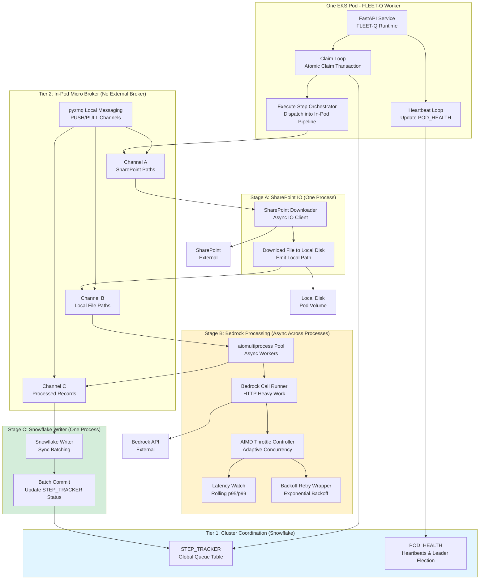
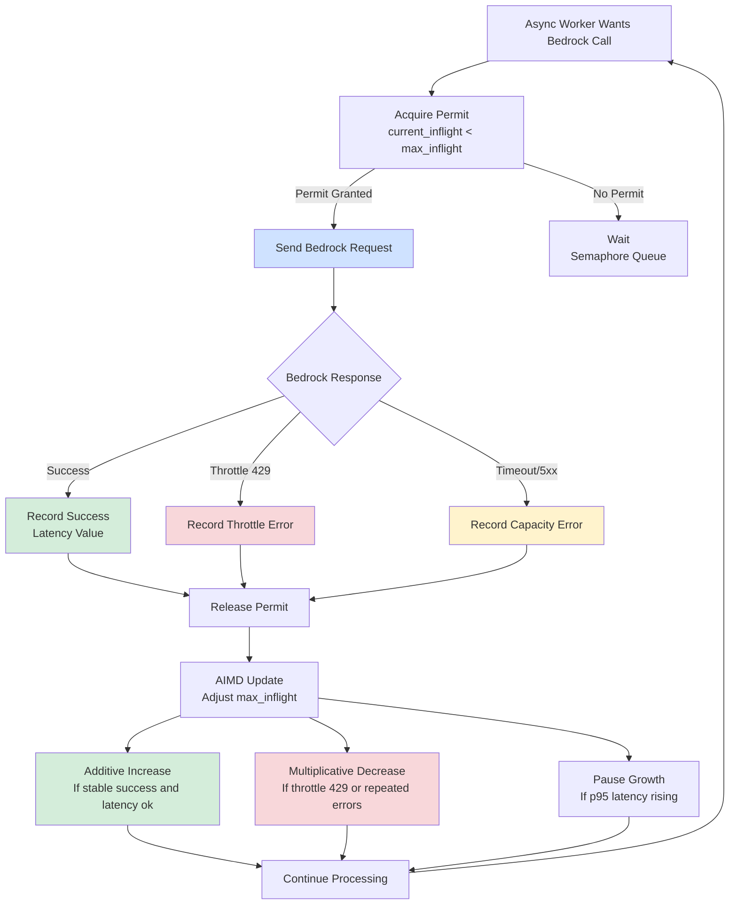
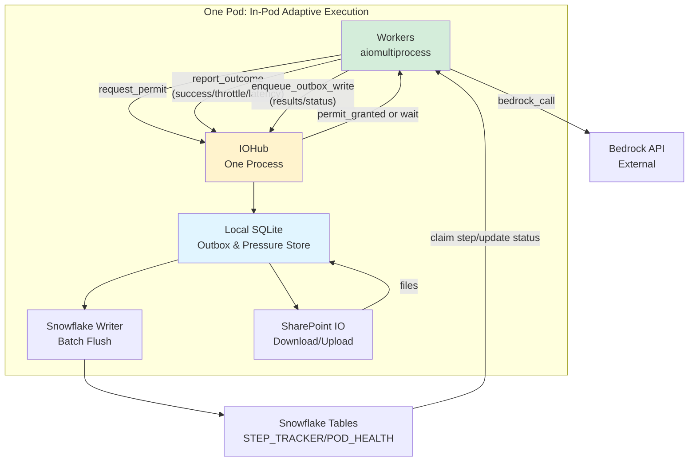
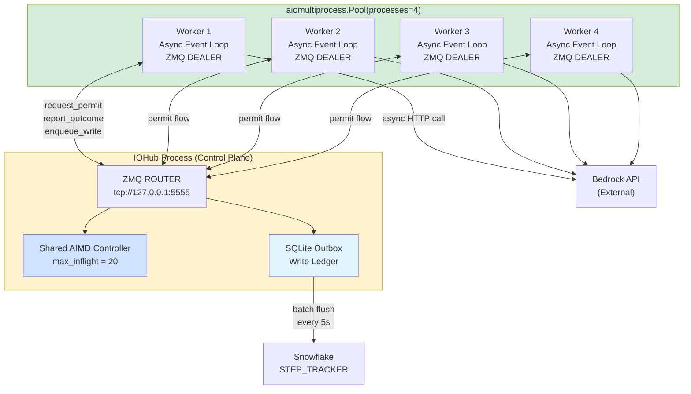
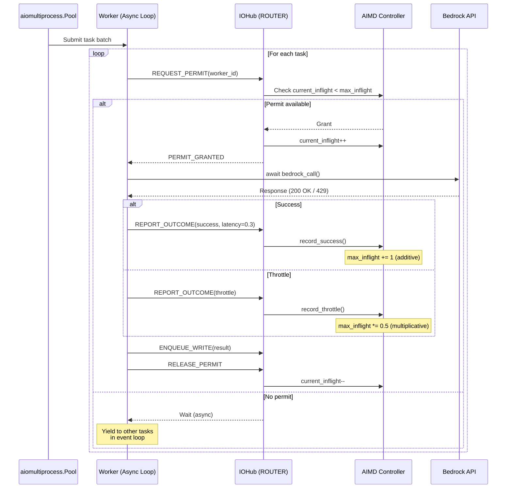
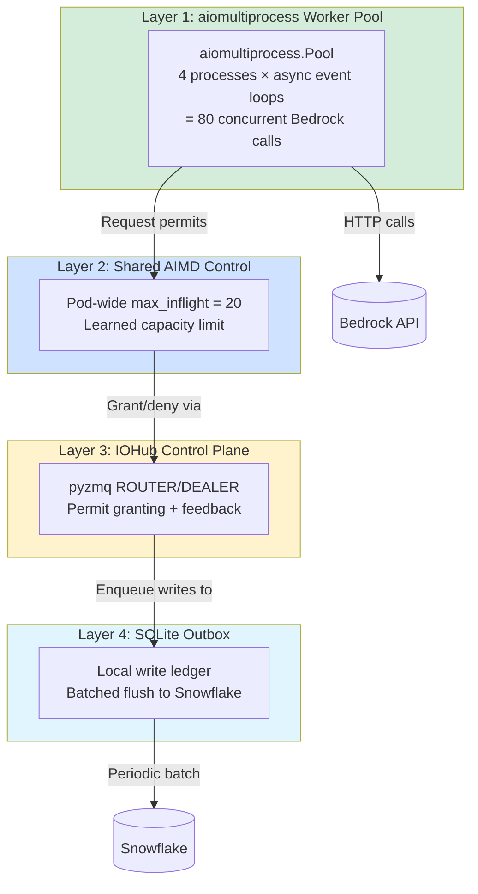

🔗 A Custom In-Pod Pipeline for Bedrock-Heavy Workloads

(Async + Multiprocessing + Adaptive Throttling)

As FLEET-Q evolved, one practical challenge became impossible to ignore:

Not all work is CPU-heavy — some work is overwhelmingly HTTP-heavy.

In our case, the processing stage is dominated by Bedrock API calls:
	•	minimal CPU usage
	•	significant network latency
	•	strict downstream capacity limits
	•	frequent throttling (429 Too Many Requests) when overloaded

Running this kind of workload with a naïve multiprocessing pool leads to two problems:
	1.	Over-parallelization — too many processes hitting Bedrock simultaneously
	2.	Client management issues — expensive initialization, non-pickleable HTTP clients, repeated auth overhead

To solve this cleanly, we introduced a custom in-pod pipeline, built entirely with:
	•	Python multiprocessing
	•	async I/O
	•	message queues (no external broker)
	•	adaptive throttling (AIMD)

This pipeline acts as a micro-broker inside each pod, complementing FLEET-Q’s Snowflake-backed global queue.

⸻

🧠 Why a Custom Pipeline?

Before diving into the design, it’s important to understand why this pattern exists at all.

The Core Constraints

Constraint	Implication
Bedrock calls are HTTP-heavy	Async I/O is far more efficient than CPU multiprocessing
Bedrock enforces soft & hard limits	We must adapt dynamically, not statically
Snowflake & SharePoint clients are non-pickleable	They cannot be freely passed across processes
Pods must remain self-contained	No Redis, Kafka, or external brokers

The solution is not “more processes” or “bigger pools”.

The solution is flow control.

⸻

🧩 Two-Tier Execution Model

FLEET-Q now operates in two clear tiers:

🧱 Tier 1 — Cluster-Level Coordination (Already Covered)
	•	Tasks are claimed atomically from Snowflake (STEP_TRACKER)
	•	Pods scale horizontally
	•	Leader handles recovery
	•	This layer decides what work exists

⚙️ Tier 2 — In-Pod Execution Pipeline (New)
	•	A custom pipeline handles how work is executed
	•	Optimized specifically for Bedrock-heavy workloads
	•	No external broker required

This section focuses on Tier 2.

⸻

🛠 The In-Pod Pipeline: Stages & Responsibilities

Inside each pod, task execution is decomposed into specialized stages, each running in its own process or pool.

📊 Pipeline Stages

Stage	Role	Concurrency Model
SharePoint Reader	Download inputs	Async I/O
Bedrock Processor	Call Bedrock APIs	Async + adaptive throttling
Snowflake Writer	Persist results	Sync batching
Coordination	Message passing	In-pod queues

Each stage is decoupled and communicates through queues, forming a true pipeline.

⸻

🔌 Message-Driven Execution (No External Broker)

Instead of Redis or Kafka, we use in-pod messaging:
	•	Messages flow forward only
	•	Each stage blocks naturally when the next stage is slow
	•	Backpressure is automatic

Conceptually:

SharePoint Path
   ↓
[ Download Queue ]
   ↓
Local File Path
   ↓
[ Processing Queue ]
   ↓
Processed Object
   ↓
[ Snowflake Write Queue ]

The queues act as:
	•	Triggers (new message → work starts)
	•	Boundaries (slow stages naturally throttle upstream stages)
	•	Buffers (smooth short bursts)

⸻

⚡ Why Async for the Processing Stage?

The processing stage is Bedrock HTTP heavy and CPU light.

This is the ideal scenario for async execution.

Async Benefits Here
	•	One process can manage many in-flight Bedrock calls
	•	While one request waits on the network, others proceed
	•	Far fewer processes are needed
	•	Memory footprint is smaller
	•	Throttling can be enforced precisely

Instead of:

“One process per Bedrock call”

We get:

“One event loop managing controlled concurrency”

⸻

🧠 Adaptive Throttling with AIMD (Critical Piece)

Async alone is not enough.

If we simply fire off async calls without restraint, we will still overwhelm Bedrock.

This is where AIMD-based adaptive throttling becomes essential.

⸻

🚀 AIMD in the Processing Stage

Each processing worker maintains a local throttle controller that governs how many Bedrock calls may be in flight.

Two Key Numbers

Variable	Meaning
current_inflight	Active Bedrock calls
max_inflight	Adaptive concurrency limit

Before a Bedrock call:
	•	The worker must acquire a permit
	•	If permits are exhausted, it waits

⸻

📈 Additive Increase (Probe Carefully)

When Bedrock responses are healthy:
	•	Requests succeed
	•	Latency is stable

We slowly increase concurrency:

max_inflight += 1

This gently probes for available capacity.

⸻

📉 Multiplicative Decrease (Protect Fast)

When Bedrock returns:
	•	429 Too Many Requests
	•	or capacity-related timeouts

We react immediately:

max_inflight = max_inflight * 0.5

This sharp reduction:
	•	protects Bedrock
	•	prevents cascading retries
	•	stabilizes the system quickly

⸻

⏱ Latency Awareness (Early Warning)

In addition to explicit throttling errors, we track rolling latency (e.g., p95).

Simple Rule

If latency is rising, pause further increases.

This prevents pushing the system right up to the breaking point.

The result is a pressure-sensitive nozzle:
	•	opens when capacity is available
	•	closes when pressure builds

⸻

🔁 How Throttling Interacts with the Pipeline

The beauty of this design is that throttling affects the entire pod naturally.

When Bedrock slows down:
	•	Processing stage accepts fewer messages
	•	The processing queue fills
	•	Upstream stages slow automatically
	•	No explicit coordination required

This is flow control by design, not by configuration.

⸻

🧱 Why This Is Better Than a Traditional Worker Pool

Traditional Pool	Custom Pipeline
Fixed concurrency	Adaptive concurrency
Blind to downstream pressure	Pressure-aware
Overloads APIs easily	Self-stabilizing
Client init per worker	Long-lived clients
Hard to debug throttling	Explicit control loop

Instead of reacting after failure, the pipeline continuously adapts.

⸻

🧠 Relationship to FLEET-Q’s Global Design

This pipeline does not replace FLEET-Q.

It complements it.

Layer	Responsibility
Snowflake / FLEET-Q	Distributed task ownership
In-Pod Pipeline	Efficient, safe execution
AIMD Throttling	Respect downstream capacity

Together, they form a distributed execution fabric:
	•	globally coordinated
	•	locally adaptive
	•	resilient under load

⸻

✨ Key Takeaway

This custom in-pod pipeline turns a hard problem —

“How do we safely scale Bedrock-heavy workloads without melting the API?”

— into a controlled, observable, and adaptive system.

By combining:
	•	async I/O
	•	multiprocessing isolation
	•	message-driven pipelines
	•	AIMD-based throttling

FLEET-Q doesn’t just execute tasks.

It learns how fast it is allowed to execute them — and adjusts continuously.

⸻

### 1) 🧭 End-to-End Architecture: FLEET-Q + In-Pod Micro-Broker Pipeline

**How to read this diagram:**
	•	Tier 1: Snowflake is the global coordination store for tasks and pod health
	•	Tier 2: pyzmq acts as an in-pod broker for staging work
	•	Stage A downloads inputs (async I/O)
	•	Stage B performs Bedrock-heavy work using aiomultiprocess + AIMD throttling
	•	Stage C writes results in a controlled, batched way to Snowflake

⸻

### 2) 🚀 AIMD Adaptive Throttling Loop for Bedrock (Detailed Control Flow)

This diagram zooms into the Bedrock processing stage and explains exactly how concurrency is adjusted based on outcomes.

**What this control loop guarantees:**
	•	🔻 Fast ramp down on throttling or saturation
	•	🔺 Slow ramp up only when stable
	•	🟡 Latency-aware pause to avoid pushing to failure
	•	🔁 Works continuously without hardcoding Bedrock limits

⸻

🧠 Adaptive Throttling as Shared “Pressure Memory”

AIMD State Sharing + Local SQLite Outbox with IPC (Pipes or ROUTER/DEALER)

As FLEET-Q matured into a Bedrock-heavy execution fabric, we ran into a subtle—but crucial—problem:

Even if each worker implements AIMD throttling locally, the pod can still overload Bedrock if every worker “learns” independently.

Why? Because each worker sees only a partial view of downstream pressure. If ten worker processes each decide “I can safely run 10 inflight calls,” the aggregate becomes 100 inflight calls—and Bedrock throttles hard.

So we introduce a new concept inside the pod:

✅ Shared Pressure Memory — a lightweight shared state that stores the current AIMD throttle configuration so all workers converge on a consistent capacity limit.

At the same time, we want to handle another reliability/performance constraint:

✅ Local SQLite Outbox Mode — instead of every worker writing to Snowflake/SharePoint directly, workers write locally to SQLite, and dedicated writers flush outward in a controlled way.

This section describes how we combine these two into a clean in-pod architecture using:
	•	Shared AIMD memory (pod-level throttle controller)
	•	Local SQLite outbox
	•	IPC via Pipe or pyzmq ROUTER/DEALER
	•	Optional stage routing and batching for Snowflake/SharePoint

⸻

1) 🎛️ Why Share AIMD Across Workers?

AIMD (Additive Increase, Multiplicative Decrease) is a control loop that adjusts max_inflight based on observed outcomes:
	•	✅ Success → increase slowly
	•	❌ Throttle 429 → decrease fast
	•	🟡 Latency rising → pause increase

If each worker learns on its own, you get inconsistent throttling:
	•	One worker sees throttles and reduces
	•	Another sees successes and increases
	•	Net effect: oscillations, capacity overshoot, unstable throughput

Shared AIMD solves this by giving the pod one “nozzle” control, even across many processes.

⸻

2) 🧠 Shared Pressure Memory: What State Do We Share?

At minimum, you want to share:

Shared Field	Meaning
max_inflight	The current pod-wide concurrency ceiling for Bedrock
min_inflight	Safety floor to avoid starving
current_inflight	Optional global inflight count
last_update_ts	Helps prevent stale controllers
error_window	Rolling throttle counts (optional)
latency_p95	Rolling p95 latency (optional)

✅ Rule of thumb

Keep shared state small and coarse-grained.
Workers don’t need every metric — they need one consistent “speed limit.”

⸻

3) 🧱 How Workers Use Shared AIMD

Each Bedrock call must acquire a “permit”:

Permit model
	•	Each worker maintains local inflight counters
	•	Shared state defines the pod limit
	•	Workers enforce:

“Do not exceed shared max_inflight across the pod.”

This can be implemented using:
	•	a shared atomic counter
	•	or a central controller process that grants permits (best when you already have an IOHub)

⸻

4) 🧩 Three Ways to Implement Shared AIMD State

Option A: ✅ Central Controller Process (Best with ROUTER/DEALER)

Make one local in-pod process “ThrottleHub”:
	•	owns AIMD logic
	•	receives feedback from workers
	•	returns permits or updated limits

Why it’s ideal:
	•	no shared memory race conditions
	•	consistent policy decisions
	•	easy to log, debug, and monitor

Option B: Shared Memory + Lightweight Locking

Use Python multiprocessing.shared_memory or multiprocessing.Manager():
	•	store max_inflight
	•	update under a lock

This can work well, but:
	•	you must avoid high-frequency lock contention
	•	keep updates infrequent (e.g., once per second)

Option C: SQLite as Shared Pressure Store

Store current max_inflight in a local SQLite table:
	•	easy persistence
	•	simple visibility
	•	slightly higher overhead than shared memory

This is a good choice if you already use SQLite outbox and want one unified local state store.

⸻

5) 🗃️ Local SQLite Outbox Mode (Why We Want It)

Workers should not spend time:
	•	initializing Snowflake/SharePoint writers repeatedly
	•	blocking on network writes
	•	handling write retries individually

Instead, workers write locally to SQLite:

✅ fast
✅ durable inside pod
✅ easy to batch
✅ flushable by dedicated writers

Outbox concept

Workers “append”:
	•	results
	•	status updates
	•	write operations

Writers “flush”:
	•	to Snowflake
	•	to SharePoint
	•	with batching + throttling + retries

⸻

6) 🔄 IPC Patterns to Combine AIMD + SQLite Outbox

Now comes the core question:

How do workers and writers coordinate cleanly?

Below are two excellent options given your available packages.

⸻

Option 1: 🧵 Pipe-Based IOHub + SQLite Outbox

Flow
	•	Workers send “write intents” to parent via multiprocessing.Pipe
	•	Parent IOHub writes intents into SQLite outbox
	•	Flusher threads/processes flush SQLite to Snowflake/SharePoint

This simplifies coordination:
	•	workers only talk to parent
	•	no multi-stage queue management
	•	parent becomes the place for:
	•	token caching
	•	Snowflake batching
	•	SharePoint session reuse
	•	throttle control decisions

Strengths

✅ simplest mental model
✅ easy request/response semantics
✅ easy centralized logging

Tradeoff

⚠️ parent can become bottleneck (often acceptable if batching)

⸻

Option 2: 🛰️ pyzmq ROUTER/DEALER “In-Pod RPC Bus” (Recommended)

This is “pipe-to-parent” done in a production-grade way.

Flow
	•	IOHub uses ROUTER
	•	Workers use DEALER
	•	Workers send messages like:
	•	request_permit
	•	report_outcome
	•	enqueue_outbox_write
	•	enqueue_download

IOHub can respond with:
	•	permit granted / denied
	•	updated max_inflight
	•	ack for outbox insert
	•	download result path

Why this is perfect here

✅ routing built-in
✅ supports many workers easily
✅ easy to add new operation types
✅ supports “permit server” pattern naturally

⸻

7) 🧭 Recommended Combined Architecture

This is the cleanest unified design:

✅ IOHub process does:
	•	shared AIMD control
	•	local SQLite outbox writes
	•	flush to Snowflake/SharePoint
	•	token caching
	•	batching
	•	backoff and retries

✅ Workers do:
	•	Bedrock calls
	•	minimal compute
	•	report feedback to IOHub
	•	request permits before calling Bedrock
	•	append results to outbox via IOHub

⸻

### 📊 Full Combined Flow

⸻

### 📊 aiomultiprocess Worker Pool Architecture

**Key Insight:** Each aiomultiprocess worker runs its own asyncio event loop, allowing many concurrent Bedrock calls per process while AIMD coordinates pod-wide concurrency.

⸻

### 🔄 Permit Flow with aiomultiprocess

**Efficiency:** While one task waits for a permit, the async event loop processes other tasks. This is why aiomultiprocess + async is perfect for HTTP-heavy workloads.

⸻

### 🏗️ Four-Layer Architecture

**Design Principle:** Each layer has one clear responsibility. Layers communicate through well-defined interfaces (permits, messages, writes).

⸻

9) 🧠 How AIMD Works Here

Permit logic
	•	IOHub maintains max_inflight
	•	Each permit increments current_inflight
	•	Each completion decrements
	•	IOHub updates max_inflight using AIMD:
	•	success → +1 slowly
	•	throttle → halve immediately
	•	latency rising → pause increase

This turns the pod into a pressure-aware execution nozzle.

⸻

10) ✅ Why This Approach Is Powerful

Benefit	Why it matters
Shared AIMD	pod behaves as one intelligent regulator
Local outbox	avoids heavy remote writes per task
Central IOHub	owns non-pickleable clients safely
Batching	huge performance improvement for Snowflake
Simple worker code	workers focus on Bedrock calls only
Stability	fewer throttles, less oscillation, higher sustained throughput

⸻

11) Practical Notes and Guardrails

Avoid global lock contention
	•	IOHub decision frequency can be per-second
	•	permit granting should be lightweight and non-blocking

Bound queues and outbox growth
	•	apply maximum outbox size
	•	apply flush intervals and batch sizes
	•	add “drain mode” for graceful shutdown

Ensure idempotency
	•	outbox entries should carry:
	•	step_id
	•	deterministic dedupe key
	•	writer must safely handle replays

⸻

### 🧠 In-Pod Adaptive Execution Fabric

aiomultiprocess × AIMD × PyZMQ × SQLite Outbox

At this point in the FLEET-Q design journey, one truth became clear:

Distributed task ownership alone is not enough.
Execution must be pressure-aware, stateful, and coordinated within each pod.

For Bedrock-heavy workloads — where CPU usage is low, network latency is high, and downstream capacity is dynamic — traditional multiprocessing or static worker pools fail in subtle but dangerous ways.

This section describes how FLEET-Q evolves into a self-regulating in-pod execution fabric, combining async multiprocessing, adaptive throttling, and message-driven coordination — without introducing any external broker.

⸻

🧩 The Core Problem We’re Solving

Let’s restate the constraints clearly:
	•	Bedrock calls are HTTP-heavy and latency-bound
	•	Throttling (429) appears under aggregate pressure, not per worker
	•	Non-pickleable clients (Snowflake, SharePoint) must be centralized
	•	We want maximum throughput without breaching limits
	•	We want learning to be shared, not fragmented per worker

If each worker:
	•	runs independently
	•	learns AIMD limits independently
	•	writes independently to external systems

Then the pod behaves like many small, uncoordinated nozzles instead of one intelligent system.

⸻

🧠 Design Principle: One Pod, One Brain

Inside a pod, FLEET-Q treats execution as a single organism:
	•	Many hands (workers)
	•	One nervous system (AIMD controller)
	•	One memory (SQLite outbox + pressure state)
	•	One voice to the outside world (writers)

This leads us to a four-layer in-pod architecture.

⸻

🏗️ The Four Layers of the In-Pod Execution Model

1️⃣ Async Multiprocessing for Bedrock (aiomultiprocess)

aiomultiprocess is used specifically for what it does best:

Running async def workloads across multiple OS processes.

Each aiomultiprocess worker:
	•	Runs its own asyncio event loop
	•	Performs Bedrock HTTP calls
	•	Consumes minimal CPU
	•	Never owns long-lived external clients
	•	Never decides throttling independently

This allows us to:
	•	Overlap network waits efficiently
	•	Use fewer processes for higher throughput
	•	Keep workers stateless and disposable

⸻

2️⃣ Shared Adaptive Throttling (AIMD as Pressure Memory)

Async alone is dangerous without restraint.

So we introduce AIMD (Additive Increase, Multiplicative Decrease) as a shared control loop, not a per-worker heuristic.

What we share across the pod
At minimum:

Field	Purpose
max_inflight	Current pod-wide Bedrock concurrency ceiling
current_inflight	Active calls (optional if permit-based)
latency_p95	Early pressure signal
last_update_ts	Staleness protection

This shared state represents learned downstream capacity.

⸻

3️⃣ IOHub as the Control Plane (pyzmq ROUTER/DEALER)

Rather than sharing locks or raw shared memory everywhere, FLEET-Q introduces a local control plane inside the pod.

This is implemented using pyzmq ROUTER/DEALER, which behaves like a lightweight in-pod RPC bus.

IOHub responsibilities
The IOHub process:
	•	Owns the AIMD controller
	•	Grants and revokes permits for Bedrock calls
	•	Receives feedback (success, throttle, latency)
	•	Owns non-pickleable clients
	•	Writes to SQLite outbox
	•	Flushes to Snowflake and SharePoint

Workers talk to IOHub by sending intent messages, not by sharing objects.

⸻

4️⃣ Local SQLite Outbox (ORM-Backed State Ledger)

Instead of writing directly to Snowflake or SharePoint, workers emit write intents.

These intents are persisted locally in SQLite using an ORM:
	•	Fast
	•	Durable within the pod
	•	Easy to batch
	•	Easy to reason about

This follows the Outbox Pattern.

Why SQLite is the right choice here
	•	SQLite handles concurrent reads well (WAL mode)
	•	Writes are append-heavy and local
	•	ORM provides schema safety and migrations
	•	IOHub can flush in controlled batches

SQLite becomes:
	•	A durable buffer
	•	A DLQ
	•	A replay log
	•	A pressure memory store (optional)

⸻

🔄 End-to-End Execution Flow (Narrative)

Let’s walk through a single step execution:
	1.	Pod claims a task from Snowflake (FLEET-Q global logic)
	2.	Task enters the in-pod execution fabric
	3.	aiomultiprocess worker:
	•	Requests a permit from IOHub
	•	Awaits asynchronously
	4.	IOHub:
	•	Checks shared AIMD state
	•	Grants permit if within max_inflight
	5.	Worker:
	•	Executes Bedrock call
	•	Measures latency and outcome
	6.	Worker reports outcome to IOHub
	7.	IOHub:
	•	Updates AIMD state
	•	Writes result intent to SQLite outbox
	8.	Flusher:
	•	Batches outbox rows
	•	Writes to Snowflake
	•	Updates step status atomically

At no point does a worker:
	•	Guess capacity
	•	Initialize heavy clients
	•	Block on external writes

⸻

🚀 AIMD as a First-Class System Component

AIMD is not a retry policy here — it is a control system.

The control logic
	•	Additive Increase
	•	Increase max_inflight slowly on stable success
	•	Multiplicative Decrease
	•	Halve max_inflight immediately on throttle
	•	Latency Awareness
	•	Pause growth if p95 latency rises

This produces:
	•	Fast reaction to overload
	•	Slow, careful exploration of free capacity
	•	Minimal oscillation

All workers converge on the same learned limit.

⸻

### 📊 aiomultiprocess Worker Pool Architecture

**Key Insight:** Each aiomultiprocess worker runs its own asyncio event loop, allowing many concurrent Bedrock calls per process while AIMD coordinates pod-wide concurrency.

⸻

### 🔄 Permit Flow with aiomultiprocess

**Efficiency:** While one task waits for a permit, the async event loop processes other tasks. This is why aiomultiprocess + async is perfect for HTTP-heavy workloads.

⸻

### 🏗️ Four-Layer Architecture Diagram

**Design Principle:** Each layer has one clear responsibility. Layers communicate through well-defined interfaces (permits, messages, writes).

⸻

⚖️ Why This Beats Traditional Patterns

Traditional Pattern	FLEET-Q In-Pod Fabric
Fixed worker count	Adaptive concurrency
Per-worker throttling	Shared pressure memory
Direct DB writes	Outbox + batching
Thread pools	Async + process isolation
Retry storms	Permit-based flow control

This is not just more efficient — it is more predictable.

⸻

🧭 How This Fits the Bigger FLEET-Q Story

This design does not replace:
	•	Snowflake-based global queue
	•	Leader-assisted recovery
	•	Distributed task ownership

It complements them.

Think of it as:
	•	Snowflake → Who owns the work
	•	In-Pod Fabric → How fast work may flow
	•	AIMD → What the system has learned

⸻

