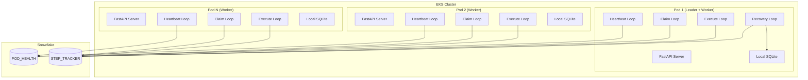

# FLEET-Q Documentation

**Federated Leaderless Execution & Elastic Tasking Queue**

Welcome to FLEET-Q, a brokerless distributed task queue designed specifically for EKS environments where pods cannot communicate directly with each other. FLEET-Q uses Snowflake as the sole coordination mechanism and implements a leaderless architecture with elected recovery coordination.

## What is FLEET-Q?

FLEET-Q solves the challenge of distributed task processing in constrained environments where:

- **Pods cannot communicate directly** with each other (no pod-to-pod networking)
- **Only Snowflake is available** as a shared coordination store
- **Tasks can be long-running** and require robust failure recovery
- **Elastic scaling** is needed as pods join and leave dynamically

## Key Features

### 🚀 Brokerless Architecture
No message broker required - uses Snowflake database transactions for coordination

### 🔒 Atomic Operations
Database-mediated coordination prevents race conditions and ensures data consistency

### 📈 Elastic Scaling
Pods can join and leave dynamically with automatic capacity management

### 👑 Leader-based Recovery
Automatic detection and recovery of orphaned tasks when pods fail

### 🔍 Comprehensive Observability
Structured logging and metrics for operational visibility

### 🐳 Container Optimized
Designed for EKS environments with proper health checks and graceful shutdown

## Quick Example

```python
from fleet_q import FleetQApplication

# Configure via environment variables
app = FleetQApplication()

# Submit a task
step_id = await app.submit_step({
    "type": "data_processing",
    "args": {"input_file": "data.csv"},
    "metadata": {"user": "alice"}
})

# Check status
status = await app.get_step_status(step_id)
print(f"Step {step_id} status: {status.status}")
```

## Architecture Overview



## Core Concepts

### Pods
Individual EKS containers running the FLEET-Q service. Each pod acts as a worker that can claim and execute tasks.

### Leader Election
One pod is automatically elected as the leader based on the eldest pod rule. The leader handles recovery operations while also functioning as a worker.

### Step Lifecycle
Tasks (called "steps") flow through states: `pending` → `claimed` → `completed`/`failed`. Failed steps can be retried automatically.

### Recovery System
When pods fail, the leader detects orphaned tasks and requeues them for processing by healthy pods.

## Getting Started

Ready to get started? Check out our guides:

- **[Installation](getting-started/installation.md)** - Install FLEET-Q in your environment
- **[Quick Start](getting-started/quick-start.md)** - Get up and running in minutes
- **[Configuration](getting-started/configuration.md)** - Configure FLEET-Q for your needs

## Need Help?

- **[API Reference](api/endpoints.md)** - Complete API documentation
- **[Operations Guide](operations/deployment.md)** - Production deployment guidance
- **[Troubleshooting](operations/troubleshooting.md)** - Common issues and solutions
- **[Examples](examples/basic-usage.md)** - Practical usage examples

## Why FLEET-Q?

Traditional task queues like Celery, RQ, and Dramatiq assume the presence of a message broker (Redis, RabbitMQ) and allow direct communication between workers. FLEET-Q is designed for environments where these assumptions don't hold.

Learn more about [why FLEET-Q exists](appendix/why-fleet-q.md) and how it [compares to alternatives](appendix/alternatives.md).

---

*FLEET-Q is open source and available under the MIT license. Contributions are welcome!*