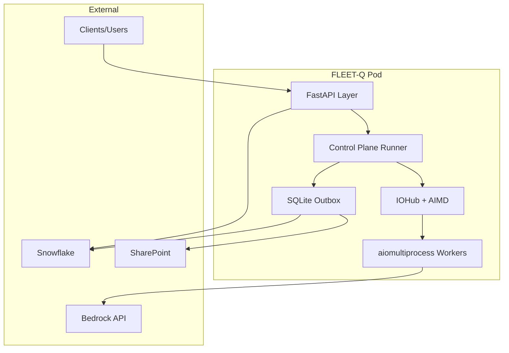
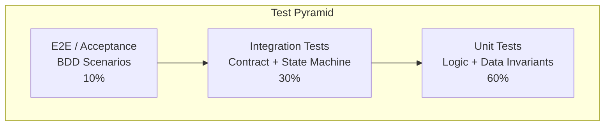
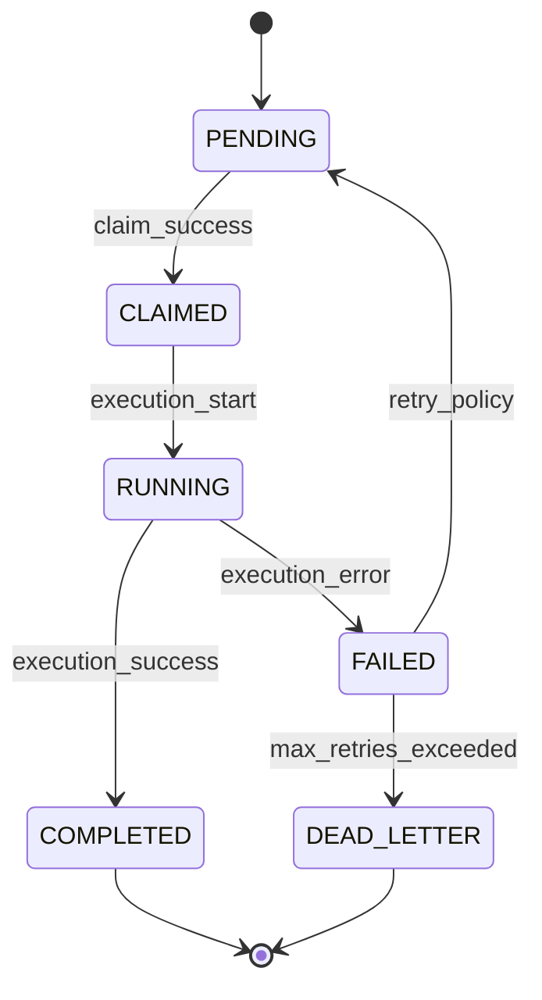
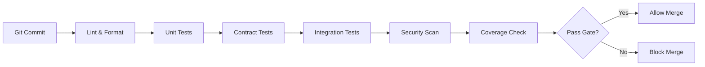
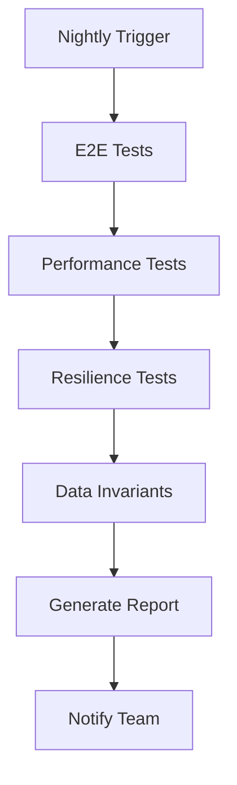

# FLEET-Q Testing Strategy

**Version:** 1.0  
**Last Updated:** February 8, 2026  
**Status:** Active  
**Owner:** FLEET-Q Engineering Team

---

## 🎯 Purpose & Scope

### Purpose

This document defines the comprehensive testing strategy for FLEET-Q, a brokerless distributed task queue system designed for EKS environments. It establishes what "fully tested" means for our system and provides the governance framework for audit-ready testing.

### Scope

**In Scope:**
- FLEET-Q core orchestration (claim, execute, recovery loops)
- In-Pod Execution Fabric (ZeroMQ, IOHub, AIMD, SQLite outbox, APScheduler)
- API layer (FastAPI endpoints)
- Snowflake integration (coordination, storage)
- State machine transitions and lifecycle management
- Data integrity and consistency
- Resilience and failure recovery
- Performance and scalability

**Out of Scope:**
- Third-party service internals (Snowflake, Bedrock, SharePoint)
- Kubernetes platform testing (handled by infrastructure team)
- Client SDK testing (separate repository)

---

## 🧩 System Decomposition

### High-Level Architecture



### Component Breakdown

| Component | Responsibility | Critical Paths |
|-----------|----------------|----------------|
| **FastAPI Layer** | HTTP API, request validation, background tasks | Submit, status, metrics endpoints |
| **Control Plane Runner** | Singleton orchestration, lease management | Lease acquisition, component initialization |
| **IOHub** | Permit control, AIMD throttling, message routing | Permit request/grant/deny, feedback processing |
| **SQLite Outbox** | Durable side effects, lease storage | Write intents, lease operations |
| **APScheduler** | Time-based triggers | Lease renewal, outbox flush, cleanup |
| **aiomultiprocess Workers** | Async execution | Bedrock calls, result processing |
| **Claim Service** | Task claiming from Snowflake | Claim loop, capacity management |
| **Recovery Service** | Orphaned task detection | Leader election, recovery loop |
| **Health Service** | Pod heartbeats | Liveness, readiness checks |

---

## 🧪 Test Types & Tools

### Testing Pyramid



### Test Type Matrix

| Test Type | What It Proves | Tools | Evidence Artifact | Frequency |
|-----------|---------------|-------|-------------------|-----------|
| **BDD Acceptance** | End-to-end business behavior | pytest-bdd, Gherkin | Scenario run logs + outputs | Per PR + Nightly |
| **Contract Tests** | API compatibility | OpenAPI validator, Pact | Contract report + schema hash | Per PR |
| **State Machine Tests** | Legal transitions, retry rules | Custom state verifier | Transition coverage report | Per PR |
| **Data Invariant Tests** | DB truth correctness | SQLite queries, assertions | Invariant check report | Per PR + Nightly |
| **Unit Tests** | Function-level logic | pytest | Code coverage report | Per commit |
| **Performance Tests** | Latency, throughput | locust, pytest-benchmark | Load report + dashboard | Weekly |
| **Resilience Tests** | Failure recovery | Chaos toolkit, custom | Chaos logs + DLQ evidence | Weekly |
| **Security Tests** | Vulnerabilities, secrets | bandit, safety, trivy | Security scan report | Per PR |

### Tooling Stack

```yaml
Testing Framework: pytest
BDD: pytest-bdd
Async: pytest-asyncio
Mocking: pytest-mock, responses
Contract: openapi-spec-validator
Load: locust
Chaos: custom resilience framework
Coverage: pytest-cov
CI/CD: GitHub Actions
```

---

## 📏 Coverage Model

### Risk-Based Coverage Framework

We define "fully tested" through six proof dimensions:

| Proof Type | What We Demonstrate | Target Coverage | Evidence |
|------------|---------------------|-----------------|----------|
| 🧑‍💼 **Behavior Proof** | Business flows work as intended | 100% critical paths | BDD scenario runs |
| 🔁 **State Proof** | Only legal transitions occur | 100% states + transitions | State coverage report |
| 📊 **Data Truth Proof** | DB consistency under retries/replays | 100% invariants | Invariant check logs |
| 🔌 **Integration Proof** | APIs and schemas won't drift | 100% endpoints | Contract reports |
| 🌪 **Resilience Proof** | System recovers from failures | 100% failure classes | Chaos run logs |
| 🧾 **Governance Proof** | Requirements traced to tests | 100% critical requirements | Traceability matrix |

### State Machine Coverage

FLEET-Q step lifecycle states:



**Coverage Requirements:**
- ✅ 100% coverage of all states
- ✅ 100% coverage of all legal transitions
- ✅ Explicit tests proving illegal transitions are blocked
- ✅ Replay idempotency verified for all states
- ✅ Retry exhaustion tested
- ✅ Terminal state finality proven

### Test Dimension Taxonomy

| Dimension | What We Test | Example Scenarios | Priority |
|-----------|--------------|-------------------|----------|
| 🔀 **Flow Correctness** | Ordering, branching, fan-in/out | Wrong route, missing stage | P0 |
| 🔁 **State Correctness** | Transitions, terminal states | Illegal jump, status regression | P0 |
| 📊 **Data Correctness** | Status updates, idempotency | Duplicate job, missing result | P0 |
| 🔌 **Integration** | API & schema compatibility | Breaking field, contract drift | P0 |
| ⏱ **Non-Functional** | Latency, throughput | Backlog growth, slow stage | P1 |
| 🧯 **Resilience** | Retries, replay, DLQ | Retries exhausted, replay dupe | P0 |
| 🧾 **Security/Governance** | Audit log, RBAC | Missing audit, PII leak | P0 |

---

## 🧯 Resilience Testing Plan

### Failure Modes to Test

| Failure Mode | What Can Go Wrong | Test Approach | Expected Behavior |
|--------------|-------------------|---------------|-------------------|
| **Pod Crash** | Mid-execution failure | Kill pod during execution | Task recovered by another pod |
| **Network Partition** | Snowflake unreachable | Block network in test | Retry with backoff, circuit breaker |
| **Bedrock Throttle** | 429 rate limit | Mock 429 response | AIMD decrease, retry with backoff |
| **SQLite Lock** | Concurrent write contention | Parallel writers | WAL mode handles, no corruption |
| **Lease Expiry** | Control plane fails | Stop lease renewal | New control plane elected |
| **Outbox Overflow** | Writes faster than flush | High volume load | HWM backpressure, no loss |
| **Infinite Retry** | Persistent failure | Max retries config | Move to DLQ after max |
| **Partial Failure** | Some steps succeed | Mixed success/failure | Correct status per step |

### Chaos Engineering Scenarios

1. **Pod Termination During Execution**
   - Kill random pod
   - Verify task is recovered
   - Verify no duplicate execution

2. **Database Connection Loss**
   - Disconnect from Snowflake
   - Verify retry behavior
   - Verify eventual consistency

3. **AIMD Stress Test**
   - Continuous 429 responses
   - Verify max_inflight decreases
   - Verify recovery when throttling stops

4. **Lease Contention**
   - Multiple pods compete for lease
   - Verify only one wins
   - Verify takeover on failure

---

## 🧾 Evidence & Traceability Plan

### Evidence Artifacts

For each test run, we capture:

```yaml
Evidence Pack:
  - Build Information:
      - version: "1.2.3"
      - git_sha: "abc123..."
      - timestamp: "2026-02-08T10:30:00Z"
      - environment: "staging"
  
  - Dataset Information:
      - dataset_ids: ["DS001", "DS002"]
      - synthetic_rules: "link to config"
  
  - Execution Results:
      - scenarios_executed: 40
      - scenarios_passed: 38
      - scenarios_failed: 2
      - coverage_percentage: 92.5
  
  - Artifacts:
      - logs: "s3://evidence/run-123/logs/"
      - metrics: "s3://evidence/run-123/metrics/"
      - traces: "s3://evidence/run-123/traces/"
      - screenshots: "s3://evidence/run-123/screenshots/"
  
  - Known Issues:
      - issue_ids: ["JIRA-456"]
      - waivers: ["WAIVER-789"]
      - approvals: ["Tech Lead", "QA Lead"]
```

### Traceability Requirements

Every critical requirement must be traceable:

```
Requirement → Risk → Test Scenario → Evidence → Sign-off
```

Example:
```
REQ-101 (Step lifecycle management)
  → RISK-03 (Status corruption)
    → FLEETQ-BDD-001 (Happy path lifecycle)
    → FLEETQ-STATE-005 (Illegal transition block)
    → DATA-INV-01 (Monotonic status)
      → Evidence: run_20260208_build123.md
        → Sign-off: Tech Lead ✓, QA Lead ✓
```

### Audit Readiness Checklist

- [ ] All P0 requirements have test coverage
- [ ] All test scenarios have evidence links
- [ ] Traceability matrix is up-to-date
- [ ] Risk register is reviewed quarterly
- [ ] Evidence retention policy is followed (90 days)
- [ ] Known issues are documented with waivers
- [ ] Sign-offs are captured for production releases

---

## 📊 Test Data Strategy

### Data Categories

| Category | Purpose | Source | Refresh Frequency |
|----------|---------|--------|-------------------|
| **Synthetic** | Predictable test cases | Generated | Per run |
| **Anonymized Production** | Real patterns, safe | Prod snapshot + masking | Weekly |
| **Edge Cases** | Boundary conditions | Manual | As needed |
| **Chaos Data** | Malformed, extreme | Generated | Per run |

### Test Data Requirements

```yaml
Test Data Sets:

  DS001_Happy_Path:
    description: "Standard successful flow"
    steps: 10
    payload_size: "1KB"
    expected_duration: "2s"
    expected_status: "COMPLETED"
  
  DS002_Large_Payload:
    description: "Maximum payload size"
    steps: 1
    payload_size: "10MB"
    expected_duration: "30s"
    expected_status: "COMPLETED"
  
  DS003_Retry_Exhaustion:
    description: "Max retries then DLQ"
    steps: 1
    inject_failures: 5
    expected_status: "DEAD_LETTER"
  
  DS004_Concurrent_Load:
    description: "100 simultaneous steps"
    steps: 100
    concurrency: 100
    expected_duration: "60s"
```

### Data Privacy & Security

- **PII Handling:** All production data must be anonymized
- **Secrets:** Use test credentials, rotate monthly
- **Data Retention:** Test data deleted after 7 days
- **Access Control:** Test data accessible only to eng/qa teams

---

## 🏗️ Test Environments

### Environment Matrix

| Environment | Purpose | Refresh | Data | Access |
|-------------|---------|---------|------|--------|
| **Local Dev** | Developer testing | On demand | Synthetic | Developer |
| **CI** | Automated PR checks | Per commit | Synthetic | CI/CD |
| **Integration** | Integration testing | Nightly | Synthetic + anonymized | QA Team |
| **Staging** | Pre-prod validation | Weekly | Anonymized prod | QA + Eng |
| **Canary** | Production subset | Continuous | Real prod | Ops team |
| **Production** | Live system | N/A | Real prod | Ops team |

### Environment Configuration

```yaml
Local Dev:
  snowflake: SQLite simulation
  bedrock: Mock responses
  sharepoint: Local filesystem
  pod_count: 1
  
CI:
  snowflake: Test account (isolated)
  bedrock: Mock with chaos injection
  sharepoint: Mock
  pod_count: 2
  
Integration:
  snowflake: Test account (shared)
  bedrock: Test account (rate limited)
  sharepoint: Test tenant
  pod_count: 4
  
Staging:
  snowflake: Staging account
  bedrock: Prod account (quota limited)
  sharepoint: Staging tenant
  pod_count: 10
```

---

## 📈 Metrics & Observability

### Test Success Metrics

| Metric | Target | Alert Threshold | Owner |
|--------|--------|-----------------|-------|
| **Test Pass Rate** | ≥ 98% | < 95% | QA Lead |
| **Code Coverage** | ≥ 85% | < 80% | Tech Lead |
| **State Coverage** | 100% | < 100% | Architect |
| **Contract Coverage** | 100% | < 100% | API Owner |
| **Flaky Test Rate** | ≤ 2% | > 5% | QA Lead |
| **Test Execution Time** | ≤ 15 min | > 20 min | Infra Team |

### Quality Gates

```yaml
PR Merge Requirements:
  - unit_tests: PASS
  - integration_tests: PASS
  - contract_tests: PASS
  - code_coverage: >= 85%
  - security_scan: PASS
  - no_critical_issues: true

Release Requirements:
  - all_pr_gates: PASS
  - e2e_tests: PASS
  - performance_tests: PASS
  - resilience_tests: PASS
  - traceability_complete: true
  - evidence_captured: true
  - sign_offs: ["Tech Lead", "QA Lead", "Product Owner"]
```

---

## 🔄 Test Execution Workflow

### CI/CD Pipeline



### Nightly Build



### Weekly Validation

- Full regression suite (all scenarios)
- Load testing (sustained load + spike)
- Chaos engineering (random failures)
- Evidence pack generation
- Traceability matrix update

---

## 🎓 Testing Principles

### Core Tenets

1. **Testing Is Documentation**
   - Tests explain system behavior
   - Scenarios are living requirements

2. **Fail Fast, Fail Clear**
   - Clear failure messages
   - Root cause should be obvious

3. **Test Isolation**
   - No test depends on another
   - Clean state before each test

4. **Deterministic Results**
   - Same input → same output
   - No flaky tests tolerated

5. **Audit-Ready By Default**
   - Evidence captured automatically
   - Traceability built-in

### Anti-Patterns to Avoid

❌ **Don't:**
- Write tests without evidence capture
- Skip negative test cases
- Test only happy paths
- Use production data without anonymization
- Ignore flaky tests
- Hard-code test data
- Skip documentation

✅ **Do:**
- Use BDD for acceptance criteria
- Test all state transitions
- Verify data invariants
- Capture comprehensive evidence
- Update traceability matrix
- Use synthetic test data
- Document test intentions

---

## 📚 References

- [Test Scenarios](scenarios/)
- [Risk Register](02_risk_register.md)
- [Traceability Matrix](03_traceability_matrix.md)
- [Evidence Packs](evidence/)
- [Test Data Catalog](04_test_data_strategy.md)
- [Environment Guide](05_test_environments.md)

---

## 📝 Revision History

| Version | Date | Author | Changes |
|---------|------|--------|---------|
| 1.0 | 2026-02-08 | FLEET-Q Team | Initial version |

---

## ✅ Approval

| Role | Name | Signature | Date |
|------|------|-----------|------|
| Tech Lead | ___________ | ___________ | _______ |
| QA Lead | ___________ | ___________ | _______ |
| Architect | ___________ | ___________ | _______ |
| Product Owner | ___________ | ___________ | _______ |
