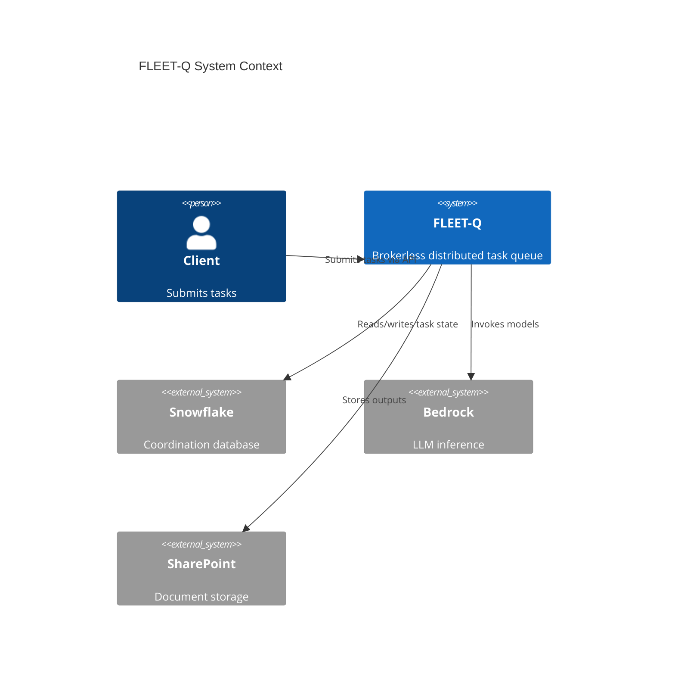
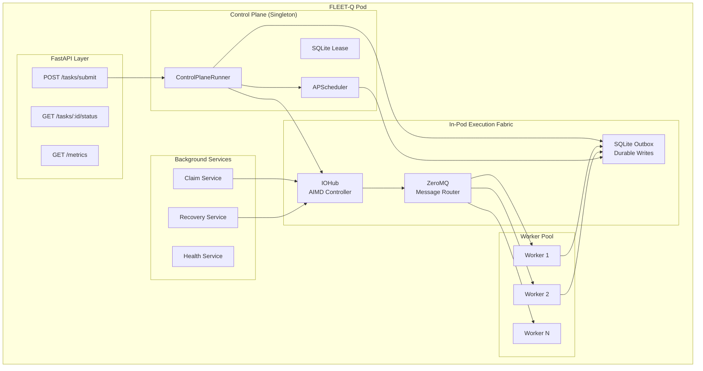
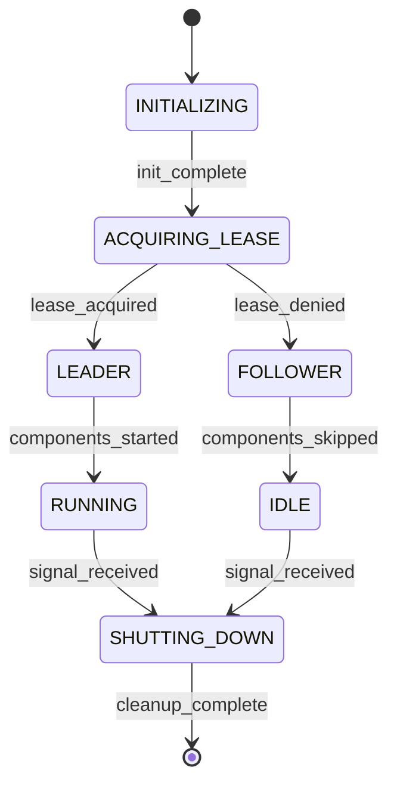
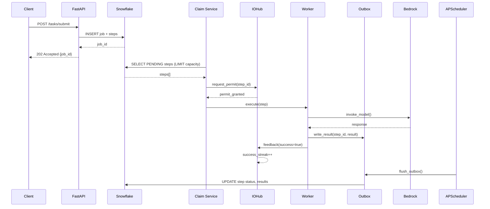
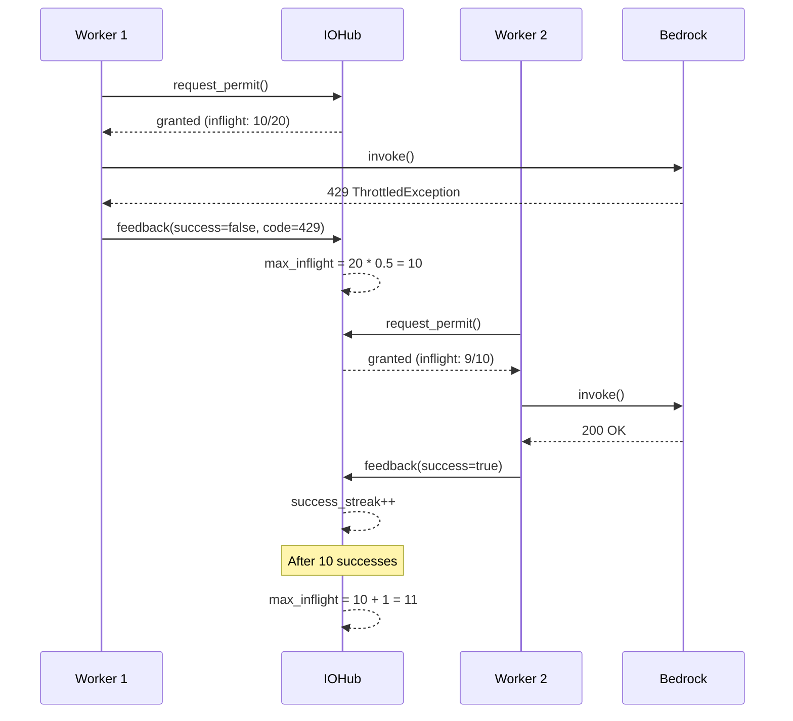
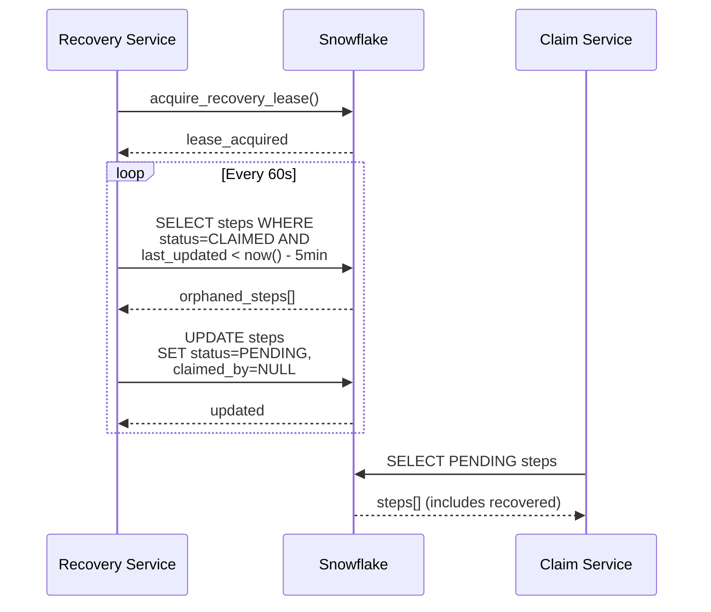

# FLEET-Q System Overview (Test Perspective)

**Version:** 1.0  
**Last Updated:** 2026-02-08  
**Purpose:** Component breakdown for testing decomposition

---

## 🏗️ Architecture Overview

### System Context



### Pod Architecture



---

## 🧩 Component Catalog

### 1. FastAPI Layer

**Purpose:** HTTP API for task submission and monitoring

| Endpoint | Method | Purpose | Test Priority |
|----------|--------|---------|---------------|
| `/tasks/submit` | POST | Submit new job/steps | P0 |
| `/tasks/{id}/status` | GET | Query task status | P0 |
| `/metrics` | GET | Prometheus metrics | P1 |
| `/health/liveness` | GET | Pod liveness | P0 |
| `/health/readiness` | GET | Pod readiness | P0 |
| `/` | GET | Info endpoint | P2 |

**Critical Flows:**
- Request validation (schema, auth)
- Background task submission
- Status query (from Snowflake)
- Error handling (400, 500)

**Test Focus:**
- Contract testing (OpenAPI schema)
- Input validation
- Error responses
- Rate limiting

---

### 2. Control Plane Runner

**Purpose:** Singleton orchestrator per pod

**Responsibilities:**
- SQLite lease acquisition/renewal
- Component initialization (IOHub, Outbox, APScheduler)
- Graceful shutdown
- Signal handling (SIGINT/SIGTERM)

**State Machine:**



**Test Focus:**
- Lease election (only one winner)
- Leader failover
- Component startup order
- Graceful shutdown
- Signal handling

---

### 3. IOHub (AIMD Controller)

**Purpose:** Central permit coordinator with adaptive throttling

**Components:**
- **IOHub:** ROUTER socket, AIMD brain, permit arbiter
- **IOHubClient:** DEALER socket, worker-side client

**AIMD Algorithm:**

```python
# Permit Control Logic
if response == 429:
    max_inflight *= 0.5  # Multiplicative decrease
elif success_streak >= 10:
    max_inflight += 1    # Additive increase
```

**Message Types:**

| Message | Direction | Purpose |
|---------|-----------|---------|
| PERMIT_REQUEST | Worker → IOHub | Request execution permit |
| PERMIT_GRANTED | IOHub → Worker | Permit approved |
| PERMIT_DENIED | IOHub → Worker | Permit denied (backpressure) |
| EXECUTION_FEEDBACK | Worker → IOHub | Report 429 or success |
| OUTBOX_WRITE | Worker → IOHub | Store durable intent |
| PRESSURE_STATUS | IOHub → Worker | Current AIMD state |

**Test Focus:**
- Permit request/grant/deny flow
- AIMD decrease on 429
- AIMD increase on success streak
- Backpressure handling
- Pressure state persistence

---

### 4. SQLite Outbox

**Purpose:** Durable side effects storage

**Schema:**

```sql
-- Outbox tables
CREATE TABLE outbox_step_updates (
    id INTEGER PRIMARY KEY,
    step_id TEXT,
    status TEXT,
    created_at TEXT,
    flushed INTEGER DEFAULT 0
);

CREATE TABLE outbox_results (
    id INTEGER PRIMARY KEY,
    step_id TEXT,
    result_data TEXT,
    created_at TEXT,
    flushed INTEGER DEFAULT 0
);

CREATE TABLE outbox_sharepoint_ops (
    id INTEGER PRIMARY KEY,
    operation TEXT,
    file_path TEXT,
    content TEXT,
    created_at TEXT,
    flushed INTEGER DEFAULT 0
);

-- Control plane coordination
CREATE TABLE control_plane_lease (
    id INTEGER PRIMARY KEY CHECK (id = 1),
    holder_pid INTEGER,
    holder_hostname TEXT,
    acquired_at REAL,
    expires_at REAL,
    renewal_count INTEGER DEFAULT 0
);

-- AIMD pressure state
CREATE TABLE pressure_state (
    id INTEGER PRIMARY KEY CHECK (id = 1),
    max_inflight INTEGER,
    current_inflight INTEGER,
    success_streak INTEGER,
    last_throttle_at REAL,
    last_increase_at REAL
);
```

**Test Focus:**
- Write intent durability
- Flush to Snowflake
- Lease operations (acquire, renew, release)
- Concurrent write handling (WAL mode)
- Cleanup of old records

---

### 5. APScheduler Integration

**Purpose:** Time-based triggers with lease protection

**Default Jobs:**

| Job | Schedule | Purpose | Lease Required |
|-----|----------|---------|----------------|
| `lease_renewal` | Every 5s | Renew control plane lease | Yes |
| `outbox_flush` | Every 10s | Flush pending outbox writes | Yes |
| `outbox_cleanup` | Every 1h | Delete old flushed records | Yes |
| `pressure_report` | Every 30s | Log AIMD state | Yes |

**Decorator:**

```python
@lease_required(outbox, "job_name")
async def my_job():
    """Only runs if pod holds lease"""
    pass
```

**Test Focus:**
- Jobs run only in leader
- Lease check before execution
- Job rescheduling after leader change
- Error handling in jobs
- Graceful shutdown

---

### 6. ZeroMQ Messaging

**Purpose:** Fast in-pod communication

**Patterns:**

| Pattern | Sockets | Use Case |
|---------|---------|----------|
| ROUTER/DEALER | IOHub ↔ Workers | Request/reply with routing |
| PUSH/PULL | Producer → Consumers | Pipeline distribution |

**Message Structure:**

```python
@dataclass
class ZMQMessage:
    message_type: MessageType
    sender_id: str
    payload: Dict[str, Any]
    timestamp: float
    request_id: Optional[str] = None
```

**Test Focus:**
- Message routing
- HWM (high water mark) backpressure
- Context management (singleton per process)
- Graceful shutdown
- Error handling (socket errors)

---

### 7. aiomultiprocess Workers

**Purpose:** Async parallel execution

**Worker Function:**

```python
async def bedrock_worker(task_id: str, iohub_address: str):
    """Worker function with IOHub integration"""
    client = IOHubClient(iohub_address, f"worker-{os.getpid()}")
    
    # Request permit
    permitted = await client.request_permit(task_id)
    if not permitted:
        return {"status": "DENIED"}
    
    try:
        # Execute Bedrock call
        response = await bedrock_client.invoke(...)
        
        # Report success
        await client.send_feedback(task_id, success=True)
        
        # Write result to outbox
        await client.write_to_outbox(...)
        
        return {"status": "COMPLETED"}
    except Throttled:
        await client.send_feedback(task_id, success=False, error_code=429)
        return {"status": "THROTTLED"}
```

**Test Focus:**
- Worker pool initialization
- Task distribution
- Permit request flow
- Feedback reporting
- Result capture

---

### 8. Claim Service

**Purpose:** Claim PENDING tasks from Snowflake

**Algorithm:**

```python
async def claim_loop():
    while running:
        # Check capacity
        capacity = await get_available_capacity()
        if capacity <= 0:
            await asyncio.sleep(5)
            continue
        
        # Claim batch
        claimed = await snowflake.claim_steps(
            status='PENDING',
            limit=capacity,
            pod_id=POD_ID
        )
        
        # Submit to worker pool
        for step in claimed:
            await execute_with_iohub(step)
```

**Test Focus:**
- Capacity calculation
- Claim query correctness
- Claim uniqueness (no double claims)
- Backlog handling
- Error recovery

---

### 9. Recovery Service

**Purpose:** Detect and recover orphaned tasks

**Algorithm:**

```python
async def recovery_loop():
    # Leader election
    if not await acquire_recovery_lease():
        return
    
    while holding_lease:
        # Find orphaned steps
        orphaned = await snowflake.find_orphaned_steps(
            timeout=300  # 5 minutes
        )
        
        # Reset to PENDING
        for step in orphaned:
            await snowflake.update_step(
                step_id=step.id,
                status='PENDING',
                claimed_by=None
            )
        
        await asyncio.sleep(60)
```

**Test Focus:**
- Leader election
- Orphan detection logic
- Recovery correctness
- Lease renewal
- Graceful shutdown

---

### 10. Health Service

**Purpose:** Pod heartbeat and health checks

**Heartbeat:**

```python
async def heartbeat_loop():
    while running:
        await snowflake.upsert_heartbeat(
            pod_id=POD_ID,
            hostname=HOSTNAME,
            last_seen=now(),
            status='HEALTHY'
        )
        await asyncio.sleep(10)
```

**Health Checks:**

```python
def liveness_check():
    """Can pod continue running?"""
    return {
        "status": "healthy" if main_loop_running else "unhealthy"
    }

def readiness_check():
    """Can pod accept traffic?"""
    return {
        "status": "ready" if snowflake_connected and lease_acquired else "not_ready"
    }
```

**Test Focus:**
- Heartbeat persistence
- Liveness logic
- Readiness logic
- Dead pod detection
- Health endpoint responses

---

## 🔄 Data Flow Diagrams

### Task Submission Flow



### AIMD Throttle Flow



### Recovery Flow



---

## 🧪 Test Decomposition Strategy

### Testing by Component

| Component | Unit Tests | Integration Tests | E2E Tests |
|-----------|-----------|-------------------|-----------|
| FastAPI | Schema validation, error handling | API contract, endpoint flow | Full submission flow |
| Control Plane | Lease logic, init order | Lease election, failover | Leader switch during load |
| IOHub | AIMD math, permit logic | ZeroMQ routing, feedback | Throttle adaptation |
| Outbox | CRUD operations, cleanup | Flush to Snowflake | Durability under crash |
| APScheduler | Job registration, decorator | Lease-protected execution | Leader job migration |
| ZeroMQ | Message serialization | Socket communication | HWM backpressure |
| Workers | Task execution logic | IOHub integration | End-to-end task |
| Claim Service | Capacity calc, claim query | Snowflake interaction | Backlog processing |
| Recovery | Orphan detection logic | Lease election, reset | Orphan recovery |
| Health | Heartbeat logic, health checks | Snowflake heartbeat | Pod failure detection |

### Testing by Flow

| Flow | Components Involved | Test Scenarios |
|------|---------------------|----------------|
| **Task Submission** | API → SF → Claim → IOHub → Worker → Outbox | Happy path, validation errors, backlog |
| **AIMD Adaptation** | IOHub → Workers → Bedrock | 429 decrease, success increase, steady state |
| **Outbox Flush** | Outbox → APScheduler → SF | Scheduled flush, retry, cleanup |
| **Leader Election** | Control Plane → SQLite Lease | Single leader, failover, lease expiry |
| **Task Recovery** | Recovery → SF | Orphan detection, reset, re-claim |
| **Health Monitoring** | Health → SF | Heartbeat, liveness, readiness, dead pod |

---

## 📏 Testability Design

### Built-In Testability Features

1. **Configurable Dependencies**
   ```python
   # Inject mocks for testing
   iohub = IOHub(
       outbox=mock_outbox,
       zmq_address="inproc://test",
       aimd_config=test_config
   )
   ```

2. **Observable State**
   ```python
   # Query internal state for assertions
   status = await iohub.get_status()
   assert status['max_inflight'] == 10
   assert status['success_streak'] == 5
   ```

3. **Controllable Time**
   ```python
   # Time-travel for scheduler testing
   scheduler.add_job(
       my_job,
       trigger='interval',
       seconds=10,
       next_run_time=datetime(2026, 2, 8, 10, 0, 0)
   )
   ```

4. **Failure Injection**
   ```python
   # Chaos testing hooks
   if chaos_mode and random.random() < failure_rate:
       raise NetworkError("Injected failure")
   ```

5. **Evidence Capture**
   ```python
   # Automatic evidence collection
   @capture_evidence
   async def test_scenario():
       # Logs, metrics, traces captured automatically
       pass
   ```

---

## 🎯 Critical Path Analysis

### P0 Flows (Must Test)

1. ✅ **Task Submission → Execution → Completion**
   - Components: API, SF, Claim, IOHub, Worker, Outbox
   - Risk: Core functionality

2. ✅ **AIMD Throttle Adaptation**
   - Components: IOHub, Worker, Bedrock
   - Risk: Bedrock cost/limits

3. ✅ **Leader Election & Failover**
   - Components: Control Plane, SQLite Lease
   - Risk: Duplicate work, data corruption

4. ✅ **Orphan Recovery**
   - Components: Recovery Service, Snowflake
   - Risk: Stuck tasks

5. ✅ **Outbox Durability**
   - Components: Outbox, APScheduler, Snowflake
   - Risk: Data loss

### P1 Flows (Should Test)

6. ⚠️ **Backpressure Handling**
   - Components: IOHub, ZeroMQ HWM
   - Risk: Memory overflow

7. ⚠️ **Graceful Shutdown**
   - Components: Control Plane, all services
   - Risk: In-flight task loss

8. ⚠️ **Health Monitoring**
   - Components: Health Service, K8s
   - Risk: Pod churn

### P2 Flows (Nice to Test)

9. 💡 **Metrics Export**
   - Components: All (via observability)
   - Risk: Low visibility

10. 💡 **Configuration Hot Reload**
    - Components: Config management
    - Risk: Restart required

---

## 📚 Related Documents

- [Test Strategy](00_test_strategy.md) - Overall testing approach
- [Risk Register](02_risk_register.md) - Risk-based testing priorities
- [Test Scenarios](scenarios/) - Concrete test cases
- [In-Pod Fabric Guide](../IN_POD_FABRIC_GUIDE.md) - Detailed architecture

---

**Next:** Proceed to [Risk Register](02_risk_register.md) for risk-based test prioritization.
