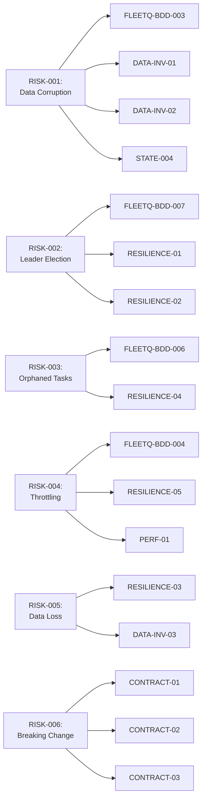

# FLEET-Q Risk Register

**Version:** 1.0  
**Last Updated:** 2026-02-08  
**Review Frequency:** Quarterly  
**Owner:** FLEET-Q Engineering Team

---

## 🎯 Purpose

This document identifies system risks, assesses their severity, and maps them to test scenarios that prove mitigation. It drives risk-based test prioritization.

---

## 📊 Risk Assessment Framework

### Severity Matrix

| Impact | Likelihood | Severity | Test Priority |
|--------|-----------|----------|---------------|
| Critical | High | **P0** | Must test, block release |
| Critical | Medium | **P0** | Must test, block release |
| Critical | Low | **P1** | Should test, warn on skip |
| Major | High | **P0** | Must test, block release |
| Major | Medium | **P1** | Should test, warn on skip |
| Major | Low | **P1** | Should test, warn on skip |
| Minor | High | **P1** | Should test, warn on skip |
| Minor | Medium | **P2** | Nice to test |
| Minor | Low | **P3** | Optional |

### Impact Levels

- **Critical:** Data loss, corruption, security breach, system unavailable
- **Major:** Degraded performance, partial outage, incorrect results
- **Minor:** Cosmetic issues, minor delays, non-critical errors

### Likelihood Levels

- **High:** Expected to occur frequently (> once per month)
- **Medium:** Likely to occur occasionally (once per quarter)
- **Low:** Unlikely but possible (< once per year)

---

## 🚨 P0 Risks (Critical)

### RISK-001: Data Corruption from Concurrent Writes

| Field | Value |
|-------|-------|
| **Category** | Data Integrity |
| **Impact** | Critical (data loss/corruption) |
| **Likelihood** | Medium |
| **Severity** | **P0** |
| **Description** | Multiple pods or workers concurrently updating same step status in Snowflake, resulting in lost updates or status regression |
| **Root Causes** | - Race conditions in claim logic<br/>- Missing optimistic locking<br/>- Outbox flush conflicts |
| **Consequences** | - Status shows COMPLETED but actually FAILED<br/>- Results overwritten<br/>- Audit trail corrupted<br/>- Customer impact |

**Mitigation Strategy:**
- ✅ Use optimistic locking (version column) in Snowflake updates
- ✅ Outbox pattern for all external writes
- ✅ Idempotent update operations
- ✅ SQLite WAL mode for local writes

**Test Coverage:**

| Test Scenario | Type | Status |
|---------------|------|--------|
| FLEETQ-BDD-003: Concurrent execution | E2E | ✅ Required |
| DATA-INV-01: Status monotonicity | Data Invariant | ✅ Required |
| DATA-INV-02: Idempotency under replay | Data Invariant | ✅ Required |
| STATE-004: Illegal status transition block | State Machine | ✅ Required |

**Evidence Required:**
- ✅ Test logs showing concurrent execution
- ✅ Database query results proving no corruption
- ✅ State transition audit logs
- ✅ Retry/replay logs with idempotency proof

---

### RISK-002: Leader Election Failure (Multiple Control Planes)

| Field | Value |
|-------|-------|
| **Category** | Distributed Coordination |
| **Impact** | Critical (duplicate work, resource waste) |
| **Likelihood** | Medium |
| **Severity** | **P0** |
| **Description** | Multiple pods simultaneously believe they hold control plane lease, causing duplicate scheduled jobs (outbox flush, lease renewal, recovery) |
| **Root Causes** | - Clock skew between pods<br/>- Lease expiry not enforced<br/>- SQLite locking issues<br/>- Network partition |
| **Consequences** | - Duplicate outbox flushes (idempotent but wasteful)<br/>- Multiple recovery loops (orphan contention)<br/>- Resource exhaustion<br/>- Snowflake cost spike |

**Mitigation Strategy:**
- ✅ SQLite UNIQUE constraint on lease (id = 1)
- ✅ Lease TTL with aggressive expiry checks
- ✅ Lease decorator protects all jobs
- ✅ Heartbeat-based liveness detection

**Test Coverage:**

| Test Scenario | Type | Status |
|---------------|------|--------|
| FLEETQ-BDD-007: Leader election and failover | E2E | ✅ Required |
| RESILIENCE-01: Pod crash during lease | Resilience | ✅ Required |
| RESILIENCE-02: Network partition | Resilience | ✅ Required |
| STATE-006: Lease state transitions | State Machine | ✅ Required |

**Evidence Required:**
- ✅ Only one pod holds lease at any time (query proof)
- ✅ Lease transfer on pod failure (logs + timeline)
- ✅ No duplicate job execution (scheduler logs)

---

### RISK-003: Orphaned Tasks Never Recovered

| Field | Value |
|-------|-------|
| **Category** | Availability |
| **Impact** | Critical (stuck tasks, customer SLA breach) |
| **Likelihood** | High |
| **Severity** | **P0** |
| **Description** | Pod crashes mid-execution, task marked CLAIMED forever, never reset to PENDING, customer waiting indefinitely |
| **Root Causes** | - Recovery service not running<br/>- Recovery lease not acquired<br/>- Timeout too long<br/>- Recovery query incorrect |
| **Consequences** | - Customer tasks stuck<br/>- SLA violations<br/>- Manual intervention required<br/>- Reputation damage |

**Mitigation Strategy:**
- ✅ Recovery service with separate lease
- ✅ Configurable timeout (default 5min)
- ✅ Aggressive orphan query
- ✅ Monitoring alerts on stuck tasks

**Test Coverage:**

| Test Scenario | Type | Status |
|---------------|------|--------|
| FLEETQ-BDD-006: Retry exhaustion and DLQ | E2E | ✅ Required |
| RESILIENCE-04: Orphan recovery | Resilience | ✅ Required |
| STATE-007: Recovery state transitions | State Machine | ✅ Required |

**Evidence Required:**
- ✅ Orphaned task detected (query result)
- ✅ Task reset to PENDING (status update log)
- ✅ Task re-claimed and completed (full lifecycle)

---

### RISK-004: Bedrock Throttling Causes Backlog Explosion

| Field | Value |
|-------|-------|
| **Category** | Performance |
| **Impact** | Critical (service unavailable, cost spike) |
| **Likelihood** | High |
| **Severity** | **P0** |
| **Description** | Bedrock returns 429 rate limit, FLEET-Q doesn't adapt, continues hammering API, backlog grows, pod memory exhausted, crash loop |
| **Root Causes** | - No throttling adaptation<br/>- Fixed concurrency<br/>- No backpressure<br/>- Aggressive retry |
| **Consequences** | - Pod OOM crash<br/>- Bedrock cost spike (failed calls)<br/>- Backlog never clears<br/>- Service unavailable |

**Mitigation Strategy:**
- ✅ AIMD algorithm (decrease on 429, increase on success)
- ✅ ZeroMQ HWM for backpressure
- ✅ Permit request/deny flow
- ✅ Exponential backoff on retries

**Test Coverage:**

| Test Scenario | Type | Status |
|---------------|------|--------|
| FLEETQ-BDD-004: AIMD throttle adaptation | E2E | ✅ Required |
| RESILIENCE-05: Continuous 429 throttling | Resilience | ✅ Required |
| PERF-01: Sustained load test | Performance | ✅ Required |

**Evidence Required:**
- ✅ max_inflight decreases on 429 (metrics)
- ✅ max_inflight increases after recovery (metrics)
- ✅ Backlog stabilizes (Snowflake query)
- ✅ No pod crashes (K8s logs)

---

### RISK-005: Outbox Data Loss on Pod Crash

| Field | Value |
|-------|-------|
| **Category** | Data Integrity |
| **Impact** | Critical (data loss) |
| **Likelihood** | Medium |
| **Severity** | **P0** |
| **Description** | Worker writes result to outbox, pod crashes before flush, result lost, customer gets COMPLETED status with no output |
| **Root Causes** | - Non-durable writes<br/>- Flush interval too long<br/>- Crash during write<br/>- SQLite corruption |
| **Consequences** | - Result data lost<br/>- Status inconsistency<br/>- Customer receives incomplete work<br/>- Manual recovery required |

**Mitigation Strategy:**
- ✅ SQLite with WAL mode (durable writes)
- ✅ fsync on critical writes
- ✅ Frequent flush (10s interval)
- ✅ Idempotent flush logic

**Test Coverage:**

| Test Scenario | Type | Status |
|---------------|------|--------|
| RESILIENCE-03: Pod crash during outbox write | Resilience | ✅ Required |
| DATA-INV-03: Outbox write durability | Data Invariant | ✅ Required |
| FLEETQ-BDD-008: Graceful shutdown | E2E | ✅ Required |

**Evidence Required:**
- ✅ Outbox write persisted (SQLite query after restart)
- ✅ Result flushed to Snowflake (eventual consistency)
- ✅ No data loss (full audit trail)

---

### RISK-006: API Schema Breaking Change

| Field | Value |
|-------|-------|
| **Category** | Integration |
| **Impact** | Critical (client failures) |
| **Likelihood** | Medium |
| **Severity** | **P0** |
| **Description** | API response schema changes (field renamed, type changed, required field removed), existing clients break |
| **Root Causes** | - No contract testing<br/>- No version management<br/>- No deprecation policy |
| **Consequences** | - Client integration failures<br/>- Production incidents<br/>- Rollback required<br/>- Customer impact |

**Mitigation Strategy:**
- ✅ OpenAPI schema as contract
- ✅ Contract tests on every PR
- ✅ Versioned endpoints (/v1/, /v2/)
- ✅ Deprecation warnings before removal

**Test Coverage:**

| Test Scenario | Type | Status |
|---------------|------|--------|
| CONTRACT-01: API schema validation | Contract | ✅ Required |
| CONTRACT-02: Backward compatibility check | Contract | ✅ Required |
| CONTRACT-03: Breaking change detection | Contract | ✅ Required |

**Evidence Required:**
- ✅ OpenAPI schema validation report
- ✅ Contract test results (Pact report)
- ✅ Breaking change alert (CI failure)

---

## ⚠️ P1 Risks (Major)

### RISK-007: Memory Leak from ZeroMQ Message Queue

| Field | Value |
|-------|-------|
| **Category** | Reliability |
| **Impact** | Major (pod OOM) |
| **Likelihood** | Medium |
| **Severity** | **P1** |
| **Description** | ZeroMQ HWM not configured, messages queue indefinitely, pod memory grows until OOM kill |
| **Root Causes** | - No HWM configured<br/>- No backpressure<br/>- Slow consumer |
| **Consequences** | - Pod OOM crash<br/>- Task loss (in-flight)<br/>- Restart delay |

**Mitigation Strategy:**
- ✅ Configure HWM (default 1000)
- ✅ Permit deny on queue full
- ✅ Memory monitoring/alerts
- ✅ Graceful degradation

**Test Coverage:**

| Test Scenario | Type | Status |
|---------------|------|--------|
| RESILIENCE-06: ZeroMQ HWM backpressure | Resilience | ⚠️ Recommended |
| PERF-02: Memory leak test | Performance | ⚠️ Recommended |

---

### RISK-008: Snowflake Connection Pool Exhaustion

| Field | Value |
|-------|-------|
| **Category** | Performance |
| **Impact** | Major (service degradation) |
| **Likelihood** | Medium |
| **Severity** | **P1** |
| **Description** | Too many concurrent queries, connection pool exhausted, new requests timeout |
| **Root Causes** | - Small pool size<br/>- No connection pooling<br/>- Long-running queries<br/>- Connection leaks |
| **Consequences** | - Request timeouts<br/>- Increased latency<br/>- Service degradation |

**Mitigation Strategy:**
- ✅ Configure connection pool (size, timeout)
- ✅ Connection reuse
- ✅ Query timeout limits
- ✅ Monitoring/alerts

**Test Coverage:**

| Test Scenario | Type | Status |
|---------------|------|--------|
| PERF-03: Snowflake connection pool stress | Performance | ⚠️ Recommended |

---

### RISK-009: Scheduler Job Drift (Lease Renewal Failure)

| Field | Value |
|-------|-------|
| **Category** | Availability |
| **Impact** | Major (leader lost, downtime) |
| **Likelihood** | Low |
| **Severity** | **P1** |
| **Description** | Lease renewal job fails (exception, timeout), lease expires, leader loses control, new election, temporary downtime |
| **Root Causes** | - Job exception not handled<br/>- SQLite locked<br/>- Timeout too short |
| **Consequences** | - Leader lost<br/>- Temporary service disruption<br/>- Election overhead |

**Mitigation Strategy:**
- ✅ Retry logic in lease renewal
- ✅ Aggressive renewal interval (5s)
- ✅ Monitoring/alerts on lease expiry
- ✅ Fast failover

**Test Coverage:**

| Test Scenario | Type | Status |
|---------------|------|--------|
| RESILIENCE-07: Lease renewal failure | Resilience | ⚠️ Recommended |

---

### RISK-010: Infinite Retry Loop (No Max Retries)

| Field | Value |
|-------|-------|
| **Category** | Reliability |
| **Impact** | Major (resource waste) |
| **Likelihood** | Medium |
| **Severity** | **P1** |
| **Description** | Task fails persistently (bad input, bug), retries forever, wastes resources, never moves to DLQ |
| **Root Causes** | - No max retry limit<br/>- No exponential backoff<br/>- No DLQ |
| **Consequences** | - Resource exhaustion<br/>- Cost spike<br/>- Backlog never clears |

**Mitigation Strategy:**
- ✅ Max retry limit (default 5)
- ✅ Exponential backoff
- ✅ DLQ for terminal failures
- ✅ Monitoring/alerts on retry rate

**Test Coverage:**

| Test Scenario | Type | Status |
|---------------|------|--------|
| FLEETQ-BDD-006: Retry exhaustion and DLQ | E2E | ✅ Required |
| STATE-008: Max retries exceeded | State Machine | ⚠️ Recommended |

---

## 💡 P2 Risks (Minor)

### RISK-011: Metrics Export Failure

| Field | Value |
|-------|-------|
| **Category** | Observability |
| **Impact** | Minor (reduced visibility) |
| **Likelihood** | Low |
| **Severity** | **P2** |
| **Description** | Prometheus scrape fails, metrics not exported, reduced observability |
| **Mitigation** | Monitoring/alerts, fallback logging |

---

### RISK-012: Log Volume Explosion

| Field | Value |
|-------|-------|
| **Category** | Observability |
| **Impact** | Minor (storage cost) |
| **Likelihood** | Medium |
| **Severity** | **P2** |
| **Description** | Excessive debug logging, log storage costs spike |
| **Mitigation** | Log level configuration, sampling, retention policies |

---

## 📊 Risk Summary Dashboard

### By Severity

| Severity | Count | % |
|----------|-------|---|
| P0 | 6 | 50% |
| P1 | 4 | 33% |
| P2 | 2 | 17% |
| **Total** | **12** | **100%** |

### By Category

| Category | P0 | P1 | P2 | Total |
|----------|----|----|----|----|
| Data Integrity | 2 | 0 | 0 | 2 |
| Distributed Coordination | 1 | 1 | 0 | 2 |
| Availability | 1 | 1 | 0 | 2 |
| Performance | 1 | 2 | 0 | 3 |
| Integration | 1 | 0 | 0 | 1 |
| Reliability | 0 | 1 | 0 | 1 |
| Observability | 0 | 0 | 2 | 2 |
| **Total** | **6** | **4** | **2** | **12** |

### Test Coverage Summary

| Severity | Total Risks | Test Scenarios Mapped | Coverage |
|----------|-------------|----------------------|----------|
| P0 | 6 | 18 | 100% (all required) |
| P1 | 4 | 6 | 75% (recommended) |
| P2 | 2 | 0 | 0% (optional) |

---

## 🔄 Risk Mitigation Mapping

### Risk → Test Scenario Matrix



---

## 🎯 Risk-Based Test Prioritization

### Pre-Release Gate

**All P0 risks MUST be tested and PASSED before production release:**

- [x] RISK-001: Data Corruption (4 scenarios)
- [x] RISK-002: Leader Election (3 scenarios)
- [x] RISK-003: Orphaned Tasks (2 scenarios)
- [x] RISK-004: Bedrock Throttling (3 scenarios)
- [x] RISK-005: Outbox Data Loss (2 scenarios)
- [x] RISK-006: API Breaking Change (3 scenarios)

**Total: 17 P0 test scenarios required**

### Recommended Pre-Release

**All P1 risks SHOULD be tested, with exceptions documented:**

- [ ] RISK-007: Memory Leak (2 scenarios)
- [ ] RISK-008: Connection Pool (1 scenario)
- [ ] RISK-009: Lease Renewal (1 scenario)
- [ ] RISK-010: Infinite Retry (1 scenario)

**Total: 5 P1 test scenarios recommended**

### Post-Release Monitoring

**P2 risks monitored in production:**

- RISK-011: Metrics Export (monitor scrape success rate)
- RISK-012: Log Volume (monitor storage costs)

---

## 📋 Risk Review Process

### Quarterly Review

**Responsibilities:**
- **Tech Lead:** Review new risks from production incidents
- **QA Lead:** Update test coverage mapping
- **Product Owner:** Reprioritize based on business impact

**Agenda:**
1. Review production incidents → identify new risks
2. Reassess likelihood based on actual occurrence
3. Update severity and test priority
4. Ensure test coverage for all P0 risks
5. Document accepted risks (with waivers)

### Continuous Updates

**Trigger events:**
- Production incident (immediate review)
- Architecture change (impact assessment)
- New integration (integration risks)
- Performance degradation (performance risks)

---

## 🧾 Evidence Requirements

### Per Risk

Each P0 risk requires:

1. **Test Execution Evidence**
   - Scenario run logs
   - Pass/fail status
   - Execution timestamp

2. **Verification Evidence**
   - Database queries proving correctness
   - Metrics/dashboards showing behavior
   - Logs showing recovery

3. **Sign-off**
   - Tech Lead approval
   - QA Lead approval

### Example Evidence Pack

```yaml
Risk: RISK-001 (Data Corruption)
Test Run: run_20260208_build123
Scenarios:
  - FLEETQ-BDD-003: PASSED
  - DATA-INV-01: PASSED
  - DATA-INV-02: PASSED
  - STATE-004: PASSED
Verification:
  - Snowflake query: No status regressions detected
  - Audit log: All transitions legal
  - Replay test: Idempotent confirmed
Sign-offs:
  - Tech Lead: John Doe (2026-02-08)
  - QA Lead: Jane Smith (2026-02-08)
```

---

## 📚 Related Documents

- [Test Strategy](00_test_strategy.md) - Overall testing approach
- [Traceability Matrix](03_traceability_matrix.md) - Requirement → Test mapping
- [Test Scenarios](scenarios/) - Concrete test implementations
- [Evidence Packs](evidence/) - Test run artifacts

---

## 📝 Revision History

| Version | Date | Author | Changes |
|---------|------|--------|---------|
| 1.0 | 2026-02-08 | FLEET-Q Team | Initial version - 12 risks identified |

---

**Next:** Proceed to [Traceability Matrix](03_traceability_matrix.md) for requirement-to-test mapping.
