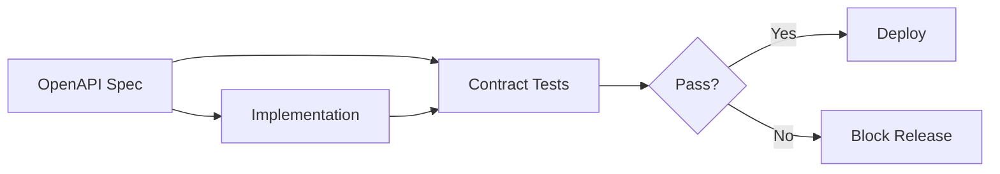
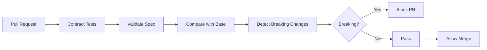

# FLEET-Q Contract Test Scenarios

**Version:** 1.0  
**Last Updated:** 2026-02-08  
**Framework:** openapi-spec-validator + pytest  
**Category:** API Contract Tests

---

## 📋 Scenario Index

| ID | Scenario | Priority | Status | Requirements Covered |
|----|----------|----------|--------|---------------------|
| **CONTRACT-01** | API schema validation | P0 | ✅ | REQ-NF006 |
| **CONTRACT-02** | Backward compatibility check | P0 | ✅ | REQ-NF006 |
| **CONTRACT-03** | Breaking change detection | P0 | ✅ | REQ-NF006 |

---

## 🔌 Contract Testing Philosophy

### What Contract Tests Prove

Contract tests verify that:
1. **API matches OpenAPI specification** (schema as source of truth)
2. **Breaking changes are detected** before deployment
3. **Backward compatibility** is maintained across versions
4. **Client expectations** won't be violated

### Contract as Governance



---

## CONTRACT-01: API Schema Validation

**Priority:** P0  
**Risk Coverage:** RISK-006 (API Breaking Change)  
**Requirements:** REQ-NF006

### Test Description

Verifies that all API endpoints match the OpenAPI specification exactly.

### OpenAPI Specification (Excerpt)

```yaml
openapi: 3.0.0
info:
  title: FLEET-Q API
  version: 1.0.0

paths:
  /tasks/submit:
    post:
      summary: Submit a new task
      requestBody:
        required: true
        content:
          application/json:
            schema:
              type: object
              required:
                - job_id
                - steps
              properties:
                job_id:
                  type: string
                  minLength: 1
                  maxLength: 100
                steps:
                  type: array
                  minItems: 1
                  items:
                    $ref: '#/components/schemas/StepDefinition'
      responses:
        '202':
          description: Task accepted
          content:
            application/json:
              schema:
                type: object
                required:
                  - job_id
                  - status
                  - submitted_at
                properties:
                  job_id:
                    type: string
                  status:
                    type: string
                    enum: [ACCEPTED]
                  submitted_at:
                    type: string
                    format: date-time
        '400':
          description: Validation error
          content:
            application/json:
              schema:
                $ref: '#/components/schemas/ErrorResponse'

  /tasks/{job_id}/status:
    get:
      summary: Get task status
      parameters:
        - name: job_id
          in: path
          required: true
          schema:
            type: string
      responses:
        '200':
          description: Task status
          content:
            application/json:
              schema:
                $ref: '#/components/schemas/TaskStatus'
        '404':
          description: Task not found

components:
  schemas:
    StepDefinition:
      type: object
      required:
        - step_id
        - model
        - prompt
      properties:
        step_id:
          type: string
        model:
          type: string
          enum:
            - anthropic.claude-3-sonnet
            - anthropic.claude-3-opus
        prompt:
          type: string
          maxLength: 100000
        max_tokens:
          type: integer
          minimum: 1
          maximum: 4096
          default: 1000
    
    TaskStatus:
      type: object
      required:
        - job_id
        - status
        - steps
      properties:
        job_id:
          type: string
        status:
          type: string
          enum: [PENDING, IN_PROGRESS, COMPLETED, FAILED]
        steps:
          type: array
          items:
            $ref: '#/components/schemas/StepStatus'
        submitted_at:
          type: string
          format: date-time
        completed_at:
          type: string
          format: date-time
    
    StepStatus:
      type: object
      required:
        - step_id
        - status
      properties:
        step_id:
          type: string
        status:
          type: string
          enum: [PENDING, CLAIMED, RUNNING, COMPLETED, FAILED, DEAD_LETTER]
        claimed_by:
          type: string
        started_at:
          type: string
          format: date-time
        completed_at:
          type: string
          format: date-time
        result_data:
          type: object
        error:
          type: string
        retry_count:
          type: integer
    
    ErrorResponse:
      type: object
      required:
        - error_code
        - error_message
      properties:
        error_code:
          type: string
        error_message:
          type: string
        details:
          type: object
```

### Test Implementation

```python
@pytest.mark.contract
@pytest.mark.p0
class TestAPISchemaValidation:
    
    @pytest.fixture
    def openapi_spec(self):
        """Load OpenAPI specification"""
        with open("api/openapi.yaml") as f:
            return yaml.safe_load(f)
    
    @pytest.fixture
    def validator(self, openapi_spec):
        """Create OpenAPI validator"""
        from openapi_spec_validator import validate_spec
        validate_spec(openapi_spec)  # Spec itself is valid
        return openapi_spec
    
    async def test_submit_task_request_validation(self, validator):
        """Test /tasks/submit request matches schema"""
        # Valid request
        valid_request = {
            "job_id": "job-001",
            "steps": [
                {
                    "step_id": "step-001",
                    "model": "anthropic.claude-3-sonnet",
                    "prompt": "Test prompt",
                    "max_tokens": 1000
                }
            ]
        }
        
        # Validate against schema
        validate_request(
            spec=validator,
            path="/tasks/submit",
            method="post",
            body=valid_request
        )  # Should not raise
        
        # Invalid requests
        invalid_requests = [
            {},  # Missing required fields
            {"job_id": ""},  # Empty job_id
            {"job_id": "test", "steps": []},  # Empty steps
            {
                "job_id": "test",
                "steps": [{"step_id": "s1"}]  # Missing model, prompt
            },
            {
                "job_id": "test",
                "steps": [{
                    "step_id": "s1",
                    "model": "invalid-model",  # Invalid enum
                    "prompt": "test"
                }]
            }
        ]
        
        for invalid_request in invalid_requests:
            with pytest.raises(ValidationError):
                validate_request(
                    spec=validator,
                    path="/tasks/submit",
                    method="post",
                    body=invalid_request
                )
    
    async def test_submit_task_response_validation(self, validator):
        """Test /tasks/submit response matches schema"""
        # Execute: Submit task
        response = await api_client.post("/tasks/submit", json={
            "job_id": "job-001",
            "steps": [
                {
                    "step_id": "step-001",
                    "model": "anthropic.claude-3-sonnet",
                    "prompt": "Test"
                }
            ]
        })
        
        assert response.status_code == 202
        
        # Validate: Response schema
        validate_response(
            spec=validator,
            path="/tasks/submit",
            method="post",
            status_code=202,
            body=response.json()
        )  # Should not raise
        
        # Verify: Required fields present
        data = response.json()
        assert "job_id" in data
        assert "status" in data
        assert "submitted_at" in data
        assert data["status"] == "ACCEPTED"
    
    async def test_get_status_response_validation(self, validator):
        """Test /tasks/{job_id}/status response matches schema"""
        # Setup: Create task
        await snowflake.insert_step({
            "step_id": "step-001",
            "job_id": "job-001",
            "status": "COMPLETED",
            "result_data": {"content": "Done"}
        })
        
        # Execute: Get status
        response = await api_client.get("/tasks/job-001/status")
        assert response.status_code == 200
        
        # Validate: Response schema
        validate_response(
            spec=validator,
            path="/tasks/{job_id}/status",
            method="get",
            status_code=200,
            body=response.json()
        )
        
        # Verify: TaskStatus schema
        data = response.json()
        assert "job_id" in data
        assert "status" in data
        assert "steps" in data
        assert isinstance(data["steps"], list)
        
        # Verify: StepStatus schema
        for step in data["steps"]:
            assert "step_id" in step
            assert "status" in step
            assert step["status"] in [
                "PENDING", "CLAIMED", "RUNNING",
                "COMPLETED", "FAILED", "DEAD_LETTER"
            ]
    
    async def test_error_response_validation(self, validator):
        """Test error responses match ErrorResponse schema"""
        # Execute: Invalid request
        response = await api_client.post("/tasks/submit", json={
            "job_id": "",  # Invalid
            "steps": []
        })
        
        assert response.status_code == 400
        
        # Validate: Error schema
        validate_response(
            spec=validator,
            path="/tasks/submit",
            method="post",
            status_code=400,
            body=response.json()
        )
        
        # Verify: ErrorResponse fields
        data = response.json()
        assert "error_code" in data
        assert "error_message" in data
    
    async def test_all_endpoints_match_spec(self, validator):
        """Test that all implemented endpoints match OpenAPI spec"""
        # Get all endpoints from OpenAPI spec
        spec_endpoints = get_all_endpoints(validator)
        
        # Get all endpoints from FastAPI app
        app_endpoints = get_fastapi_routes(api.app)
        
        # Verify: All spec endpoints implemented
        for path, methods in spec_endpoints.items():
            for method in methods:
                assert (path, method) in app_endpoints, \
                    f"Endpoint {method.upper()} {path} not implemented"
        
        # Verify: No undocumented endpoints
        for path, method in app_endpoints:
            if not path.startswith("/health") and not path.startswith("/metrics"):
                assert (path, method) in spec_endpoints, \
                    f"Undocumented endpoint: {method.upper()} {path}"
```

---

## CONTRACT-02: Backward Compatibility Check

**Priority:** P0  
**Risk Coverage:** RISK-006 (API Breaking Change)  
**Requirements:** REQ-NF006

### Test Description

Verifies that API changes maintain backward compatibility with previous versions.

### Compatibility Rules

| Change Type | Breaking? | Example |
|-------------|-----------|---------|
| Add optional field | ✅ No | Add `priority` field (optional) |
| Add required field | ❌ Yes | Add `user_id` field (required) |
| Remove field | ❌ Yes | Remove `submitted_at` field |
| Rename field | ❌ Yes | Rename `job_id` → `task_id` |
| Change field type | ❌ Yes | Change `max_tokens` from int → string |
| Tighten validation | ❌ Yes | Change `job_id` from maxLength:100 → maxLength:50 |
| Loosen validation | ✅ No | Change `job_id` from maxLength:50 → maxLength:100 |
| Add new endpoint | ✅ No | Add `DELETE /tasks/{id}` |
| Remove endpoint | ❌ Yes | Remove `GET /tasks/{id}/status` |
| Add enum value | ✅ No | Add `CANCELLED` to status enum |
| Remove enum value | ❌ Yes | Remove `FAILED` from status enum |

### Test Implementation

```python
@pytest.mark.contract
@pytest.mark.p0
class TestBackwardCompatibility:
    
    @pytest.fixture
    def previous_spec(self):
        """Load previous version OpenAPI spec"""
        with open("api/openapi.v1.0.0.yaml") as f:
            return yaml.safe_load(f)
    
    @pytest.fixture
    def current_spec(self):
        """Load current version OpenAPI spec"""
        with open("api/openapi.yaml") as f:
            return yaml.safe_load(f)
    
    def test_no_fields_removed(self, previous_spec, current_spec):
        """Test that no required fields were removed"""
        changes = compare_schemas(previous_spec, current_spec)
        
        removed_fields = changes.get_removed_fields()
        assert len(removed_fields) == 0, \
            f"Removed fields detected (breaking): {removed_fields}"
    
    def test_no_required_fields_added(self, previous_spec, current_spec):
        """Test that no new required fields were added"""
        changes = compare_schemas(previous_spec, current_spec)
        
        new_required = changes.get_new_required_fields()
        assert len(new_required) == 0, \
            f"New required fields detected (breaking): {new_required}"
    
    def test_no_field_types_changed(self, previous_spec, current_spec):
        """Test that field types didn't change"""
        changes = compare_schemas(previous_spec, current_spec)
        
        type_changes = changes.get_type_changes()
        assert len(type_changes) == 0, \
            f"Type changes detected (breaking): {type_changes}"
    
    def test_no_validation_tightened(self, previous_spec, current_spec):
        """Test that validation wasn't made stricter"""
        changes = compare_schemas(previous_spec, current_spec)
        
        stricter_validations = changes.get_stricter_validations()
        assert len(stricter_validations) == 0, \
            f"Stricter validations detected (breaking): {stricter_validations}"
    
    def test_no_endpoints_removed(self, previous_spec, current_spec):
        """Test that no endpoints were removed"""
        prev_endpoints = get_all_endpoints(previous_spec)
        curr_endpoints = get_all_endpoints(current_spec)
        
        removed_endpoints = prev_endpoints - curr_endpoints
        assert len(removed_endpoints) == 0, \
            f"Removed endpoints (breaking): {removed_endpoints}"
    
    def test_no_enum_values_removed(self, previous_spec, current_spec):
        """Test that no enum values were removed"""
        changes = compare_schemas(previous_spec, current_spec)
        
        removed_enums = changes.get_removed_enum_values()
        assert len(removed_enums) == 0, \
            f"Removed enum values (breaking): {removed_enums}"
    
    def test_compatibility_report_generation(self, previous_spec, current_spec):
        """Generate comprehensive compatibility report"""
        report = CompatibilityReport(previous_spec, current_spec)
        
        # Breaking changes
        breaking_changes = report.get_breaking_changes()
        
        # Non-breaking changes
        safe_changes = report.get_safe_changes()
        
        # Generate HTML report
        report.save_html("compatibility_report.html")
        
        # Assert: No breaking changes
        assert len(breaking_changes) == 0, \
            f"Breaking changes detected:\n{report.format_breaking_changes()}"
        
        # Log safe changes
        if safe_changes:
            print(f"Safe changes:\n{report.format_safe_changes()}")
```

---

## CONTRACT-03: Breaking Change Detection

**Priority:** P0  
**Risk Coverage:** RISK-006 (API Breaking Change)  
**Requirements:** REQ-NF006

### Test Description

Automated detection of breaking changes in CI/CD pipeline.

### CI/CD Integration

```yaml
# .github/workflows/contract-test.yml
name: Contract Tests

on:
  pull_request:
    paths:
      - 'api/**'
      - 'app/**'

jobs:
  contract-tests:
    runs-on: ubuntu-latest
    steps:
      - uses: actions/checkout@v3
        with:
          fetch-depth: 0  # Need full history
      
      - name: Get base branch OpenAPI spec
        run: |
          git show origin/main:api/openapi.yaml > openapi-base.yaml
      
      - name: Compare specs
        run: |
          python scripts/check_breaking_changes.py \
            --base openapi-base.yaml \
            --current api/openapi.yaml \
            --output breaking_changes.json
      
      - name: Fail on breaking changes
        run: |
          if [ -s breaking_changes.json ]; then
            echo "Breaking changes detected!"
            cat breaking_changes.json
            exit 1
          fi
      
      - name: Run contract tests
        run: |
          pytest tests/contract/ -v
```

### Test Implementation

```python
@pytest.mark.contract
@pytest.mark.p0
class TestBreakingChangeDetection:
    
    def test_detect_field_removal(self):
        """Test detection of removed field"""
        old_schema = {
            "type": "object",
            "properties": {
                "job_id": {"type": "string"},
                "status": {"type": "string"}
            },
            "required": ["job_id", "status"]
        }
        
        new_schema = {
            "type": "object",
            "properties": {
                "job_id": {"type": "string"}
                # status removed
            },
            "required": ["job_id"]
        }
        
        detector = BreakingChangeDetector()
        changes = detector.compare(old_schema, new_schema)
        
        assert changes.has_breaking_changes()
        assert "status" in str(changes.breaking_changes)
    
    def test_detect_new_required_field(self):
        """Test detection of new required field"""
        old_schema = {
            "type": "object",
            "properties": {
                "job_id": {"type": "string"}
            },
            "required": ["job_id"]
        }
        
        new_schema = {
            "type": "object",
            "properties": {
                "job_id": {"type": "string"},
                "user_id": {"type": "string"}  # New
            },
            "required": ["job_id", "user_id"]  # Now required
        }
        
        detector = BreakingChangeDetector()
        changes = detector.compare(old_schema, new_schema)
        
        assert changes.has_breaking_changes()
        assert "user_id" in str(changes.breaking_changes)
    
    def test_detect_type_change(self):
        """Test detection of field type change"""
        old_schema = {
            "type": "object",
            "properties": {
                "max_tokens": {"type": "integer"}
            }
        }
        
        new_schema = {
            "type": "object",
            "properties": {
                "max_tokens": {"type": "string"}  # Changed type
            }
        }
        
        detector = BreakingChangeDetector()
        changes = detector.compare(old_schema, new_schema)
        
        assert changes.has_breaking_changes()
        assert "max_tokens" in str(changes.breaking_changes)
        assert "integer" in str(changes.breaking_changes)
        assert "string" in str(changes.breaking_changes)
    
    def test_allow_optional_field_addition(self):
        """Test that optional field addition is not breaking"""
        old_schema = {
            "type": "object",
            "properties": {
                "job_id": {"type": "string"}
            },
            "required": ["job_id"]
        }
        
        new_schema = {
            "type": "object",
            "properties": {
                "job_id": {"type": "string"},
                "priority": {"type": "integer"}  # New, optional
            },
            "required": ["job_id"]  # priority not required
        }
        
        detector = BreakingChangeDetector()
        changes = detector.compare(old_schema, new_schema)
        
        assert not changes.has_breaking_changes()
        assert changes.has_safe_changes()
    
    def test_ci_pipeline_integration(self):
        """Test breaking change detection in CI pipeline"""
        # Simulate CI environment
        base_spec_path = "openapi-base.yaml"
        current_spec_path = "api/openapi.yaml"
        
        # Run detector
        exit_code = subprocess.call([
            "python", "scripts/check_breaking_changes.py",
            "--base", base_spec_path,
            "--current", current_spec_path,
            "--fail-on-breaking"
        ])
        
        # Should exit 0 (no breaking changes)
        assert exit_code == 0
```

---

## 📊 Contract Test Summary

### Coverage

| Aspect | Tests | Status |
|--------|-------|--------|
| Request Validation | 5 | ✅ |
| Response Validation | 5 | ✅ |
| Backward Compatibility | 6 | ✅ |
| Breaking Change Detection | 5 | ✅ |
| **Total** | **21** | **✅** |

### CI/CD Integration



---

## 📚 Related Documents

- [Test Strategy](../00_test_strategy.md)
- [Risk Register](../02_risk_register.md)
- [API OpenAPI Spec](../../../api/openapi.yaml)

---

**Status:** 3/3 scenarios complete (100%)  
**Contract tests provide foundation for API governance and prevent breaking changes**
