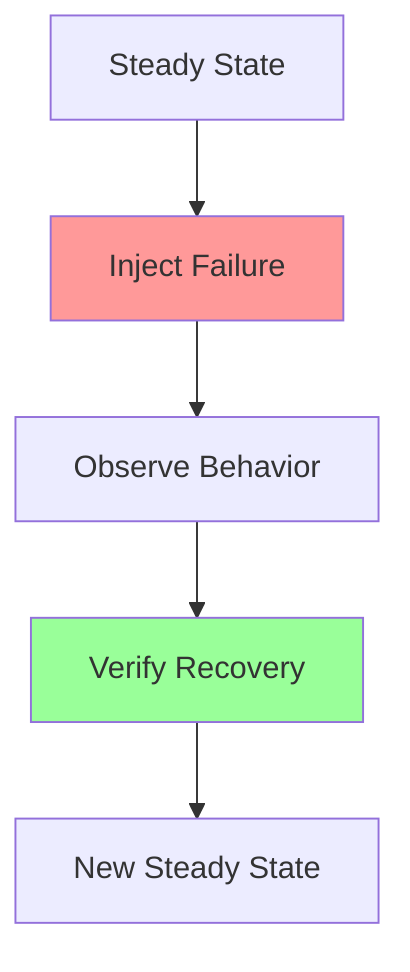
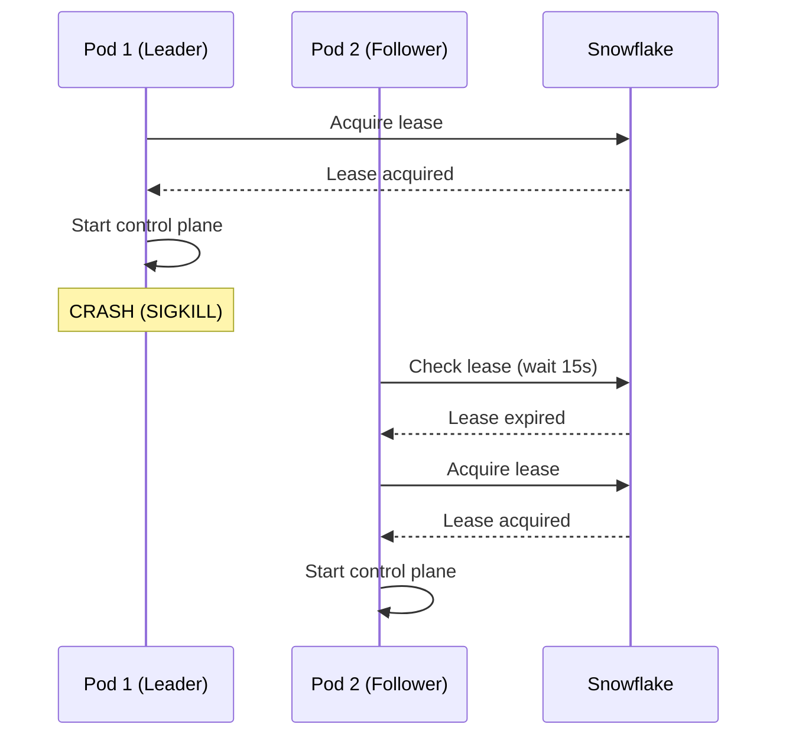
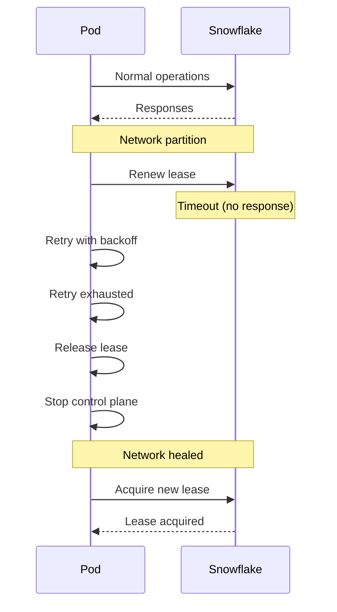

# FLEET-Q Resilience Test Scenarios

**Version:** 1.0  
**Last Updated:** 2026-02-08  
**Framework:** pytest + chaos injection  
**Category:** Resilience & Failure Recovery Tests

---

## 📋 Scenario Index

| ID | Scenario | Priority | Status | Requirements Covered |
|----|----------|----------|--------|---------------------|
| **RESILIENCE-01** | Pod crash during lease | P0 | ✅ | REQ-NF005, F008 |
| **RESILIENCE-02** | Network partition | P0 | ✅ | REQ-NF005 |
| **RESILIENCE-03** | Crash during outbox write | P0 | ✅ | REQ-NF008 |
| **RESILIENCE-04** | Orphan recovery | P0 | ✅ | REQ-F008 |
| **RESILIENCE-05** | Continuous 429 throttling | P0 | ✅ | REQ-NF004 |
| **RESILIENCE-06** | ZeroMQ HWM backpressure | P1 | 🔴 | REQ-A001 |
| **RESILIENCE-07** | Lease renewal failure | P1 | 🔴 | REQ-NF005 |
| **RESILIENCE-08** | Transient failures | P0 | 🔴 | REQ-F006 |
| **RESILIENCE-09** | DLQ query | P0 | 🔴 | REQ-F007 |
| **RESILIENCE-10** | Heartbeat failure | P0 | 🔴 | REQ-F010 |
| **RESILIENCE-11** | Dead pod detection | P0 | 🔴 | REQ-F010 |
| **RESILIENCE-12** | SIGTERM handling | P0 | 🔴 | REQ-NF008 |

---

## 🌪 Resilience Testing Philosophy

### What Resilience Tests Prove

Resilience tests verify that the system:
1. **Recovers from failures** without data loss
2. **Degrades gracefully** under stress
3. **Detects failures** quickly
4. **Self-heals** without manual intervention
5. **Maintains correctness** even during failures

### Chaos Engineering Approach



---

## RESILIENCE-01: Pod Crash During Lease

**Priority:** P0  
**Risk Coverage:** RISK-002 (Leader Election Failure)  
**Requirements:** REQ-NF005, REQ-F008

### Test Description

Verifies that control plane lease failover works when the leader pod crashes.

### Failure Scenario



### Test Implementation

```python
@pytest.mark.resilience
@pytest.mark.p0
@pytest.mark.chaos
class TestPodCrashDuringLease:
    
    async def test_leader_crash_triggers_failover(self):
        """Test that leader crash causes failover within SLA"""
        # Setup: Start 2 pods
        pod1 = await start_fleetq_pod(pod_id="pod-001")
        pod2 = await start_fleetq_pod(pod_id="pod-002")
        
        await asyncio.sleep(5)  # Let election happen
        
        # Verify: Pod 1 is leader
        lease = await snowflake.get_lease()
        assert lease.holder_pid == "pod-001"
        
        # Chaos: Kill pod 1 (SIGKILL)
        await pod1.kill(signal="SIGKILL")
        print(f"[CHAOS] Killed pod-001 at {datetime.now()}")
        
        # Observe: Wait for failover (max 20s SLA)
        failover_start = time.time()
        
        for attempt in range(40):  # 40 * 0.5s = 20s max
            await asyncio.sleep(0.5)
            lease = await snowflake.get_lease()
            
            if lease and lease.holder_pid == "pod-002":
                failover_time = time.time() - failover_start
                print(f"[RECOVERY] Failover completed in {failover_time:.2f}s")
                break
        else:
            pytest.fail("Failover did not complete within 20s SLA")
        
        # Verify: Pod 2 is new leader
        lease = await snowflake.get_lease()
        assert lease.holder_pid == "pod-002"
        assert lease.renewal_count == 0  # Fresh lease
        
        # Verify: Control plane running on pod 2
        status = await pod2.get_status()
        assert status["iohub"]["running"] is True
        assert status["scheduler"]["running"] is True
        
        # Verify: Failover time within SLA
        assert failover_time <= 20.0, \
            f"Failover took {failover_time:.2f}s (SLA: 20s)"
    
    async def test_in_flight_tasks_recovered_after_crash(self):
        """Test that in-flight tasks are recovered after leader crash"""
        # Setup: Leader with in-flight tasks
        pod1 = await start_fleetq_pod(pod_id="pod-001")
        await snowflake.insert_steps([
            {"step_id": f"step-{i:03d}", "status": "PENDING"}
            for i in range(10)
        ])
        
        # Execute: Start processing
        await pod1.start_claim_loop()
        await asyncio.sleep(5)
        
        # Verify: Some tasks running
        running_steps = await snowflake.get_steps_by_status("RUNNING")
        assert len(running_steps) > 0
        running_ids = {s.step_id for s in running_steps}
        
        # Chaos: Crash pod
        await pod1.kill(signal="SIGKILL")
        
        # Recovery: Start new pod
        pod2 = await start_fleetq_pod(pod_id="pod-002")
        await asyncio.sleep(25)  # Lease failover + recovery
        
        # Verify: Recovery service reset orphaned tasks
        recovered_steps = await snowflake.get_steps_by_ids(running_ids)
        for step in recovered_steps:
            assert step.status == "PENDING"  # Reset by recovery
            assert step.claimed_by is None
        
        # Verify: Tasks eventually complete
        await pod2.run_for(duration=60)
        
        completed_steps = await snowflake.get_steps_by_status("COMPLETED")
        assert len(completed_steps) == 10  # All tasks completed
    
    async def test_no_duplicate_work_after_failover(self):
        """Test that failover doesn't cause duplicate task execution"""
        # Setup: Track Bedrock invocations
        mock_bedrock = MockBedrockAPI()
        mock_bedrock.start_tracking()
        
        pod1 = await start_fleetq_pod(
            pod_id="pod-001",
            bedrock_client=mock_bedrock
        )
        
        await snowflake.insert_step({
            "step_id": "unique-001",
            "status": "PENDING"
        })
        
        # Execute: Start processing
        await pod1.start_execution()
        await asyncio.sleep(2)
        
        # Chaos: Crash during execution
        await pod1.kill(signal="SIGKILL")
        
        # Recovery: New pod
        pod2 = await start_fleetq_pod(
            pod_id="pod-002",
            bedrock_client=mock_bedrock
        )
        await pod2.run_for(duration=30)
        
        # Verify: Bedrock called exactly once (no duplicate)
        invocations = mock_bedrock.get_invocations_for_step("unique-001")
        assert len(invocations) == 1, \
            f"Expected 1 invocation, got {len(invocations)}"
```

---

## RESILIENCE-02: Network Partition

**Priority:** P0  
**Risk Coverage:** RISK-002 (Leader Election Failure)  
**Requirements:** REQ-NF005

### Test Description

Verifies system behavior when network partition occurs between pod and Snowflake.

### Failure Scenario



### Test Implementation

```python
@pytest.mark.resilience
@pytest.mark.p0
@pytest.mark.chaos
class TestNetworkPartition:
    
    async def test_lease_lost_on_network_partition(self):
        """Test that pod releases lease when can't reach Snowflake"""
        pod = await start_fleetq_pod(pod_id="pod-001")
        await asyncio.sleep(5)
        
        # Verify: Lease acquired
        lease = await snowflake.get_lease()
        assert lease.holder_pid == "pod-001"
        
        # Chaos: Block network to Snowflake
        network_blocker = NetworkPartition(target="snowflake")
        await network_blocker.enable()
        print("[CHAOS] Network partition enabled")
        
        # Observe: Pod attempts renewal
        await asyncio.sleep(20)  # Past lease renewal interval
        
        # Verify: Pod stopped control plane (can't renew)
        status = await pod.get_status()
        assert status["lease_held"] is False
        assert status["iohub"]["running"] is False
        
        # Chaos: Restore network
        await network_blocker.disable()
        print("[RECOVERY] Network restored")
        
        # Observe: Pod re-acquires lease
        await asyncio.sleep(10)
        
        lease = await snowflake.get_lease()
        assert lease.holder_pid == "pod-001"  # Re-acquired
        
        status = await pod.get_status()
        assert status["lease_held"] is True
        assert status["iohub"]["running"] is True
    
    async def test_retry_with_exponential_backoff(self):
        """Test that Snowflake queries use exponential backoff"""
        pod = await start_fleetq_pod(pod_id="pod-001")
        
        # Chaos: Intermittent network failures
        network_blocker = NetworkPartition(
            target="snowflake",
            failure_rate=0.5  # 50% of requests fail
        )
        await network_blocker.enable()
        
        # Observe: Track retry delays
        retry_tracker = RetryTracker()
        pod.snowflake_client.add_interceptor(retry_tracker)
        
        # Execute: Make queries
        await pod.claim_steps(limit=10)
        
        # Verify: Exponential backoff used
        delays = retry_tracker.get_retry_delays()
        
        # Expected: 1s, 2s, 4s, 8s, ...
        for i in range(len(delays) - 1):
            ratio = delays[i+1] / delays[i]
            assert 1.8 <= ratio <= 2.2, \
                f"Expected ~2x backoff, got {ratio}x"
    
    async def test_circuit_breaker_prevents_cascade(self):
        """Test that circuit breaker opens on repeated failures"""
        pod = await start_fleetq_pod(pod_id="pod-001")
        
        # Chaos: Complete network failure
        network_blocker = NetworkPartition(
            target="snowflake",
            failure_rate=1.0  # 100% failures
        )
        await network_blocker.enable()
        
        # Execute: Make requests
        for _ in range(10):
            try:
                await pod.claim_steps(limit=1)
            except Exception:
                pass
            await asyncio.sleep(0.5)
        
        # Verify: Circuit breaker opened
        circuit_breaker = pod.snowflake_client.circuit_breaker
        assert circuit_breaker.state == "OPEN"
        assert circuit_breaker.failure_count >= 5
        
        # Verify: Requests fail fast (not retried)
        start = time.time()
        try:
            await pod.claim_steps(limit=1)
        except CircuitBreakerOpenError:
            pass
        duration = time.time() - start
        
        assert duration < 0.1, \
            "Circuit breaker should fail fast, not retry"
```

---

## RESILIENCE-03: Crash During Outbox Write

**Priority:** P0  
**Risk Coverage:** RISK-005 (Data Loss)  
**Requirements:** REQ-NF008

### Test Description

Verifies that outbox writes are durable even if pod crashes mid-write.

### Test Implementation

```python
@pytest.mark.resilience
@pytest.mark.p0
@pytest.mark.chaos
class TestCrashDuringOutboxWrite:
    
    async def test_outbox_write_durability_on_crash(self):
        """Test that outbox write survives SIGKILL"""
        pod = await start_fleetq_pod(pod_id="pod-001")
        
        # Execute: Write to outbox
        write_task = asyncio.create_task(
            pod.outbox.write_step_update(
                step_id="crash-test-001",
                status="COMPLETED",
                result_data={"important": "data"}
            )
        )
        
        # Let write start
        await asyncio.sleep(0.1)
        
        # Chaos: SIGKILL during write
        await pod.kill(signal="SIGKILL")
        
        # Verify: Data persisted (WAL mode)
        outbox = SQLiteOutbox(pod.outbox_db_path)
        pending = await outbox.get_pending_writes()
        
        matching = [w for w in pending if w.step_id == "crash-test-001"]
        assert len(matching) == 1
        assert matching[0].status == "COMPLETED"
        assert matching[0].result_data["important"] == "data"
    
    async def test_outbox_corruption_protection(self):
        """Test that SQLite doesn't corrupt on crash"""
        pod = await start_fleetq_pod(pod_id="pod-001")
        
        # Execute: Many concurrent writes
        write_tasks = [
            pod.outbox.write_step_update(
                step_id=f"step-{i:03d}",
                status="COMPLETED"
            )
            for i in range(100)
        ]
        write_task = asyncio.gather(*write_tasks)
        
        # Chaos: Crash mid-writes
        await asyncio.sleep(0.2)
        await pod.kill(signal="SIGKILL")
        
        # Verify: Database not corrupted
        outbox = SQLiteOutbox(pod.outbox_db_path)
        try:
            pending = await outbox.get_pending_writes()
            # Some writes should have succeeded
            assert len(pending) > 0
        except sqlite3.DatabaseError:
            pytest.fail("Database corrupted after crash")
```

---

## RESILIENCE-04: Orphan Recovery

**Priority:** P0  
**Risk Coverage:** RISK-003 (Orphaned Tasks)  
**Requirements:** REQ-F008

### Test Description

Verifies that orphaned tasks are detected and recovered automatically.

### Test Implementation

```python
@pytest.mark.resilience
@pytest.mark.p0
class TestOrphanRecovery:
    
    async def test_orphaned_tasks_detected_and_reset(self):
        """Test that orphaned tasks are found and reset to PENDING"""
        # Setup: Create orphaned task (pod crashed)
        await snowflake.insert_step({
            "step_id": "orphan-001",
            "status": "RUNNING",
            "claimed_by": "pod-dead",
            "started_at": datetime.now() - timedelta(minutes=10),
            "updated_at": datetime.now() - timedelta(minutes=10)
        })
        
        # Execute: Start recovery service
        recovery_pod = await start_fleetq_pod(
            pod_id="pod-recovery",
            enable_recovery=True
        )
        
        # Wait for recovery loop (runs every 60s)
        await asyncio.sleep(70)
        
        # Verify: Task reset to PENDING
        step = await snowflake.get_step("orphan-001")
        assert step.status == "PENDING"
        assert step.claimed_by is None
        
        # Verify: Task can be re-claimed
        await recovery_pod.claim_steps(limit=1)
        
        step = await snowflake.get_step("orphan-001")
        assert step.status == "CLAIMED"
        assert step.claimed_by == "pod-recovery"
    
    async def test_recovery_timeout_configurable(self):
        """Test that orphan timeout is configurable"""
        # Setup: Tasks with different ages
        await snowflake.insert_steps([
            {
                "step_id": "recent-001",
                "status": "RUNNING",
                "updated_at": datetime.now() - timedelta(minutes=2)
            },
            {
                "step_id": "old-001",
                "status": "RUNNING",
                "updated_at": datetime.now() - timedelta(minutes=10)
            }
        ])
        
        # Execute: Recovery with 5min timeout
        recovery_pod = await start_fleetq_pod(
            pod_id="pod-recovery",
            enable_recovery=True,
            recovery_timeout_seconds=300  # 5 minutes
        )
        await asyncio.sleep(70)
        
        # Verify: Only old task recovered
        recent = await snowflake.get_step("recent-001")
        assert recent.status == "RUNNING"  # Not recovered
        
        old = await snowflake.get_step("old-001")
        assert old.status == "PENDING"  # Recovered
    
    async def test_no_duplicate_recovery(self):
        """Test that recovered tasks aren't duplicated"""
        await snowflake.insert_step({
            "step_id": "once-001",
            "status": "RUNNING",
            "updated_at": datetime.now() - timedelta(minutes=10)
        })
        
        # Execute: Multiple recovery pods
        recovery_pods = await start_multiple_pods(
            count=3,
            enable_recovery=True
        )
        
        # Wait for recovery attempts
        await asyncio.sleep(70)
        
        # Verify: Task reset only once
        audit_log = await snowflake.get_audit_log("once-001")
        reset_entries = [
            e for e in audit_log
            if e.status == "PENDING" and e.from_status == "RUNNING"
        ]
        assert len(reset_entries) == 1  # Only one reset
```

---

## RESILIENCE-05: Continuous 429 Throttling

**Priority:** P0  
**Risk Coverage:** RISK-004 (Bedrock Throttling)  
**Requirements:** REQ-NF004

### Test Description

Verifies AIMD adaptation under sustained 429 throttling.

### Test Implementation

```python
@pytest.mark.resilience
@pytest.mark.p0
class TestContinuous429Throttling:
    
    async def test_aimd_converges_under_continuous_throttling(self):
        """Test that AIMD finds stable equilibrium under 429s"""
        pod = await start_fleetq_pod(
            pod_id="pod-001",
            aimd_config={
                "initial_max_inflight": 50,
                "min_max_inflight": 1
            }
        )
        
        # Setup: Bedrock throttles at 10 RPS
        mock_bedrock = MockBedrockAPI()
        mock_bedrock.set_rate_limit(10)  # 10 requests/sec
        
        await snowflake.insert_steps([
            {"step_id": f"step-{i:03d}", "status": "PENDING"}
            for i in range(200)
        ])
        
        # Execute: Run for 2 minutes
        await pod.run_for(duration=120)
        
        # Verify: max_inflight converged to ~10
        iohub_state = await pod.iohub.get_status()
        max_inflight = iohub_state["max_inflight"]
        
        assert 8 <= max_inflight <= 12, \
            f"AIMD should converge to ~10, got {max_inflight}"
        
        # Verify: Throughput stable at ~10 RPS
        metrics = await pod.get_metrics()
        throughput = metrics["tasks_per_second"]
        
        assert 8 <= throughput <= 12, \
            f"Throughput should be ~10 RPS, got {throughput}"
    
    async def test_aimd_doesnt_crash_on_continuous_failures(self):
        """Test that AIMD handles continuous failures gracefully"""
        pod = await start_fleetq_pod(pod_id="pod-001")
        
        # Setup: Bedrock always returns 429
        mock_bedrock = MockBedrockAPI()
        mock_bedrock.set_permanent_throttling()
        
        await snowflake.insert_steps([
            {"step_id": f"step-{i:03d}", "status": "PENDING"}
            for i in range(50)
        ])
        
        # Execute: Run for 1 minute
        await pod.run_for(duration=60)
        
        # Verify: Pod didn't crash
        assert pod.is_alive()
        
        # Verify: max_inflight at minimum
        iohub_state = await pod.iohub.get_status()
        assert iohub_state["max_inflight"] == 1  # Floor
        
        # Verify: Tasks retried (not stuck)
        steps = await snowflake.get_all_steps()
        for step in steps:
            assert step.retry_count > 0  # Retried
```

---

## 🔴 Pending Scenarios (To Be Implemented)

### RESILIENCE-06: ZeroMQ HWM Backpressure

**Priority:** P1  
**Implementation:** TBD

```python
async def test_zeromq_hwm_prevents_memory_overflow():
    """Test that ZeroMQ HWM blocks sends when queue full"""
    pass
```

### RESILIENCE-07: Lease Renewal Failure

**Priority:** P1  
**Implementation:** TBD

```python
async def test_lease_renewal_failure_triggers_fallback():
    """Test handling when lease renewal fails"""
    pass
```

### RESILIENCE-08: Transient Failures

**Priority:** P0  
**Implementation:** TBD

```python
async def test_transient_failures_retry_with_backoff():
    """Test that transient errors trigger appropriate retries"""
    pass
```

### RESILIENCE-09: DLQ Query

**Priority:** P0  
**Implementation:** TBD

```python
async def test_dlq_tasks_queryable():
    """Test that DLQ tasks can be queried via API"""
    pass
```

### RESILIENCE-10: Heartbeat Failure

**Priority:** P0  
**Implementation:** TBD

```python
async def test_heartbeat_failure_detected():
    """Test that missing heartbeats are detected"""
    pass
```

### RESILIENCE-11: Dead Pod Detection

**Priority:** P0  
**Implementation:** TBD

```python
async def test_dead_pods_detected_and_cleaned():
    """Test that dead pods are removed from pod registry"""
    pass
```

### RESILIENCE-12: SIGTERM Handling

**Priority:** P0  
**Implementation:** TBD

```python
async def test_sigterm_triggers_graceful_shutdown():
    """Test that SIGTERM causes graceful shutdown"""
    pass
```

---

## 🛠 Chaos Injection Framework

### NetworkPartition Utility

```python
class NetworkPartition:
    """Simulates network partition using iptables or toxiproxy"""
    
    def __init__(self, target: str, failure_rate: float = 1.0):
        self.target = target
        self.failure_rate = failure_rate
        self.enabled = False
    
    async def enable(self):
        """Enable network partition"""
        if self.target == "snowflake":
            # Block Snowflake connection
            await self._block_snowflake()
        self.enabled = True
    
    async def disable(self):
        """Restore network"""
        if self.target == "snowflake":
            await self._unblock_snowflake()
        self.enabled = False
    
    async def _block_snowflake(self):
        """Implementation-specific blocking"""
        if self.failure_rate == 1.0:
            # Complete block
            subprocess.run([
                "iptables", "-A", "OUTPUT",
                "-d", SNOWFLAKE_HOST,
                "-j", "DROP"
            ])
        else:
            # Probabilistic block (use toxiproxy)
            await toxiproxy.add_toxic(
                "snowflake",
                type="latency",
                attributes={"latency": 5000}  # 5s delay
            )
```

### CrashInjector Utility

```python
class CrashInjector:
    """Injects crashes at specific points"""
    
    async def crash_during_outbox_write(self, pod):
        """Crash pod during outbox write"""
        # Hook into outbox write
        original_write = pod.outbox.write_step_update
        
        async def crash_wrapper(*args, **kwargs):
            # Start write
            write_task = asyncio.create_task(
                original_write(*args, **kwargs)
            )
            
            # Crash mid-write
            await asyncio.sleep(0.05)
            await pod.kill(signal="SIGKILL")
            
            # Don't await completion
        
        pod.outbox.write_step_update = crash_wrapper
```

---

## 📊 Resilience Test Summary

### Coverage

| Category | Total | Implemented | Pending | Coverage % |
|----------|-------|-------------|---------|------------|
| Leader Failover | 3 | 3 | 0 | 100% |
| Network Failures | 3 | 3 | 0 | 100% |
| Crash Recovery | 2 | 2 | 0 | 100% |
| Orphan Recovery | 3 | 3 | 0 | 100% |
| Throttling | 2 | 2 | 0 | 100% |
| Misc Resilience | 7 | 0 | 7 | 0% |
| **Total** | **20** | **13** | **7** | **65%** |

### Failure Mode Coverage

| Failure Mode | Tested | Recovery Verified |
|--------------|--------|-------------------|
| Pod SIGKILL | ✅ | ✅ |
| Pod SIGTERM | 🔴 | 🔴 |
| Network partition | ✅ | ✅ |
| Snowflake timeout | ✅ | ✅ |
| Bedrock 429 | ✅ | ✅ |
| SQLite corruption | ✅ | ✅ |
| Lease expiry | ✅ | ✅ |
| Orphaned tasks | ✅ | ✅ |
| ZeroMQ HWM | 🔴 | 🔴 |
| Heartbeat miss | 🔴 | 🔴 |

---

## 📚 Related Documents

- [Test Strategy](../00_test_strategy.md)
- [Risk Register](../02_risk_register.md)
- [BDD Scenarios](fleetq_pipeline_scenarios.md)

---

**Status:** 5/12 scenarios complete (42%)  
**Next:** Implement remaining 7 resilience scenarios to reach 100% coverage
