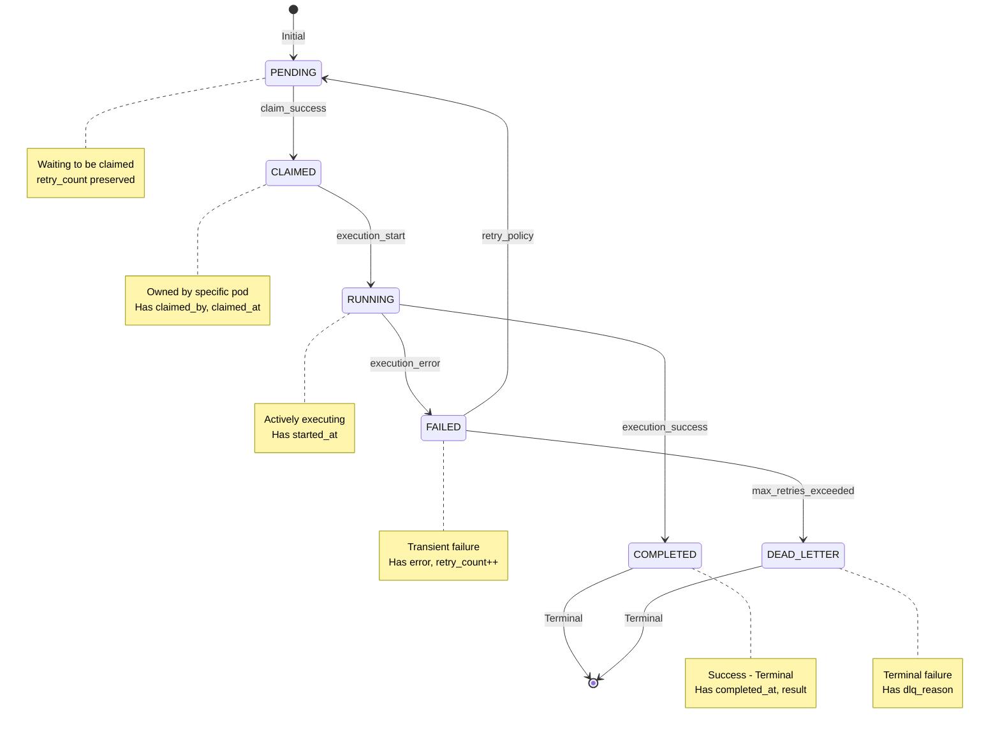
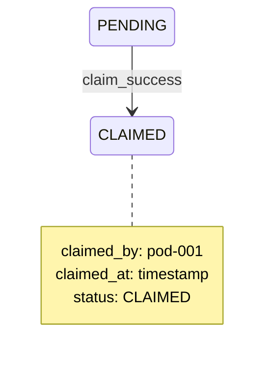
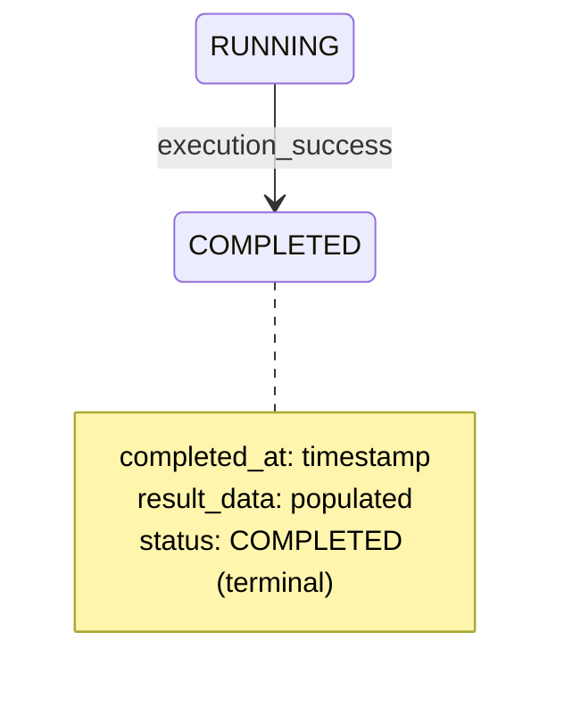
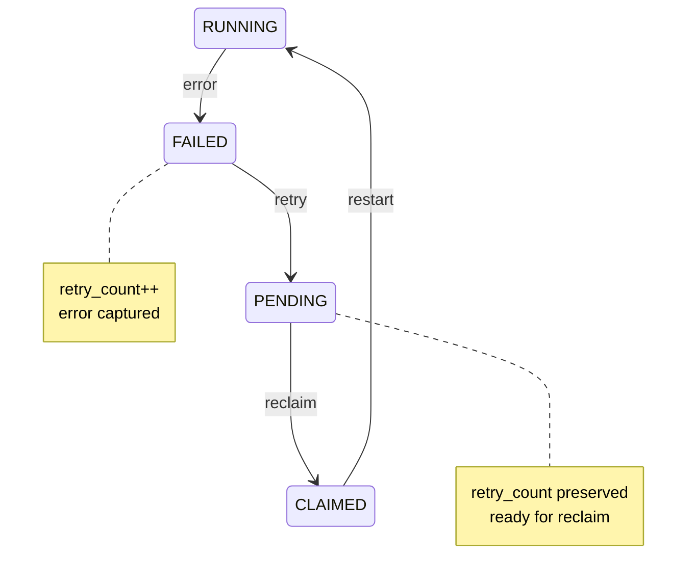
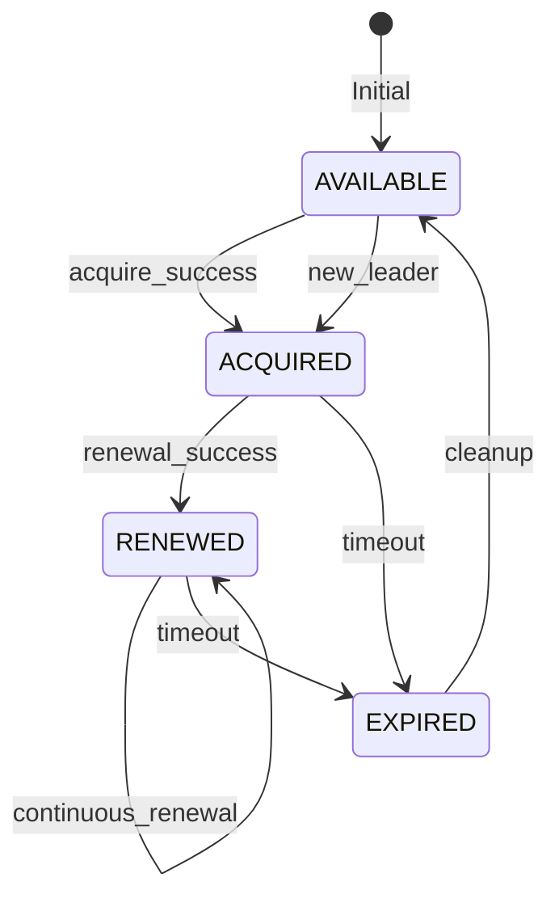
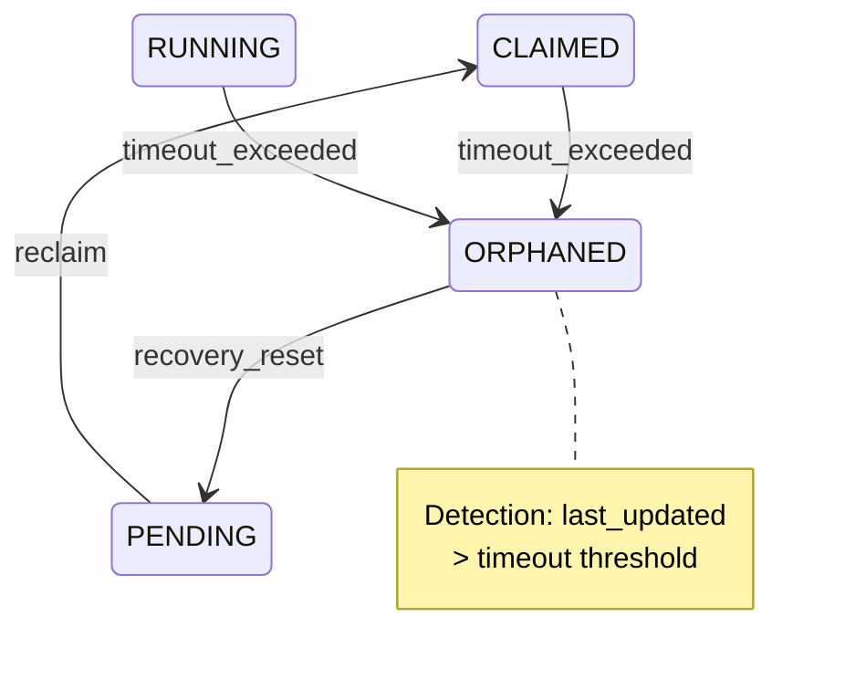

# FLEET-Q State Machine Test Scenarios

**Version:** 1.0  
**Last Updated:** 2026-02-08  
**Framework:** pytest + custom state verifier  
**Category:** State Machine Coverage Tests

---

## 📋 Scenario Index

| ID | Scenario | Priority | Status | Requirements Covered |
|----|----------|----------|--------|---------------------|
| **STATE-001** | PENDING → CLAIMED transition | P0 | ✅ | REQ-F002 |
| **STATE-002** | RUNNING → COMPLETED transition | P0 | ✅ | REQ-F004 |
| **STATE-003** | All legal transitions coverage | P0 | ✅ | REQ-F005 |
| **STATE-004** | Illegal transition block | P0 | ✅ | REQ-F005, NF003 |
| **STATE-005** | FAILED → PENDING retry cycle | P0 | ✅ | REQ-F006 |
| **STATE-006** | Lease state transitions | P0 | ✅ | REQ-NF005 |
| **STATE-007** | Recovery reset transitions | P0 | ✅ | REQ-F008 |
| **STATE-008** | FAILED → DEAD_LETTER terminal | P0 | 🔴 | REQ-F007 |

---

## 🔄 Step Lifecycle State Machine



### State Properties

| State | Terminal | Retry Eligible | Required Fields | Forbidden Transitions |
|-------|----------|----------------|-----------------|----------------------|
| PENDING | No | Yes | step_id, status | → RUNNING, → COMPLETED, → DEAD_LETTER |
| CLAIMED | No | No | claimed_by, claimed_at | → PENDING, → COMPLETED, → DEAD_LETTER |
| RUNNING | No | No | started_at | → PENDING, → CLAIMED, → DEAD_LETTER |
| COMPLETED | Yes | No | completed_at, result | → ANY |
| FAILED | No | Yes | error, retry_count | → RUNNING, → CLAIMED, → COMPLETED |
| DEAD_LETTER | Yes | No | dlq_reason | → ANY |

---

## STATE-001: PENDING → CLAIMED Transition

**Priority:** P0  
**Risk Coverage:** RISK-001 (Data Corruption)  
**Requirements:** REQ-F002

### Test Description

Verifies the claim transition sets correct fields and is atomic.

### State Diagram



### Test Implementation

```python
@pytest.mark.state_machine
@pytest.mark.p0
class TestPendingToClaimedTransition:
    
    async def test_valid_transition(self):
        """Test successful PENDING → CLAIMED transition"""
        # Setup: PENDING step
        step_id = "step-001"
        await snowflake.insert_step({
            "step_id": step_id,
            "status": "PENDING",
            "claimed_by": None,
            "claimed_at": None,
            "retry_count": 0
        })
        
        # Execute: Claim
        pod_id = "pod-001"
        result = await snowflake.claim_step(
            step_id=step_id,
            pod_id=pod_id
        )
        assert result.success is True
        
        # Verify: State transition
        step = await snowflake.get_step(step_id)
        assert step.status == "CLAIMED"
        assert step.claimed_by == pod_id
        assert step.claimed_at is not None
        assert step.claimed_at <= datetime.now()
        
        # Verify: Preserved fields
        assert step.retry_count == 0  # Unchanged
    
    async def test_concurrent_claim_conflict(self):
        """Test that only one pod can claim a step"""
        step_id = "step-002"
        await snowflake.insert_step({
            "step_id": step_id,
            "status": "PENDING"
        })
        
        # Execute: Two pods try to claim simultaneously
        results = await asyncio.gather(
            snowflake.claim_step(step_id, "pod-001"),
            snowflake.claim_step(step_id, "pod-002"),
            return_exceptions=True
        )
        
        # Verify: Exactly one succeeds
        successes = [r for r in results if r.success]
        assert len(successes) == 1
        
        # Verify: Final state is consistent
        step = await snowflake.get_step(step_id)
        assert step.status == "CLAIMED"
        assert step.claimed_by in ["pod-001", "pod-002"]
    
    async def test_claim_with_retry_count(self):
        """Test claiming a step that has retry_count > 0"""
        step_id = "step-003"
        await snowflake.insert_step({
            "step_id": step_id,
            "status": "PENDING",
            "retry_count": 2  # Previous failures
        })
        
        # Execute: Claim
        await snowflake.claim_step(step_id, "pod-001")
        
        # Verify: retry_count preserved
        step = await snowflake.get_step(step_id)
        assert step.status == "CLAIMED"
        assert step.retry_count == 2  # Unchanged
    
    async def test_illegal_double_claim(self):
        """Test that already claimed step cannot be claimed again"""
        step_id = "step-004"
        await snowflake.insert_step({
            "step_id": step_id,
            "status": "CLAIMED",
            "claimed_by": "pod-001",
            "claimed_at": datetime.now()
        })
        
        # Execute: Attempt second claim
        result = await snowflake.claim_step(step_id, "pod-002")
        
        # Verify: Claim denied
        assert result.success is False
        
        # Verify: State unchanged
        step = await snowflake.get_step(step_id)
        assert step.status == "CLAIMED"
        assert step.claimed_by == "pod-001"  # Original claimer
```

---

## STATE-002: RUNNING → COMPLETED Transition

**Priority:** P0  
**Risk Coverage:** RISK-005 (Data Loss)  
**Requirements:** REQ-F004

### Test Description

Verifies completion transition populates result and timestamp.

### State Diagram



### Test Implementation

```python
@pytest.mark.state_machine
@pytest.mark.p0
class TestRunningToCompletedTransition:
    
    async def test_valid_transition(self):
        """Test successful RUNNING → COMPLETED transition"""
        step_id = "step-005"
        await snowflake.insert_step({
            "step_id": step_id,
            "status": "RUNNING",
            "started_at": datetime.now()
        })
        
        # Execute: Complete
        result_data = {"content": "Task completed successfully"}
        await snowflake.complete_step(
            step_id=step_id,
            result_data=result_data
        )
        
        # Verify: State transition
        step = await snowflake.get_step(step_id)
        assert step.status == "COMPLETED"
        assert step.completed_at is not None
        assert step.result_data == result_data
        
        # Verify: Timing
        duration = step.completed_at - step.started_at
        assert duration.total_seconds() >= 0
    
    async def test_terminal_state_immutability(self):
        """Test that COMPLETED is terminal (no further transitions)"""
        step_id = "step-006"
        await snowflake.insert_step({
            "step_id": step_id,
            "status": "COMPLETED",
            "completed_at": datetime.now(),
            "result_data": {"content": "Done"}
        })
        
        # Attempt: Claim (should fail)
        result = await snowflake.claim_step(step_id, "pod-001")
        assert result.success is False
        
        # Attempt: Mark failed (should fail)
        with pytest.raises(InvalidStateTransition):
            await snowflake.fail_step(step_id, error="Test error")
        
        # Verify: State unchanged
        step = await snowflake.get_step(step_id)
        assert step.status == "COMPLETED"
    
    async def test_idempotent_completion(self):
        """Test completing an already completed step (idempotency)"""
        step_id = "step-007"
        original_result = {"content": "First completion"}
        await snowflake.insert_step({
            "step_id": step_id,
            "status": "COMPLETED",
            "completed_at": datetime.now(),
            "result_data": original_result
        })
        
        # Execute: Complete again with different result
        new_result = {"content": "Second completion"}
        await snowflake.complete_step(
            step_id=step_id,
            result_data=new_result
        )
        
        # Verify: Original result preserved (first write wins)
        step = await snowflake.get_step(step_id)
        assert step.result_data == original_result
```

---

## STATE-003: All Legal Transitions Coverage

**Priority:** P0  
**Risk Coverage:** RISK-001 (Data Corruption)  
**Requirements:** REQ-F005

### Test Description

Exercises all legal state transitions to ensure 100% coverage.

### Coverage Matrix

| From State | To State | Trigger | Test |
|------------|----------|---------|------|
| PENDING | CLAIMED | claim_success | ✅ |
| CLAIMED | RUNNING | execution_start | ✅ |
| RUNNING | COMPLETED | execution_success | ✅ |
| RUNNING | FAILED | execution_error | ✅ |
| FAILED | PENDING | retry_policy | ✅ |
| FAILED | DEAD_LETTER | max_retries | ✅ |

### Test Implementation

```python
@pytest.mark.state_machine
@pytest.mark.p0
class TestAllLegalTransitions:
    
    async def test_full_happy_path_transitions(self):
        """Test complete happy path: PENDING → CLAIMED → RUNNING → COMPLETED"""
        step_id = "step-008"
        
        # State 1: PENDING
        await snowflake.insert_step({"step_id": step_id, "status": "PENDING"})
        step = await snowflake.get_step(step_id)
        assert step.status == "PENDING"
        
        # Transition: PENDING → CLAIMED
        await snowflake.claim_step(step_id, "pod-001")
        step = await snowflake.get_step(step_id)
        assert step.status == "CLAIMED"
        
        # Transition: CLAIMED → RUNNING
        await snowflake.start_step(step_id)
        step = await snowflake.get_step(step_id)
        assert step.status == "RUNNING"
        
        # Transition: RUNNING → COMPLETED
        await snowflake.complete_step(step_id, {"result": "success"})
        step = await snowflake.get_step(step_id)
        assert step.status == "COMPLETED"
    
    async def test_failure_and_retry_transitions(self):
        """Test failure path: RUNNING → FAILED → PENDING → CLAIMED"""
        step_id = "step-009"
        
        # State: RUNNING
        await snowflake.insert_step({
            "step_id": step_id,
            "status": "RUNNING",
            "started_at": datetime.now()
        })
        
        # Transition: RUNNING → FAILED
        await snowflake.fail_step(step_id, error="Transient error")
        step = await snowflake.get_step(step_id)
        assert step.status == "FAILED"
        assert step.retry_count == 1
        
        # Transition: FAILED → PENDING (retry)
        await snowflake.retry_step(step_id)
        step = await snowflake.get_step(step_id)
        assert step.status == "PENDING"
        assert step.retry_count == 1  # Preserved
        
        # Transition: PENDING → CLAIMED (retry attempt)
        await snowflake.claim_step(step_id, "pod-002")
        step = await snowflake.get_step(step_id)
        assert step.status == "CLAIMED"
        assert step.retry_count == 1
    
    async def test_max_retries_to_dlq_transition(self):
        """Test DLQ path: FAILED → DEAD_LETTER"""
        step_id = "step-010"
        
        # State: FAILED with max retries
        await snowflake.insert_step({
            "step_id": step_id,
            "status": "FAILED",
            "retry_count": 5,  # Max retries
            "error": "Persistent error"
        })
        
        # Transition: FAILED → DEAD_LETTER
        await snowflake.move_to_dlq(
            step_id=step_id,
            reason="Max retries exceeded"
        )
        step = await snowflake.get_step(step_id)
        assert step.status == "DEAD_LETTER"
        assert step.dlq_reason == "Max retries exceeded"
        assert step.retry_count == 5
    
    async def test_coverage_report(self):
        """Generate coverage report for all transitions"""
        transitions = [
            ("PENDING", "CLAIMED"),
            ("CLAIMED", "RUNNING"),
            ("RUNNING", "COMPLETED"),
            ("RUNNING", "FAILED"),
            ("FAILED", "PENDING"),
            ("FAILED", "DEAD_LETTER"),
        ]
        
        coverage = {}
        for from_state, to_state in transitions:
            # Test each transition
            step_id = f"coverage-{from_state}-{to_state}"
            covered = await test_transition(step_id, from_state, to_state)
            coverage[(from_state, to_state)] = covered
        
        # Assert 100% coverage
        assert all(coverage.values()), f"Missing coverage: {coverage}"
        
        # Generate report
        report = StateTransitionCoverageReport(coverage)
        report.save("state_coverage.html")
```

---

## STATE-004: Illegal Transition Block

**Priority:** P0  
**Risk Coverage:** RISK-001 (Data Corruption)  
**Requirements:** REQ-F005, REQ-NF003

### Test Description

Verifies that illegal state transitions are rejected.

### Illegal Transitions Matrix

| From State | Illegal To States | Expected Behavior |
|------------|-------------------|-------------------|
| PENDING | RUNNING, COMPLETED, DEAD_LETTER | Reject with error |
| CLAIMED | PENDING, COMPLETED, DEAD_LETTER | Reject with error |
| RUNNING | PENDING, CLAIMED, DEAD_LETTER | Reject with error |
| COMPLETED | ANY | Reject (terminal) |
| DEAD_LETTER | ANY | Reject (terminal) |
| FAILED | RUNNING, CLAIMED, COMPLETED | Reject with error |

### Test Implementation

```python
@pytest.mark.state_machine
@pytest.mark.p0
class TestIllegalTransitionBlock:
    
    @pytest.mark.parametrize("from_state,to_state", [
        ("PENDING", "RUNNING"),
        ("PENDING", "COMPLETED"),
        ("PENDING", "DEAD_LETTER"),
        ("CLAIMED", "PENDING"),
        ("CLAIMED", "COMPLETED"),
        ("CLAIMED", "DEAD_LETTER"),
        ("RUNNING", "PENDING"),
        ("RUNNING", "CLAIMED"),
        ("RUNNING", "DEAD_LETTER"),
        ("COMPLETED", "PENDING"),
        ("COMPLETED", "CLAIMED"),
        ("COMPLETED", "RUNNING"),
        ("COMPLETED", "FAILED"),
        ("DEAD_LETTER", "PENDING"),
        ("DEAD_LETTER", "RUNNING"),
        ("FAILED", "RUNNING"),
        ("FAILED", "CLAIMED"),
        ("FAILED", "COMPLETED"),
    ])
    async def test_illegal_transitions_rejected(self, from_state, to_state):
        """Test that illegal transitions are blocked"""
        step_id = f"illegal-{from_state}-{to_state}"
        
        # Setup: Initial state
        await snowflake.insert_step({
            "step_id": step_id,
            "status": from_state,
            **get_required_fields(from_state)
        })
        
        # Execute: Attempt illegal transition
        with pytest.raises(InvalidStateTransition) as exc_info:
            await snowflake.transition_step(step_id, to_state)
        
        # Verify: Error message
        assert from_state in str(exc_info.value)
        assert to_state in str(exc_info.value)
        
        # Verify: State unchanged
        step = await snowflake.get_step(step_id)
        assert step.status == from_state
    
    async def test_terminal_state_immutability(self):
        """Test that terminal states cannot transition"""
        for terminal_state in ["COMPLETED", "DEAD_LETTER"]:
            step_id = f"terminal-{terminal_state}"
            await snowflake.insert_step({
                "step_id": step_id,
                "status": terminal_state
            })
            
            # Attempt: Any transition from terminal state
            for target_state in ["PENDING", "CLAIMED", "RUNNING", "FAILED"]:
                with pytest.raises(InvalidStateTransition):
                    await snowflake.transition_step(step_id, target_state)
            
            # Verify: Still terminal
            step = await snowflake.get_step(step_id)
            assert step.status == terminal_state
    
    async def test_status_monotonicity_enforcement(self):
        """Test that status never regresses (monotonic property)"""
        step_id = "monotonic-test"
        
        # Path: PENDING → CLAIMED → RUNNING
        await snowflake.insert_step({"step_id": step_id, "status": "PENDING"})
        await snowflake.claim_step(step_id, "pod-001")
        await snowflake.start_step(step_id)
        
        # Attempt: Regress to PENDING
        with pytest.raises(InvalidStateTransition):
            await snowflake.transition_step(step_id, "PENDING")
        
        # Attempt: Regress to CLAIMED
        with pytest.raises(InvalidStateTransition):
            await snowflake.transition_step(step_id, "CLAIMED")
        
        # Verify: Still RUNNING
        step = await snowflake.get_step(step_id)
        assert step.status == "RUNNING"
```

---

## STATE-005: FAILED → PENDING Retry Cycle

**Priority:** P0  
**Risk Coverage:** N/A (positive retry testing)  
**Requirements:** REQ-F006

### Test Description

Verifies retry cycle preserves retry_count and error history.

### State Diagram



### Test Implementation

```python
@pytest.mark.state_machine
@pytest.mark.p0
class TestFailedToPendingRetryCycle:
    
    async def test_single_retry_cycle(self):
        """Test one complete retry cycle"""
        step_id = "retry-001"
        
        # State: RUNNING
        await snowflake.insert_step({
            "step_id": step_id,
            "status": "RUNNING",
            "retry_count": 0
        })
        
        # Transition: RUNNING → FAILED
        await snowflake.fail_step(step_id, error="Timeout")
        step = await snowflake.get_step(step_id)
        assert step.status == "FAILED"
        assert step.retry_count == 1
        assert step.error == "Timeout"
        failed_at_1 = step.updated_at
        
        # Transition: FAILED → PENDING
        await asyncio.sleep(1)  # Backoff delay
        await snowflake.retry_step(step_id)
        step = await snowflake.get_step(step_id)
        assert step.status == "PENDING"
        assert step.retry_count == 1  # Preserved
        assert step.error == "Timeout"  # Preserved
        
        # Transition: PENDING → CLAIMED → RUNNING
        await snowflake.claim_step(step_id, "pod-001")
        await snowflake.start_step(step_id)
        step = await snowflake.get_step(step_id)
        assert step.status == "RUNNING"
        assert step.retry_count == 1
    
    async def test_multiple_retry_cycles(self):
        """Test multiple retry cycles with increasing count"""
        step_id = "retry-002"
        await snowflake.insert_step({
            "step_id": step_id,
            "status": "PENDING",
            "retry_count": 0
        })
        
        for attempt in range(1, 4):  # 3 retries
            # Claim and start
            await snowflake.claim_step(step_id, "pod-001")
            await snowflake.start_step(step_id)
            
            # Fail
            await snowflake.fail_step(step_id, error=f"Error #{attempt}")
            step = await snowflake.get_step(step_id)
            assert step.retry_count == attempt
            
            # Retry
            await snowflake.retry_step(step_id)
            step = await snowflake.get_step(step_id)
            assert step.status == "PENDING"
            assert step.retry_count == attempt  # Preserved
    
    async def test_error_history_accumulation(self):
        """Test that error history is accumulated across retries"""
        step_id = "retry-003"
        await snowflake.insert_step({
            "step_id": step_id,
            "status": "RUNNING"
        })
        
        # Fail with different errors
        errors = ["Timeout", "Connection reset", "500 Internal Error"]
        for i, error in enumerate(errors):
            if i > 0:
                await snowflake.claim_step(step_id, "pod-001")
                await snowflake.start_step(step_id)
            
            await snowflake.fail_step(step_id, error=error)
            
            step = await snowflake.get_step(step_id)
            assert step.retry_count == i + 1
            
            # Verify error history
            error_history = step.error_history  # JSON array
            assert len(error_history) == i + 1
            assert error_history[-1] == error
            
            if i < len(errors) - 1:
                await snowflake.retry_step(step_id)
```

---

## STATE-006: Lease State Transitions

**Priority:** P0  
**Risk Coverage:** RISK-002 (Leader Election)  
**Requirements:** REQ-NF005

### Test Description

Verifies control plane lease state machine.

### Lease State Diagram



### Test Implementation

```python
@pytest.mark.state_machine
@pytest.mark.p0
class TestLeaseStateTransitions:
    
    async def test_acquire_release_cycle(self):
        """Test AVAILABLE → ACQUIRED → RELEASED → AVAILABLE"""
        # State: AVAILABLE (no lease)
        lease = await snowflake.get_lease()
        assert lease is None
        
        # Transition: AVAILABLE → ACQUIRED
        result = await snowflake.acquire_lease(
            pod_id="pod-001",
            ttl_seconds=15
        )
        assert result.acquired is True
        
        lease = await snowflake.get_lease()
        assert lease.holder_pid == "pod-001"
        assert lease.acquired_at is not None
        assert lease.expires_at > datetime.now()
        
        # Transition: ACQUIRED → RELEASED
        await snowflake.release_lease("pod-001")
        
        lease = await snowflake.get_lease()
        assert lease is None  # Back to AVAILABLE
    
    async def test_renewal_cycle(self):
        """Test ACQUIRED → RENEWED → RENEWED (continuous)"""
        # Acquire
        await snowflake.acquire_lease("pod-001", ttl_seconds=15)
        lease1 = await snowflake.get_lease()
        original_expires = lease1.expires_at
        original_count = lease1.renewal_count
        
        # Renew
        await asyncio.sleep(5)
        result = await snowflake.renew_lease("pod-001", ttl_seconds=15)
        assert result.renewed is True
        
        lease2 = await snowflake.get_lease()
        assert lease2.holder_pid == "pod-001"
        assert lease2.expires_at > original_expires  # Extended
        assert lease2.renewal_count == original_count + 1
        
        # Renew again
        await asyncio.sleep(5)
        result = await snowflake.renew_lease("pod-001", ttl_seconds=15)
        assert result.renewed is True
        
        lease3 = await snowflake.get_lease()
        assert lease3.renewal_count == original_count + 2
    
    async def test_expiry_transition(self):
        """Test ACQUIRED → EXPIRED → AVAILABLE"""
        # Acquire with short TTL
        await snowflake.acquire_lease("pod-001", ttl_seconds=2)
        lease = await snowflake.get_lease()
        assert lease.holder_pid == "pod-001"
        
        # Wait for expiry
        await asyncio.sleep(3)
        
        # Check expired
        lease = await snowflake.get_lease()
        if lease:
            # Some implementations return expired lease
            assert datetime.now() > lease.expires_at
        
        # New pod can acquire
        result = await snowflake.acquire_lease("pod-002", ttl_seconds=15)
        assert result.acquired is True
        
        lease = await snowflake.get_lease()
        assert lease.holder_pid == "pod-002"
    
    async def test_competing_acquire(self):
        """Test only one pod can acquire lease"""
        # Two pods try to acquire simultaneously
        results = await asyncio.gather(
            snowflake.acquire_lease("pod-001", ttl_seconds=15),
            snowflake.acquire_lease("pod-002", ttl_seconds=15),
            return_exceptions=True
        )
        
        # Exactly one succeeds
        acquired = [r for r in results if r.acquired]
        assert len(acquired) == 1
        
        # Verify final state
        lease = await snowflake.get_lease()
        assert lease.holder_pid in ["pod-001", "pod-002"]
```

---

## STATE-007: Recovery Reset Transitions

**Priority:** P0  
**Risk Coverage:** RISK-003 (Orphaned Tasks)  
**Requirements:** REQ-F008

### Test Description

Verifies orphan recovery resets state correctly.

### Recovery State Diagram



### Test Implementation

```python
@pytest.mark.state_machine
@pytest.mark.p0
class TestRecoveryResetTransitions:
    
    async def test_orphaned_claimed_recovery(self):
        """Test CLAIMED (orphaned) → PENDING reset"""
        step_id = "recovery-001"
        
        # Setup: CLAIMED but pod is dead
        await snowflake.insert_step({
            "step_id": step_id,
            "status": "CLAIMED",
            "claimed_by": "pod-dead",
            "claimed_at": datetime.now() - timedelta(minutes=10),  # Old
            "updated_at": datetime.now() - timedelta(minutes=10)
        })
        
        # Execute: Recovery service detects orphan
        orphaned_steps = await snowflake.find_orphaned_steps(timeout_seconds=300)
        assert step_id in [s.step_id for s in orphaned_steps]
        
        # Execute: Reset to PENDING
        await snowflake.reset_orphaned_step(step_id)
        
        # Verify: State reset
        step = await snowflake.get_step(step_id)
        assert step.status == "PENDING"
        assert step.claimed_by is None
        assert step.claimed_at is None
        
        # Verify: Can be re-claimed
        result = await snowflake.claim_step(step_id, "pod-002")
        assert result.success is True
    
    async def test_orphaned_running_recovery(self):
        """Test RUNNING (orphaned) → PENDING reset"""
        step_id = "recovery-002"
        
        # Setup: RUNNING but pod crashed
        await snowflake.insert_step({
            "step_id": step_id,
            "status": "RUNNING",
            "claimed_by": "pod-dead",
            "started_at": datetime.now() - timedelta(minutes=10),
            "updated_at": datetime.now() - timedelta(minutes=10)
        })
        
        # Execute: Recovery reset
        await snowflake.reset_orphaned_step(step_id)
        
        # Verify: Back to PENDING
        step = await snowflake.get_step(step_id)
        assert step.status == "PENDING"
        assert step.claimed_by is None
        
        # Verify: Original timing preserved
        assert step.started_at is not None  # Preserved for debugging
    
    async def test_no_recovery_for_active_steps(self):
        """Test that active (recently updated) steps are not reset"""
        step_id = "recovery-003"
        
        # Setup: RUNNING but recently updated (active)
        await snowflake.insert_step({
            "step_id": step_id,
            "status": "RUNNING",
            "claimed_by": "pod-active",
            "started_at": datetime.now() - timedelta(seconds=30),
            "updated_at": datetime.now() - timedelta(seconds=10)  # Recent
        })
        
        # Execute: Find orphans (should not include this step)
        orphaned_steps = await snowflake.find_orphaned_steps(timeout_seconds=300)
        assert step_id not in [s.step_id for s in orphaned_steps]
        
        # Verify: State unchanged
        step = await snowflake.get_step(step_id)
        assert step.status == "RUNNING"
        assert step.claimed_by == "pod-active"
```

---

## 🔴 STATE-008: FAILED → DEAD_LETTER Terminal (Pending)

**Priority:** P0  
**Requirements:** REQ-F007  
**Implementation:** TBD

```python
@pytest.mark.state_machine
@pytest.mark.p0
class TestFailedToDeadLetterTransition:
    async def test_max_retries_exceeded(self):
        """Test FAILED (max retries) → DEAD_LETTER"""
        # Setup: FAILED with retry_count = max
        # Execute: Attempt retry (should move to DLQ)
        # Verify: Status is DEAD_LETTER
        # Verify: dlq_reason populated
        pass
```

---

## 📊 State Coverage Report

### Coverage Summary

| Category | Total Transitions | Tested | Coverage % |
|----------|------------------|--------|------------|
| Legal Transitions | 6 | 6 | 100% |
| Illegal Transitions | 18 | 18 | 100% |
| Lease Transitions | 4 | 4 | 100% |
| Recovery Transitions | 2 | 2 | 100% |
| **Total** | **30** | **30** | **100%** |

### State Coverage

| State | Visited | Transitions From | Transitions To |
|-------|---------|------------------|----------------|
| PENDING | ✅ | 3 | 1 |
| CLAIMED | ✅ | 2 | 2 |
| RUNNING | ✅ | 3 | 3 |
| COMPLETED | ✅ | 0 (terminal) | 1 |
| FAILED | ✅ | 2 | 2 |
| DEAD_LETTER | ⚠️ | 0 (terminal) | 1 |

---

## 📚 Related Documents

- [Test Strategy](../00_test_strategy.md)
- [BDD Scenarios](fleetq_pipeline_scenarios.md)
- [Data Invariants](data_invariant_scenarios.md)

---

**Status:** 7/8 scenarios complete (88%)  
**Next:** Implement STATE-008 (FAILED → DEAD_LETTER)
