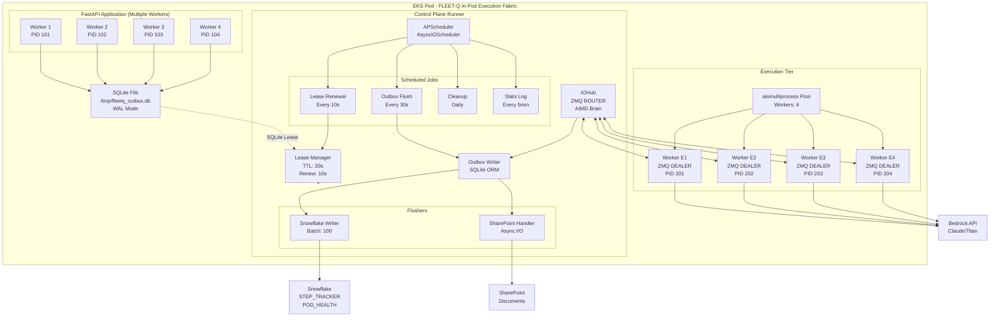
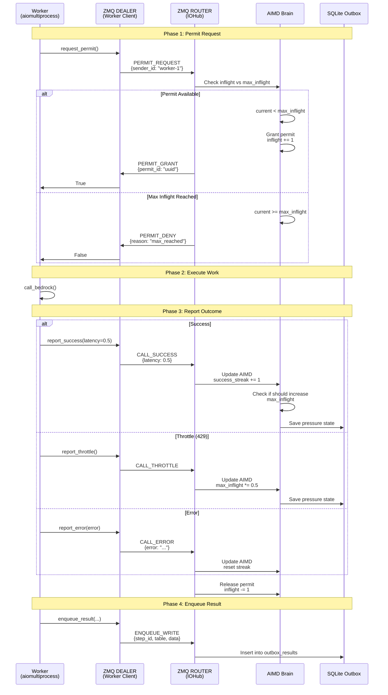
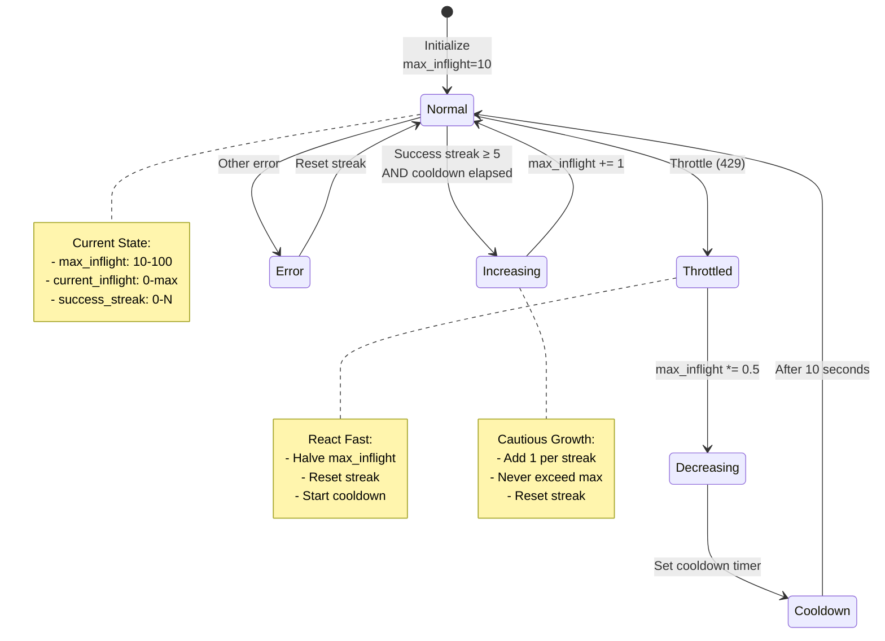
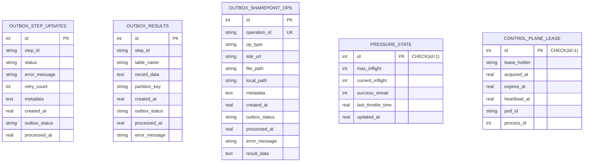
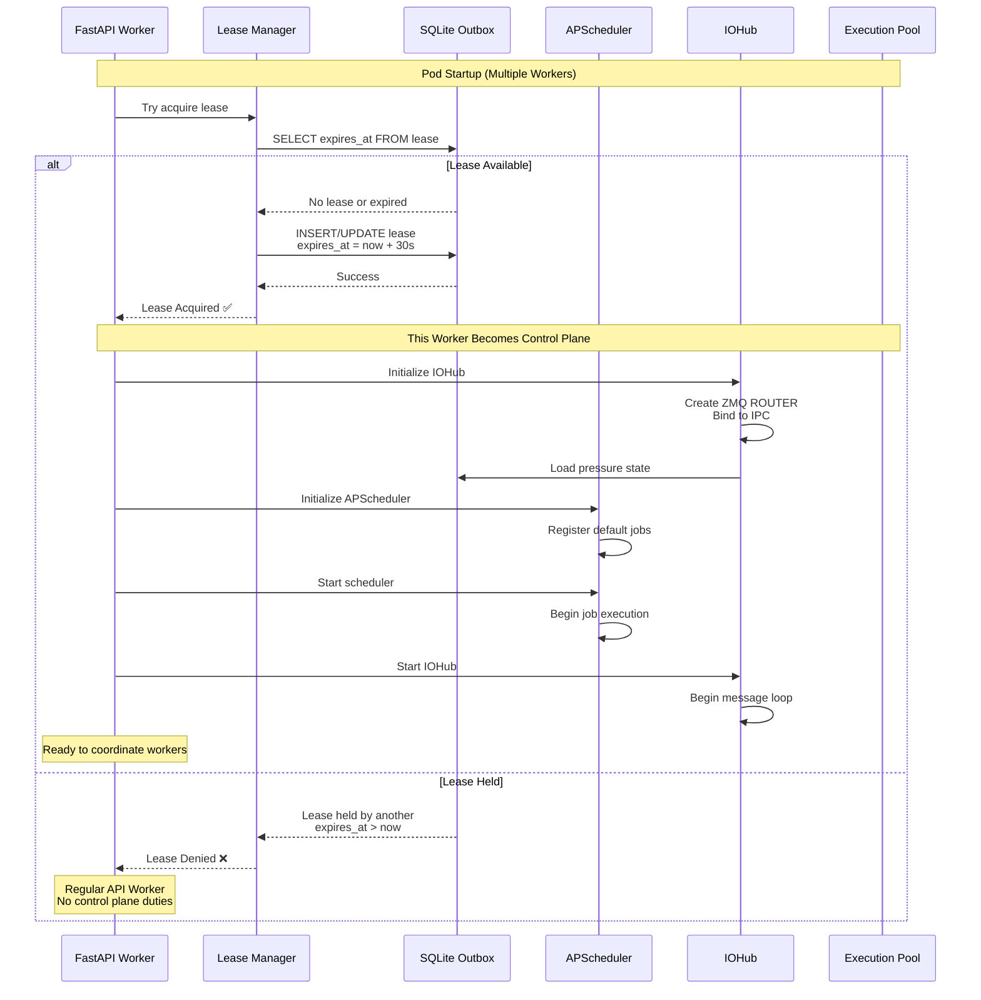
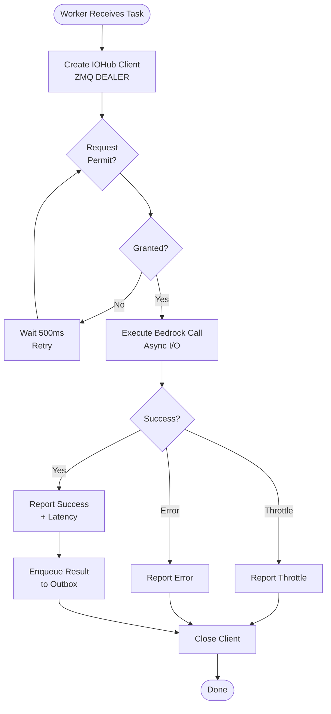
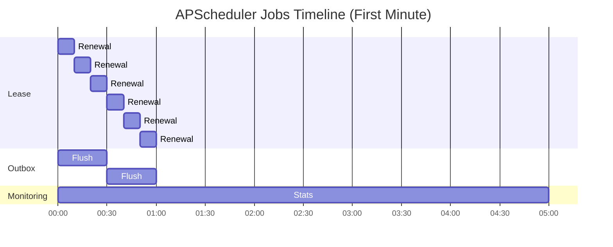
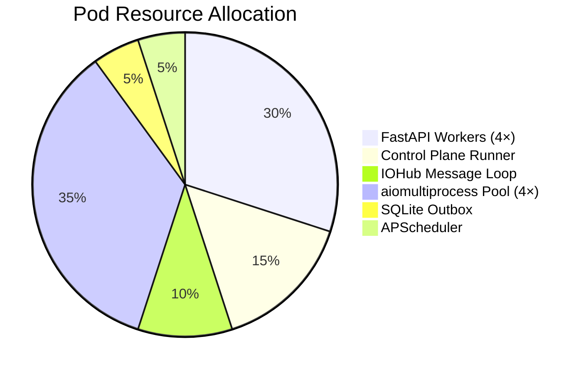
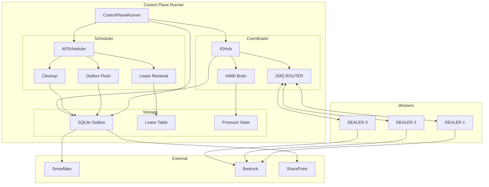
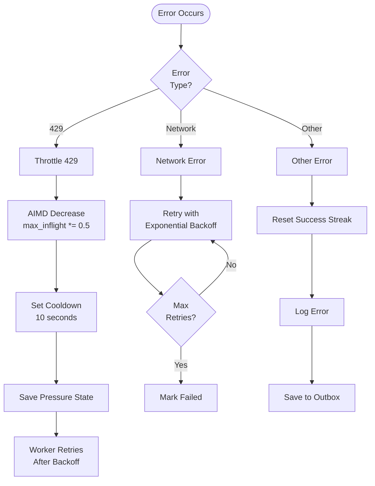

# In-Pod Execution Fabric - Architecture Diagrams

## Complete System Architecture

## Message Flow - Permit Request/Response

## AIMD State Machine

## SQLite Outbox Tables

## Control Plane Startup Sequence

## Worker Execution Flow

## Scheduled Jobs Timeline

## Resource Allocation

## Component Relationships

## Error Recovery Flow

---

**Diagrams show:**
1. Complete system architecture with all components
2. Message flow for permit request/response cycle
3. AIMD state machine with transitions
4. SQLite outbox table relationships
5. Control plane startup sequence
6. Worker execution flow
7. Scheduled jobs timeline
8. Resource allocation breakdown
9. Component relationships and dependencies
10. Error recovery flows

These diagrams provide a comprehensive visual reference for understanding the In-Pod Execution Fabric architecture.
