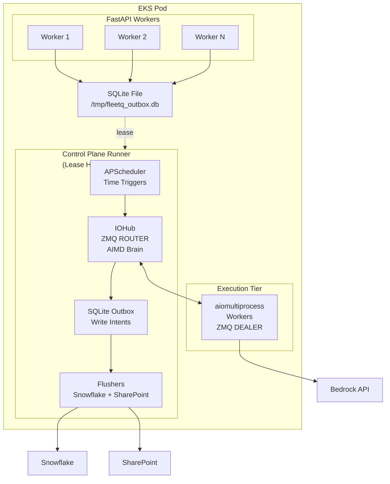

# FLEET-Q In-Pod Execution Fabric - Complete Guide

## 📋 Overview

The In-Pod Execution Fabric transforms each FLEET-Q pod into a coordinated, intelligent organism with:

- **Single Control Plane** per pod (SQLite lease-based singleton)
- **ZeroMQ messaging** for fast in-pod coordination
- **AIMD permit control** for adaptive Bedrock throttling
- **SQLite outbox** for durable side effects
- **APScheduler** for time-based triggers
- **aiomultiprocess** for async I/O parallelism

## 🏗️ Architecture



## 📦 Components

### 1. **zeromq_utils.py** - Messaging Patterns

Socket types as architectural primitives:

| Socket Type | Use Case | Pattern |
|-------------|----------|---------|
| ROUTER/DEALER | Request/reply with routing | Permits, feedback, control |
| PUSH/PULL | Pipeline distribution | Streaming data to competing consumers |
| PUB/SUB | Broadcast (optional) | Notifications, events |

**Key Features:**
- Message envelopes with routing
- High water marks (HWM) for backpressure
- Async and sync variants
- Thread-safe context management

**Usage:**
```python
from fleet_q.zeromq_utils import ZMQRouter, ZMQDealer, MessageType, ZMQMessage

# IOHub side (bind)
router = ZMQRouter(create_ipc_address("iohub"), hwm=1000)

# Worker side (connect)
dealer = ZMQDealer(create_ipc_address("iohub"), identity="worker-1")

# Send request
request = ZMQMessage.create(MessageType.PERMIT_REQUEST, "worker-1", {})
await dealer.send_message(request)

# Receive response
response = await dealer.recv_message(timeout_ms=2000)
```

### 2. **sqlite_outbox.py** - Durable Boundary

SQLite-based outbox pattern for side effects:

| Table | Purpose |
|-------|---------|
| `outbox_step_updates` | Status transitions, retries |
| `outbox_results` | Final payloads to Snowflake |
| `outbox_sharepoint_ops` | Download/upload intents |
| `pressure_state` | AIMD shared state |
| `control_plane_lease` | Singleton election |

**Why Outbox:**
- ZeroMQ is fast but not durable
- Bounded queues (HWM) + outbox absorbs bursts
- Separate flushers batch writes efficiently
- Idempotent and replayable

**Usage:**
```python
from fleet_q.sqlite_outbox import SQLiteOutbox, StepUpdate, ResultIntent

outbox = SQLiteOutbox("/tmp/fleetq_outbox.db")

# Enqueue step update
update = StepUpdate(step_id="step-123", status="completed")
outbox.enqueue_step_update(update)

# Enqueue result
result = ResultIntent(
    step_id="step-123",
    table_name="RESULTS",
    record_data={"output": "success"}
)
outbox.enqueue_result(result)

# Get pending items for flushing
pending = outbox.get_pending_results(limit=100)
```

### 3. **apscheduler_utils.py** - Time Triggers

APScheduler with lease-based singleton execution:

| Job Type | Use Case | Example |
|----------|----------|---------|
| Cron | Specific time triggers | Daily at 2:00 AM |
| Interval | Periodic execution | Every 30 seconds |
| Delayed | One-time delayed | Run once after 60s |

**Key Features:**
- Lease-aware job decorator
- Job persistence (optional)
- Misfire handling
- Event logging

**Usage:**
```python
from fleet_q.apscheduler_utils import APSchedulerManager, CommonJobs

manager = APSchedulerManager(lease_holder_id="control-plane-1", outbox=outbox)

# Add interval job
manager.add_interval_job(
    lambda: CommonJobs.outbox_flush_job(outbox),
    job_id="outbox-flush",
    seconds=30
)

# Add cron job
manager.add_cron_job(
    my_daily_task,
    job_id="daily-task",
    hour=2,
    minute=0
)

manager.start()
```

### 4. **iohub.py** - Central Coordinator

IOHub is the "brain" providing:

- **AIMD permit control** - Adaptive concurrency for Bedrock
- **Message routing** - ROUTER pattern for workers
- **Outbox coordination** - Centralized write intents
- **Feedback processing** - Success/throttle/error handling

**AIMD Algorithm:**

| Signal | Action | Intuition |
|--------|--------|-----------|
| ✅ Success streak | `max_inflight += 1` slowly | Cautiously explore capacity |
| 🚫 Throttle (429) | `max_inflight = floor(max_inflight/2)` | React fast to pressure |
| 🐢 High latency | Pause growth | Early warning before throttles |

**Usage:**
```python
from fleet_q.iohub import IOHub, IOHubClient, AIMDConfig

# Control plane side
iohub = IOHub(
    bind_address=create_ipc_address("iohub"),
    outbox=outbox,
    aimd_config=AIMDConfig(initial_max_inflight=10)
)
await iohub.start()

# Worker side
client = IOHubClient(create_ipc_address("iohub"), worker_id="worker-1")

# Request permit
granted = await client.request_permit(timeout_ms=2000)
if granted:
    # Do work
    result = await call_bedrock(...)
    
    # Report outcome
    await client.report_success(latency=0.5)
    
    # Enqueue result
    await client.enqueue_result(step_id, table_name, data)
```

### 5. **control_plane_runner.py** - Orchestrator

The singleton runner that coordinates everything:

**Lifecycle:**
1. Try to acquire SQLite lease (exit if held by another process)
2. Start IOHub message loop
3. Start APScheduler with default jobs
4. Start outbox flushers
5. Optionally start claim/heartbeat loops
6. Run until shutdown signal

**Default Jobs:**
- **Lease renewal** - Every 10s (critical)
- **Outbox flush** - Every 30s (frequent)
- **Cleanup** - Every 24h (maintenance)
- **Stats logging** - Every 5min (observability)

**Usage:**
```python
from fleet_q.control_plane_runner import ControlPlaneRunner, ControlPlaneConfig

config = ControlPlaneConfig(
    pod_id="pod-1",
    outbox_db_path="/tmp/fleetq_outbox.db",
    lease_ttl_seconds=30
)

runner = ControlPlaneRunner(config)

# Add custom job
runner.add_custom_job(
    my_custom_task,
    job_id="custom",
    job_type="interval",
    minutes=10
)

# Run forever (production)
await runner.run_forever()
```

## 🚀 Quick Start

### Installation

```bash
# Core dependencies
pip install zmq aiomultiprocess apscheduler

# Full installation with optional deps
pip install "fleet-q[full]"
```

### Minimal Example

```python
import asyncio
from fleet_q.control_plane_runner import run_control_plane, ControlPlaneConfig

async def main():
    config = ControlPlaneConfig(pod_id="my-pod")
    await run_control_plane(config)

if __name__ == "__main__":
    asyncio.run(main())
```

### Worker Example with aiomultiprocess

```python
import asyncio
from fleet_q.iohub import IOHubClient
import aiomultiprocess

async def bedrock_worker(task, iohub_address, worker_id):
    client = IOHubClient(iohub_address, worker_id)
    
    # Request permit
    if not await client.request_permit():
        return {'status': 'denied'}
    
    try:
        # Call Bedrock
        result = await call_bedrock(task['prompt'])
        
        # Report success
        await client.report_success(latency=0.5)
        
        # Enqueue result
        await client.enqueue_result(
            step_id=task['step_id'],
            table_name='RESULTS',
            record_data=result
        )
        
        return {'status': 'success'}
    
    except ThrottlingException:
        await client.report_throttle()
        return {'status': 'throttled'}
    
    finally:
        client.close()

# Execute with aiomultiprocess
async with aiomultiprocess.Pool(processes=4) as pool:
    results = await pool.map(worker_wrapper, tasks)
```

## 🔧 Configuration

### Control Plane Config

```python
from fleet_q.control_plane_runner import ControlPlaneConfig
from fleet_q.iohub import AIMDConfig

config = ControlPlaneConfig(
    # Identity
    pod_id="pod-1",
    process_id=os.getpid(),
    
    # Paths
    outbox_db_path="/tmp/fleetq_outbox.db",
    
    # ZeroMQ
    iohub_address="ipc:///tmp/fleetq-iohub.ipc",
    zmq_hwm=1000,
    
    # Lease
    lease_ttl_seconds=30,
    lease_renewal_interval_seconds=10,
    
    # AIMD
    aimd_config=AIMDConfig(
        initial_max_inflight=10,
        min_max_inflight=1,
        max_max_inflight=100,
        increase_rate=1.0,
        decrease_factor=0.5,
        success_streak_threshold=5
    ),
    
    # Flushers
    outbox_flush_interval_seconds=30,
    outbox_flush_batch_size=100,
    
    # Features
    enable_claim_loop=True,
    enable_heartbeat_loop=True,
    enable_metrics_logging=True
)
```

### AIMD Tuning

| Parameter | Default | Description |
|-----------|---------|-------------|
| `initial_max_inflight` | 10 | Starting concurrency |
| `min_max_inflight` | 1 | Floor (never go below) |
| `max_max_inflight` | 100 | Ceiling (never exceed) |
| `increase_rate` | 1.0 | Add per success streak |
| `decrease_factor` | 0.5 | Multiply on throttle |
| `success_streak_threshold` | 5 | Successes needed to increase |
| `throttle_cooldown_seconds` | 10.0 | Wait after throttle before increasing |
| `latency_threshold_ms` | 5000.0 | Warn on high latency |

## 📊 Monitoring

### Status Endpoint

```python
runner = ControlPlaneRunner(config)
await runner.start()

# Get comprehensive status
status = runner.get_status()

# Print formatted status
runner.print_status()
```

### IOHub Metrics

```python
iohub_status = runner.iohub.get_status()

print(f"Max Inflight: {iohub_status['aimd']['max_inflight']}")
print(f"Current Inflight: {iohub_status['aimd']['current_inflight']}")
print(f"Success Rate: {iohub_status['requests']['successes'] / iohub_status['requests']['total']:.2%}")
print(f"Throttle Rate: {iohub_status['requests']['throttles'] / iohub_status['requests']['total']:.2%}")
```

### Outbox Stats

```python
stats = outbox.get_stats()

print(f"Pending updates: {stats['step_updates']['pending']}")
print(f"Pending results: {stats['results']['pending']}")
print(f"Pending SharePoint ops: {stats['sharepoint_ops']['pending']}")
```

## 🔍 Troubleshooting

### Issue: Multiple Control Planes Running

**Symptom:** Duplicate claim loops, excessive Snowflake calls

**Cause:** Lease not working properly

**Fix:**
```python
# Check lease status
lease = outbox.get_current_lease()
if lease:
    print(f"Lease held by: {lease.lease_holder}")
    print(f"Expires at: {lease.expires_at}")
    print(f"Is expired: {lease.expires_at < time.time()}")
```

### Issue: Workers Not Getting Permits

**Symptom:** All permit requests denied

**Cause:** `max_inflight` too low or AIMD stuck

**Fix:**
```python
# Check AIMD state
state = outbox.get_pressure_state()
print(f"Max inflight: {state.max_inflight}")
print(f"Current inflight: {state.current_inflight}")

# Manually reset if needed
from fleet_q.sqlite_outbox import PressureState
outbox.update_pressure_state(PressureState(
    max_inflight=20,  # Reset to higher value
    current_inflight=0,
    success_streak=0,
    last_throttle_time=0,
    updated_at=time.time()
))
```

### Issue: Outbox Growing Unbounded

**Symptom:** SQLite file size increasing rapidly

**Cause:** Flushers not running or failing

**Fix:**
```python
# Check pending counts
stats = outbox.get_stats()
print(stats)

# Manually cleanup old records
outbox.cleanup_old_records(retention_hours=24)

# Check if flusher job is running
jobs = runner.scheduler.get_jobs()
for job in jobs:
    if job['id'] == 'outbox-flush':
        print(f"Next run: {job['next_run']}")
```

### Issue: ZeroMQ Connection Errors

**Symptom:** Workers can't connect to IOHub

**Cause:** Address mismatch or IOHub not started

**Fix:**
```python
# Verify IOHub is running
print(f"IOHub running: {runner.iohub.running}")
print(f"IOHub address: {runner.config.iohub_address}")

# Test connection
from fleet_q.iohub import IOHubClient
client = IOHubClient(runner.config.iohub_address, "test-worker")
granted = await client.request_permit()
print(f"Permit granted: {granted}")
```

## 🎯 Best Practices

### 1. Lease Management

✅ **DO:**
- Set `lease_ttl` to 3× renewal interval
- Monitor lease holder in logs
- Handle lease loss gracefully

❌ **DON'T:**
- Use same SQLite file for multiple purposes
- Set TTL too low (< 10s)
- Forget to renew lease

### 2. AIMD Tuning

✅ **DO:**
- Start conservative (`initial_max_inflight=5-10`)
- Set reasonable ceiling (`max_max_inflight=50-100`)
- Monitor throttle rate

❌ **DON'T:**
- Set `decrease_factor > 0.75` (too gentle)
- Set `increase_rate > 2` (too aggressive)
- Ignore latency warnings

### 3. Outbox Management

✅ **DO:**
- Flush frequently (15-30s)
- Batch writes (50-200 per flush)
- Run cleanup daily

❌ **DON'T:**
- Flush synchronously
- Skip error handling in flushers
- Let outbox grow unbounded

### 4. Worker Implementation

✅ **DO:**
- Always request permit before expensive calls
- Report outcomes accurately (success/throttle/error)
- Close clients properly
- Use correlation IDs for tracing

❌ **DON'T:**
- Create multiple clients per worker
- Skip permit release on error
- Block in worker functions
- Ignore timeout parameters

## 📚 References

- [In-Pod Execution Fabric Design Doc](../docs/pod_resources_allocation/In-Pod-Exection-Fabric.md)
- [ZeroMQ Guide](https://zeromq.org/get-started/)
- [APScheduler Documentation](https://apscheduler.readthedocs.io/)
- [aiomultiprocess](https://github.com/omnilib/aiomultiprocess)
- [Outbox Pattern](https://microservices.io/patterns/data/transactional-outbox.html)
- [AIMD Algorithm](https://en.wikipedia.org/wiki/Additive_increase/multiplicative_decrease)

## 🆘 Support

For issues or questions:
1. Check logs: `docker logs <pod-name>`
2. Inspect outbox: Use SQLite browser to examine tables
3. Monitor IOHub: Call `runner.print_status()`
4. Review documentation: Read design doc thoroughly

## 🔄 Migration Guide

### From Simple aiomultiprocess

**Before:**
```python
async with aiomultiprocess.Pool() as pool:
    results = await pool.map(worker_func, tasks)
```

**After:**
```python
# Start control plane
runner = ControlPlaneRunner(config)
await runner.start()

# Workers now connect to IOHub
async def worker_func_with_iohub(task):
    client = IOHubClient(runner.config.iohub_address, worker_id)
    # ... use client for permits and feedback

async with aiomultiprocess.Pool() as pool:
    results = await pool.map(worker_func_with_iohub, tasks)
```

### From Manual Throttling

**Before:**
```python
semaphore = asyncio.Semaphore(10)  # Fixed limit
async with semaphore:
    result = await call_bedrock(...)
```

**After:**
```python
# Adaptive limit via AIMD
granted = await iohub_client.request_permit()
if granted:
    result = await call_bedrock(...)
    await iohub_client.report_success()
```

## 🚦 Production Checklist

- [ ] Set appropriate `pod_id` from environment variable
- [ ] Configure persistent volume for SQLite outbox
- [ ] Set `lease_ttl` to at least 30 seconds
- [ ] Enable metrics logging
- [ ] Configure cleanup job (daily)
- [ ] Set reasonable AIMD bounds
- [ ] Test lease failover (kill process, verify takeover)
- [ ] Monitor outbox growth rate
- [ ] Set up log aggregation
- [ ] Document custom jobs
- [ ] Test graceful shutdown
- [ ] Configure resource limits (memory, CPU)

## 📈 Performance Expectations

| Metric | Typical Value |
|--------|---------------|
| Permit request latency | < 5ms |
| AIMD adjustment latency | < 100ms |
| Outbox flush latency | 100-500ms (batch of 100) |
| Lease renewal latency | < 50ms |
| Message routing latency | < 1ms |
| Worker startup time | 1-2s |
| Graceful shutdown time | 5-10s |

## 🎓 Learning Path

1. **Start here:** Read [design doc](../docs/pod_resources_allocation/In-Pod-Exection-Fabric.md)
2. **Run demo:** `python examples/in_pod_fabric_demo.py`
3. **Study components:** Read source code comments
4. **Build simple worker:** Integrate IOHub client
5. **Add custom jobs:** Use APScheduler
6. **Deploy to EKS:** Test lease election with multiple FastAPI workers
7. **Monitor and tune:** Adjust AIMD parameters based on throttle rate

---

**Next:** See [Complete Integration Example](../examples/in_pod_fabric_demo.py) for runnable code.
