# 🧬 Advanced ways to Enhance FLEET-Q “In-Pod Fabric” Design Patterns

## 🧠 The goal 

Inside a **single EKS pod**, we want **one coordinated execution organism**:

- **FastAPI** serves requests (multiple workers allowed)
    
- **Exactly one Control Plane Runner per pod** (SQLite lease holder)
    
- **ZeroMQ** becomes the internal “bus” for:
    
    - task dispatch
        
    - SharePoint download/upload
        
    - Snowflake write batching
        
    - AIMD permits + feedback
        
- **SQLite Outbox** is the durability layer for “write intents”
    
- **aiomultiprocess** executes Bedrock calls efficiently (async IO in multiple processes)
    
- **APScheduler** triggers schedules only in the Control Plane Runner
    

---
# 🧩 Pattern 1: “Single Control Plane per Pod” via SQLite Lease

### Why

FastAPI multi-workers = multiple OS processes. If each runs claim/heartbeat/scheduler loops, you’ll spam Snowflake and duplicate work.

### Pattern

- Every FastAPI worker can start up
    
- Only the **SQLite lease holder** starts:
    
    - claim loop
        
    - heartbeat loop
        
    - APScheduler jobs
        
    - IOHub (ZMQ router)
        
    - outbox flusher
        
✅ This prevents _N copies per pod_ of orchestration.

---
# 🧩 Pattern 2: ZeroMQ Control Plane Bus (ROUTER/DEALER)

This is your “in-pod RPC bus”:

- **IOHub** owns a `ROUTER`
    
- worker processes use `DEALER`
    
- all coordination goes through IOHub:
    
    - permits
        
    - feedback
        
    - enqueue outbox writes
        
    - enqueue SharePoint operations
        

This maps to ZeroMQ’s control-plane strengths (routing, envelopes, liveness) and avoids sharing sockets across processes.

---

# 🧩 Pattern 3: Outbox as Durability Boundary (SQLite ORM)

ZeroMQ is fast but not durable by default. So:

- Workers publish “write intents” → IOHub writes them to SQLite outbox
    
- Separate flushers read outbox → write to Snowflake/SharePoint
    
- Outbox rows are idempotent and replayable
    

This ensures:

- ZeroMQ queues can stay bounded (HWM)
    
- spikes don’t cause remote writer thrash
    
- you can restart the pod and still have “what was produced” (within pod lifetime / volume policy)
    

---

# 🧩 Pattern 4: Bedrock Execution Engine with aiomultiprocess + Shared AIMD

### Key idea

Each aiomultiprocess process runs an asyncio loop (great for HTTP-heavy). But **the pod needs one shared throttle**, not per-worker learning.

So:

- Workers request a “permit” from IOHub before Bedrock call
    
- IOHub uses **AIMD** to adjust `max_inflight`
    
- Workers report outcomes (success, throttle, latency)
    
- IOHub updates AIMD and grants fewer/more permits
    

This yields the rocket-nozzle behavior you described.

---

# 🧩 Pattern 5: APScheduler = “Time Trigger”, not “Work Queue”

APScheduler is perfect for:

- “start the run at 2:00 AM”
    
- “kick off a scan every N minutes”
    
- “perform periodic flush / health checks”
    

But it must run **only in the Control Plane Runner** (lease holder), otherwise it duplicates across FastAPI workers.

---

# 🧭 Recommended Architecture (Put this in your blog)

## ✅ End-to-End In-Pod Fabric Diagram

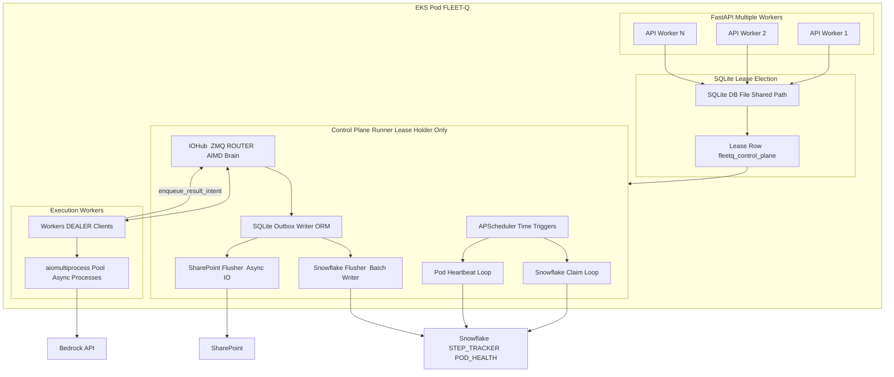

---

# 🛰 ZeroMQ Fabric Details (Recommended Socket Topologies)

## A) Control plane + permits: ROUTER/DEALER (RPC bus)

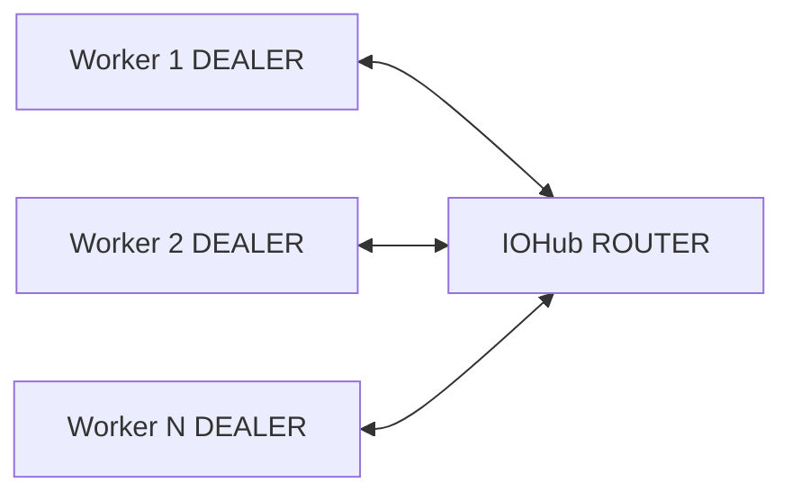

**Messages on this bus**

- `permit_request`
    
- `permit_grant`
    
- `report_outcome`
    
- `enqueue_outbox_write`
    
- `enqueue_sharepoint_download`
    
- `enqueue_sharepoint_upload`
    

This is directly aligned with ROUTER/DEALER as an async scalable request/reply + routing pattern.

---

## B) Streaming stage distribution: PUSH/PULL (optional)

If you want a pure pipeline stage:

- SharePoint downloader PUSH → processors PULL
    
- processors PUSH → Snowflake writer PULL
    

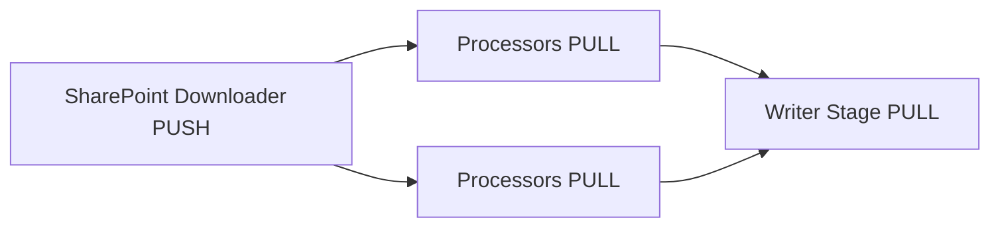

**When to use PUSH/PULL**

- When you don’t need per-message replies
    
- When you want “competing consumers”
    
- When you want natural load spreading
    

**When NOT to**

- When you need permit/ack semantics (use ROUTER/DEALER)
    

---

# 🎛 AIMD Permit Loop (Control Plane View)

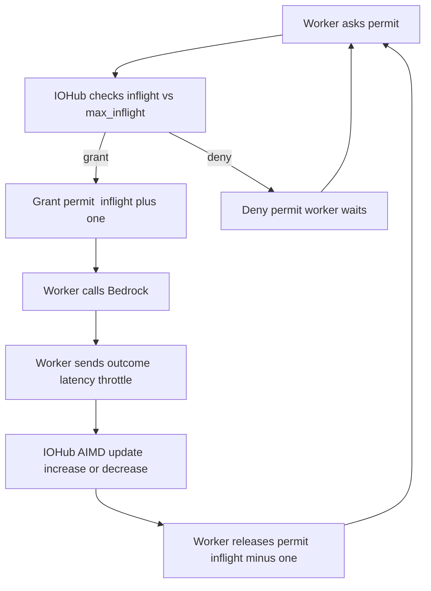

**Why this is stable**

- One shared governor per pod
    
- avoids “each worker learns separately”
    
- avoids over-parallelization when Bedrock is hot
    

---

# 🗃 SQLite Outbox Pattern (Why this is the “durable boundary”)

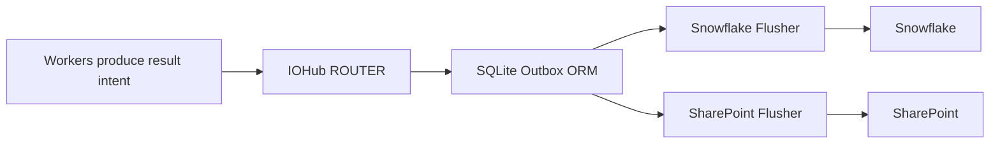

### Recommended outbox tables

|Table|Purpose|
|---|---|
|`outbox_step_updates`|status transitions, retries|
|`outbox_results`|final payload to persist|
|`outbox_sharepoint_ops`|download/upload intents|
|`pressure_state`|AIMD shared state (optional)|
|`lease`|singleton runner election|

---

# ⏰ APScheduler Placement Pattern (Safe)

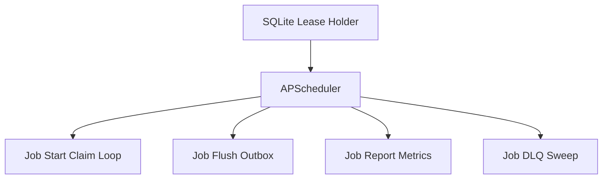

**Rule:** APScheduler runs **only** when lease is held.

---

# 📦 Design Pattern Cheat Sheet (Quick blog appendix)

|Concern|Best pattern|Why|
|---|---|---|
|Single orchestration per pod|SQLite lease lock|prevents FastAPI worker duplication|
|In-pod request/response|ZMQ ROUTER/DEALER|routing + replies + identity envelopes|
|Streaming pipeline|ZMQ PUSH/PULL|load spreading with minimal overhead|
|Backpressure|ZMQ HWM + Outbox|bounded queues + durable buffer|
|Bedrock scaling|Shared AIMD permits|stable “nozzle control”|
|Non-pickleable writers|IOHub + flushers|one owner of clients|
|Scheduled start|APScheduler in lease holder|no duplication across workers|

---

# ⚠️ Critical ZeroMQ Operational Rules (Don’t skip)

These are the “gotchas” that make or break the design:

1. **One ZMQ context per process**
    
2. **Create sockets inside the process that uses them** (no forked sockets)
    
3. **Bind in one place, connect everywhere else**
    
4. Use `ipc://` for local multi-process (fast), `inproc://` only within a process (threads)
    
5. Configure **HWM** so bursts don’t explode memory; let outbox absorb overflow
    

---

# ✅ “Best Possible” Implementation Strategy (Practical)

If you want the cleanest codebase:

### Single Control Plane Runner starts:

- IOHub (ZMQ router + AIMD)
    
- Claim loop + heartbeat loop
    
- APScheduler jobs
    
- SQLite outbox writers
    
- flushers (Snowflake + SharePoint)
    

### FastAPI workers do:

- serve HTTP endpoints
    
- optionally publish “enqueue requests” to IOHub via ZMQ (no Snowflake touching)
    

### aiomultiprocess workers do:

- request permits via IOHub
    
- call Bedrock
    
- send results back to IOHub

--- 
# 🧬 Summarizing - FLEET-Q In-Pod Execution Fabric

## ZeroMQ 🛰️ + AIMD 🎛️ + SQLite Outbox 🗃️ + aiomultiprocess ⚡ + APScheduler ⏰

_Distributed, resilient, and broker-free orchestration — with one smart pod acting like one intelligent organism._

---

## 🎬 Why this layer exists (the “real” problem)

FLEET-Q already solves **cluster-level distribution** using Snowflake tables (claim-based allocation, pod health, recovery). But once a pod has claimed tasks, we still face a harder execution reality:

- 🔥 **Bedrock is I/O heavy** → lots of waiting + bursts of throttling
    
- 🧵 **FastAPI multi-workers** → multiple OS processes in one pod (risk: duplicated loops)
    
- 🧱 **Snowflake/SharePoint writers are expensive** → cannot be created per worker/thread easily
    
- 🚦 We need **flow control** (not just more parallelism)
    

So we build an **in-pod execution fabric** that’s:

- **fast** (in-memory messaging)
    
- **pressure-aware** (AIMD)
    
- **durable at the boundary** (SQLite outbox)
    
- **cleanly scheduled** (APScheduler)
    
- **multi-process friendly** (aiomultiprocess + ZeroMQ rules)
    

---

## 🧠 The design principles (what keeps this sane)

|Principle|What it prevents|How we enforce it|
|---|---|---|
|🧠 One “brain” per pod|Duplicate claim/heartbeat loops|SQLite lease lock (singleton runner)|
|🛰️ Messaging != durability|Losing work if process dies|SQLite Outbox is the durable boundary|
|🎛️ Flow control > brute force|Throttling storms|AIMD permits + shared pressure memory|
|🔌 “Pattern sockets” not random pipes|spaghetti IPC|ROUTER/DEALER + PUSH/PULL topologies|
|⚙️ Separate concerns|hard-to-debug monolith|distinct roles: IOHub, workers, flushers|

---

# 🏗️ Architecture at a glance

## 🧭 Components (pod-internal)

- **Control Plane Runner (singleton per pod)**  
    Runs: APScheduler, claim tick, heartbeat tick, IOHub, AIMD brain, outbox flushers.
    
- **IOHub (ZeroMQ ROUTER)**  
    Central in-pod control plane: permits, routing, acknowledgements.
    
- **Execution Workers (aiomultiprocess)**  
    Bedrock calls + light compute, always permit-controlled.
    
- **SQLite Outbox (ORM)**  
    Durable buffer for all external side effects (Snowflake writes, SharePoint ops).
    

---

## 🗺️ Mermaid: Full in-pod topology (Obsidian-safe)

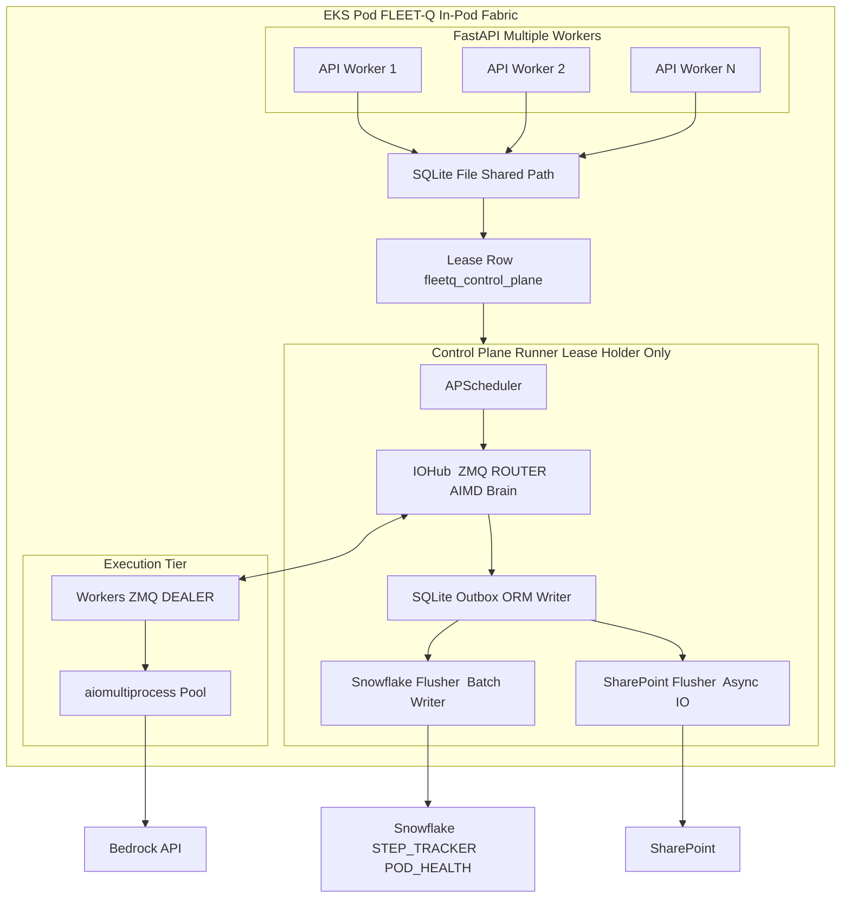

---

# 🔐 Pattern 1: SQLite Lease Election (Singleton Runner)

FastAPI multi-worker deployments will otherwise start multiple background loops.  
So: **all workers share the same SQLite file**, but **only one gets the lease** and becomes the “pod brain”.

### Lease rules

- Each process tries to acquire lease (short transaction)
    
- Winner renews lease periodically
    
- If it dies, lease expires and another process takes over
    

|Lease attribute|Recommendation|
|---|---|
|TTL|10–30s|
|Renew interval|TTL/3|
|Failure behavior|take over when `expires_at < now()`|
|Storage|SQLite shared file (WAL mode)|

---

# 🛰️ Pattern 2: ZeroMQ as the in-pod control plane (ROUTER/DEALER)

ZeroMQ is a **pattern toolkit** — we choose socket types as “architecture primitives.”

### Why ROUTER/DEALER here?

Because we need:

- async request/reply
    
- identity-aware routing
    
- permit checks + acks + feedback
    
- many workers talking to one brain
    

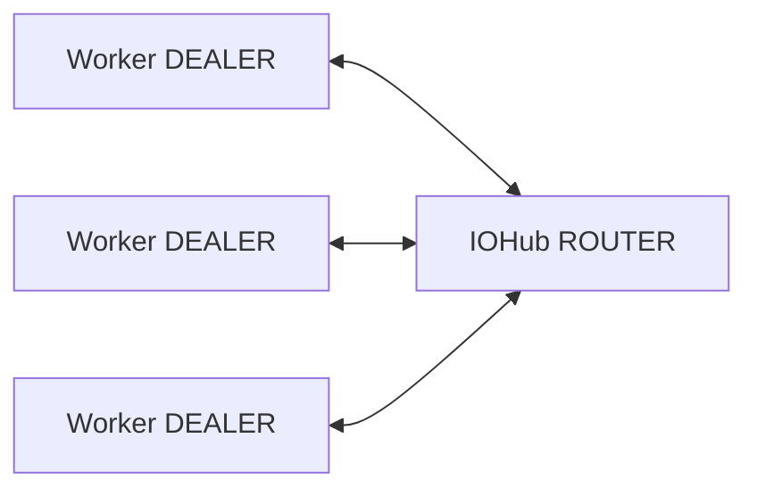

### Message families (keep it explicit)

|Type|Example|Purpose|
|---|---|---|
|🎛️ Permit|`permit_request`, `permit_grant`|AIMD-controlled Bedrock concurrency|
|📣 Feedback|`call_success`, `call_throttle`, `latency_sample`|updates pressure memory|
|🧾 Side-effect intent|`enqueue_outbox_write`|durable write intent|
|📦 IO intent|`sp_download`, `sp_upload`|SharePoint operations routed to flusher|

---

# 🎛️ Pattern 3: AIMD Permit Server (rocket-nozzle throttling)

Instead of each worker “guessing” concurrency, they request permits.

## 🔁 Permit loop (high-level)

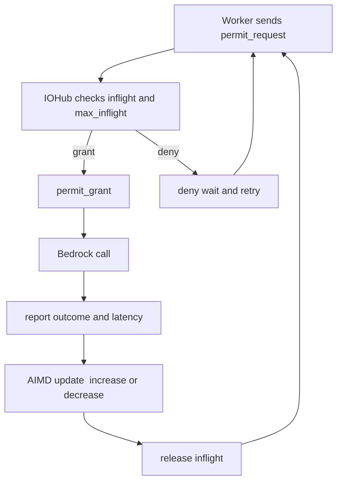

## AIMD rules (simple and stable)

|Signal|Action|Intuition|
|---|---|---|
|✅ Success streak|`max_inflight += 1` slowly|cautiously explore capacity|
|🚫 Throttle (429)|`max_inflight = max(1, floor(max_inflight/2))`|react fast to pressure|
|🐢 Latency rising|pause growth (or tiny decrease)|early warning before hard throttles|

---

# 🗃️ Pattern 4: SQLite Outbox (ORM) as the durability boundary

ZeroMQ is fast, but not durable by default. So we persist **side effects** into SQLite first.

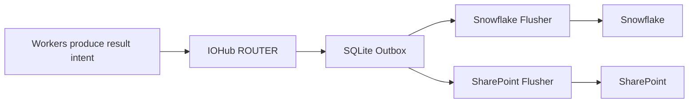

### Outbox tables (minimal + powerful)

|Table|What it stores|
|---|---|
|`outbox_step_updates`|status transitions, retries, metadata|
|`outbox_results`|final payload to Snowflake|
|`outbox_sharepoint_ops`|download/upload requests + outputs|
|`pressure_state`|AIMD config (optional)|
|`lease`|singleton runner election|

### Why this helps

- 🧯 ZeroMQ HWM can stay bounded (no memory blowups)
    
- 🧾 Writers batch from SQLite efficiently
    
- 🔁 Replays are possible within pod lifetime
    
- 🧠 Control plane keeps external clients centralized
    

---

# ⚡ Pattern 5: aiomultiprocess for Bedrock-heavy execution

Each aiomultiprocess worker process:

- runs its own asyncio loop
    
- performs HTTP calls efficiently
    
- never owns Snowflake/SharePoint clients
    

✅ Great fit because your workload is **I/O bound**, not CPU bound.

**Important**: aiomultiprocess does _execution_; IOHub does _governance_.

|Layer|Responsibility|
|---|---|
|aiomultiprocess worker|Bedrock call + parse + send feedback|
|IOHub|permits, AIMD, routing, outbox persistence|
|Flushers|durable side effects to external systems|

---

# ⏰ Pattern 6: APScheduler for “time triggers” (only in the lease holder)

APScheduler is great, but must be **singleton guarded**.

Use it for:

- 🕒 start the claim run at a given time
    
- 🔁 periodic outbox flush
    
- 📊 metrics emission
    
- 🧹 DLQ sweep / stale intent cleanup (local)
    

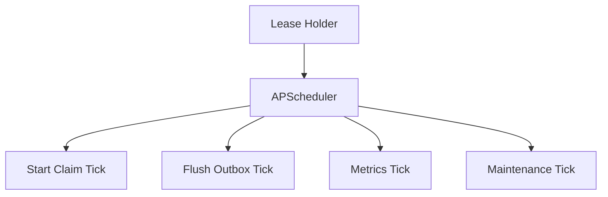

---

# 🧵 Where PUSH/PULL fits (optional data plane)

If you want a pure “pipeline” feel for internal stages (e.g., SharePoint downloads feeding processors), PUSH/PULL is perfect.

Use it when:

- no per-message response required
    
- you want competing consumers
    
- you want smooth load distribution
    

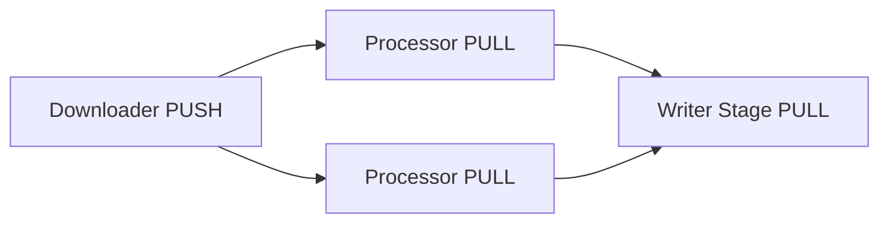

**But**: keep durability via outbox, not ZMQ queues.

---

# 🧰 “Best Possible” Pattern Stack (summary table)

|Concern|Pattern|Tooling|
|---|---|---|
|One brain per pod|Lease election|SQLite|
|In-pod coordination|Async RPC bus|ZMQ ROUTER/DEALER|
|Streaming pipeline|Work distribution|ZMQ PUSH/PULL|
|Backpressure|Bounded queues|ZMQ HWM + outbox|
|Bedrock throttling|Shared AIMD permits|IOHub brain|
|Durable side effects|Outbox pattern|SQLite + ORM|
|Heavy external clients|Centralized writers|IOHub + flushers|
|Start at specific time|Time trigger|APScheduler|

---
# ✅ Final Takeaway

This design gives FLEET-Q an **internal nervous system**:

- **ZeroMQ** is the fast signaling fabric (control + pipeline)
    
- **SQLite Outbox** is the durable memory of side effects
    
- **AIMD permits** make Bedrock concurrency adaptive and stable
    
- **aiomultiprocess** maximizes I/O throughput without chaos
    
- **APScheduler** triggers “start/flush/maintain” safely (singleton only)