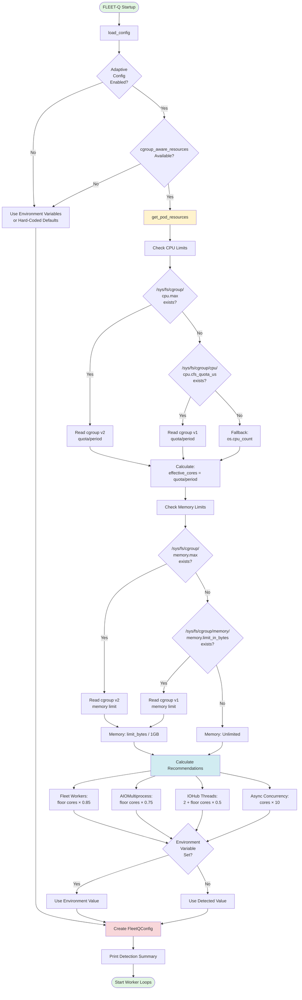
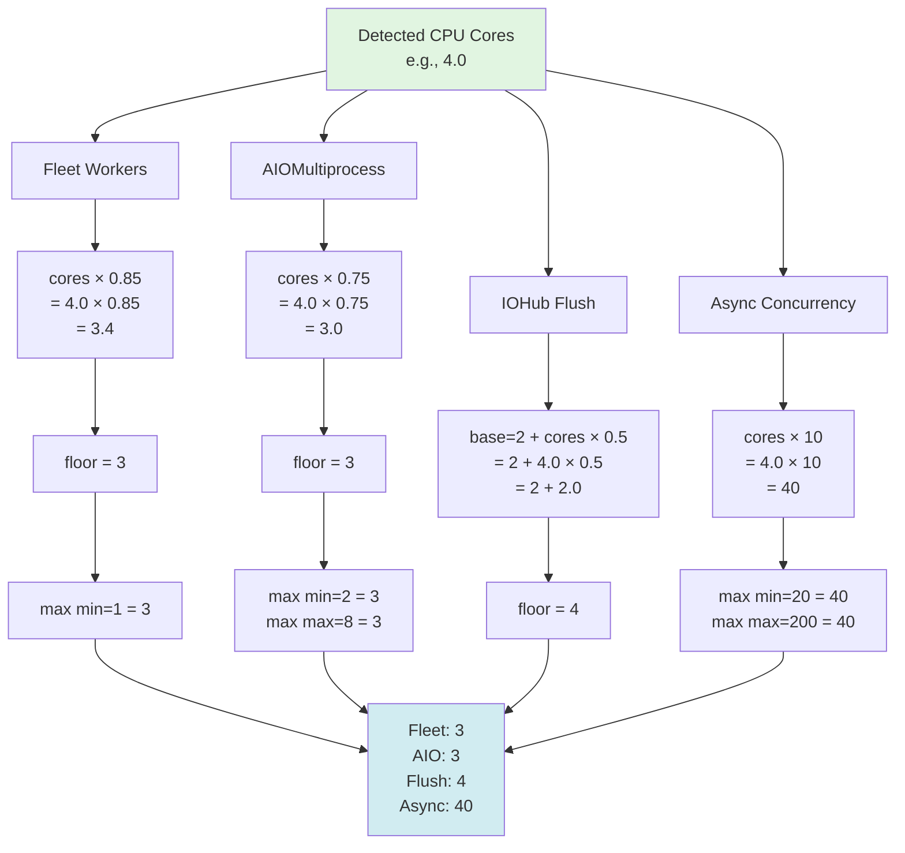
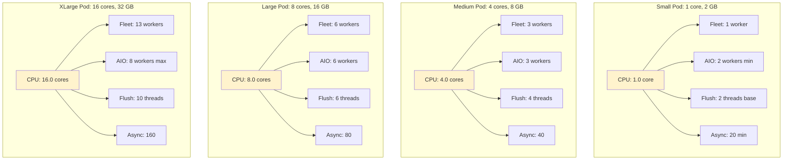
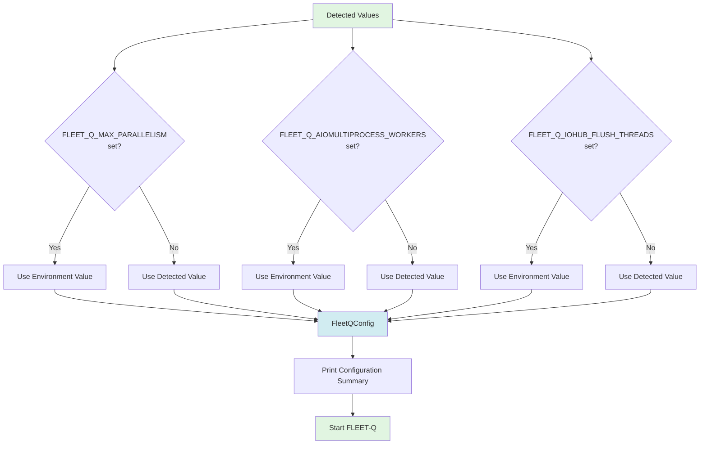
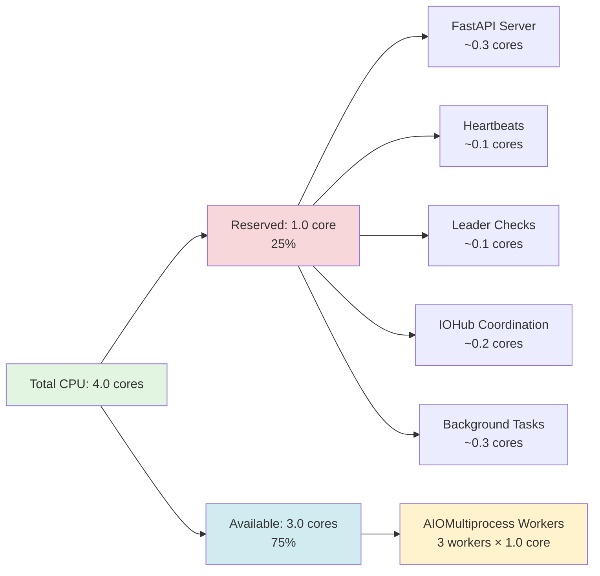
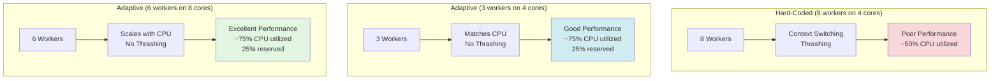
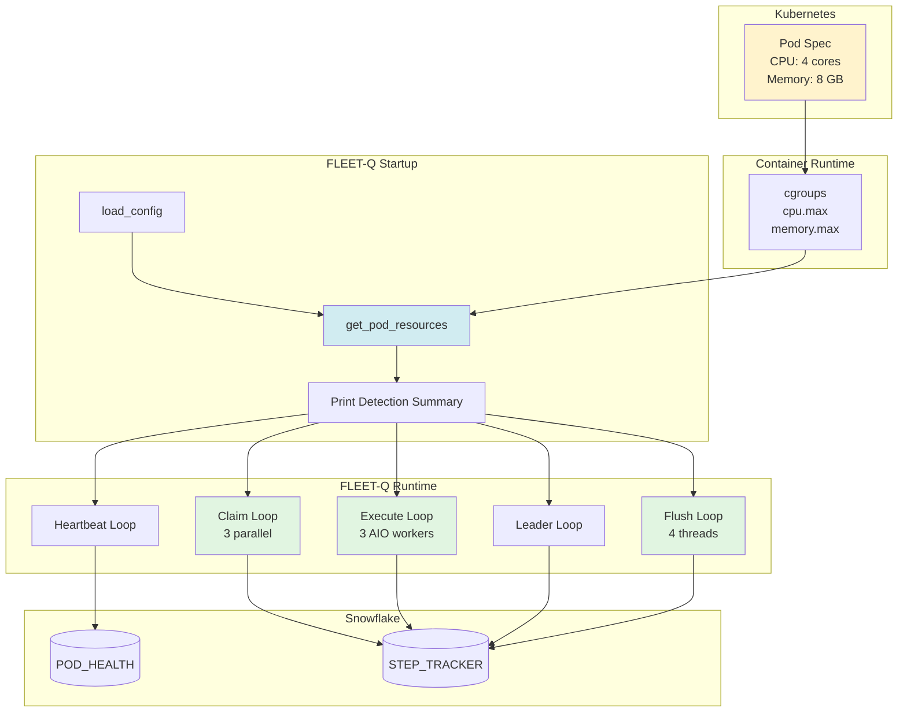

# Pod Resource Detection Flow

This document provides visual diagrams showing how FLEET-Q detects and adapts to Kubernetes pod resources.

## Detection Flow



## CPU Detection Priority

```mermaid
flowchart LR
    A[CPU Detection] --> B{cgroup v2?}
    B -->|Yes| C[/sys/fs/cgroup/cpu.max]
    B -->|No| D{cgroup v1?}
    D -->|Yes| E[/sys/fs/cgroup/cpu/\ncpu.cfs_quota_us]
    D -->|No| F{CPU Affinity?}
    F -->|Yes| G[os.sched_getaffinity]
    F -->|No| H[os.cpu_count]
    
    C --> I[effective_cores]
    E --> I
    G --> I
    H --> I
    
    style A fill:#e1f5e1
    style I fill:#d1ecf1
    style C fill:#fff3cd
    style E fill:#fff3cd
    style G fill:#ffeeba
    style H fill:#f8d7da
```

## Memory Detection Priority

```mermaid
flowchart LR
    A[Memory Detection] --> B{cgroup v2?}
    B -->|Yes| C[/sys/fs/cgroup/memory.max]
    B -->|No| D{cgroup v1?}
    D -->|Yes| E[/sys/fs/cgroup/memory/\nmemory.limit_in_bytes]
    D -->|No| F[Unlimited]
    
    C --> G{Value = 'max'?}
    G -->|Yes| F
    G -->|No| H[effective_memory_gb]
    
    E --> I{Value > 8 EiB?}
    I -->|Yes| F
    I -->|No| H
    
    F --> H
    
    style A fill:#e1f5e1
    style H fill:#d1ecf1
    style C fill:#fff3cd
    style E fill:#fff3cd
    style F fill:#f8d7da
```

## Recommendation Calculation



## Pod Size Examples



## Environment Variable Override Flow



## Kubernetes Integration

```mermaid
graph TB
    subgraph "Kubernetes Pod Spec"
        PodSpec[Pod YAML] --> ResourceLimits[resources.limits]
        ResourceLimits --> CPULimit[cpu: '4000m']
        ResourceLimits --> MemLimit[memory: '8Gi']
    end
    
    subgraph "Container Runtime cgroup Setup"
        CPULimit --> CgroupCPU[/sys/fs/cgroup/cpu.max\n'400000 100000']
        MemLimit --> CgroupMem[/sys/fs/cgroup/memory.max\n'8589934592']
    end
    
    subgraph "FLEET-Q Detection"
        CgroupCPU --> DetectCPU[effective_cpu_cores\n= 400000/100000\n= 4.0]
        CgroupMem --> DetectMem[effective_memory_gb\n= 8589934592/1073741824\n= 8.0]
    end
    
    subgraph "FLEET-Q Configuration"
        DetectCPU --> CalcWorkers[Calculate Recommendations]
        DetectMem --> CalcWorkers
        CalcWorkers --> FleetWorkers[max_parallelism: 3]
        CalcWorkers --> AIOWorkers[aiomultiprocess_workers: 3]
        CalcWorkers --> FlushThreads[iohub_flush_threads: 4]
    end
    
    subgraph "Worker Loops"
        FleetWorkers --> ClaimLoop[Claim Loop:\n3 parallel claims]
        AIOWorkers --> HTTPPool[HTTP Pool:\n3 processes × 40 async\n= 120 concurrent]
        FlushThreads --> FlushPool[Flush Pool:\n4 threads]
    end
    
    style PodSpec fill:#e1f5e1
    style ResourceLimits fill:#fff3cd
    style DetectCPU fill:#d1ecf1
    style DetectMem fill:#d1ecf1
    style CalcWorkers fill:#f8d7da
```

## Reserve Fraction Explanation



## Throughput Comparison



## Complete System Architecture with Adaptive Config



---

## Key Takeaways

1. **Detection is automatic** - No manual configuration needed
2. **Priority system** - cgroup v2 → v1 → fallback
3. **Reserve CPU** - 15-25% for overhead (heartbeats, FastAPI, IOHub)
4. **Environment overrides** - Can override any detected value
5. **Graceful degradation** - Falls back to defaults if detection fails
6. **Kubernetes integration** - Respects `resources.limits` from pod spec

---

## Related Documentation

- [POD_RESOURCES_GUIDE.md](POD_RESOURCES_GUIDE.md) - Complete guide
- [POD_RESOURCES_QUICKREF.md](POD_RESOURCES_QUICKREF.md) - Quick reference
- [AIOMULTIPROCESS_GUIDE.md](AIOMULTIPROCESS_GUIDE.md) - HTTP concurrency
