# DuckDB Integration Architecture

This document shows how DuckDB utilities integrate with FLEET-Q's distributed execution framework.

## System Architecture

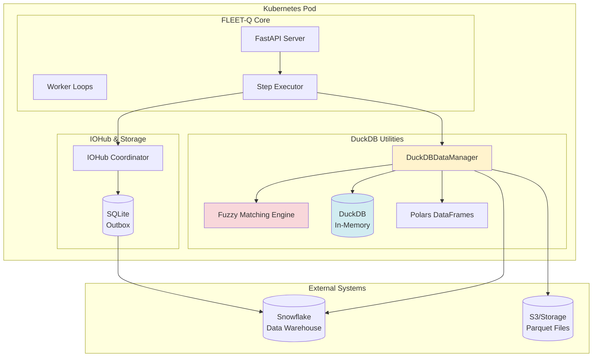

## Data Flow: Matching Task Execution

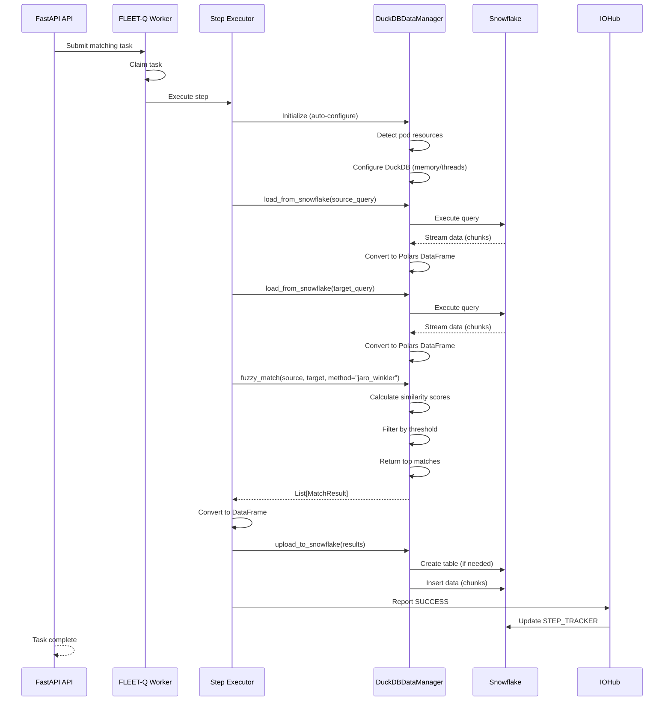

## Component Interaction

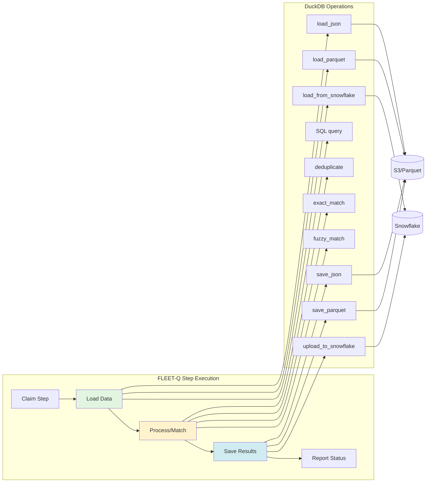

## Fuzzy Matching Pipeline

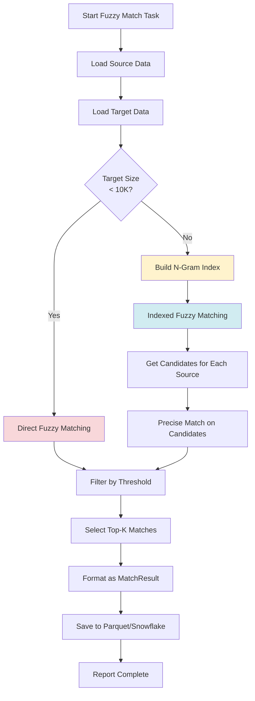

## Resource Management

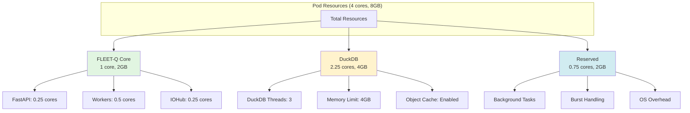

## Data Format Support

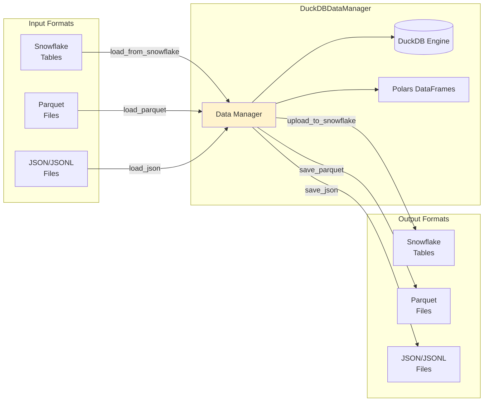

## Matching Algorithm Selection

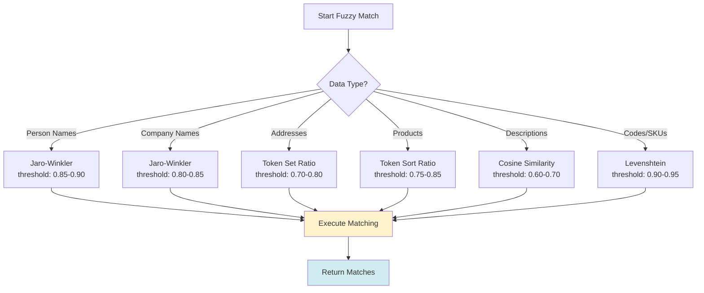

## Performance Optimization Flow

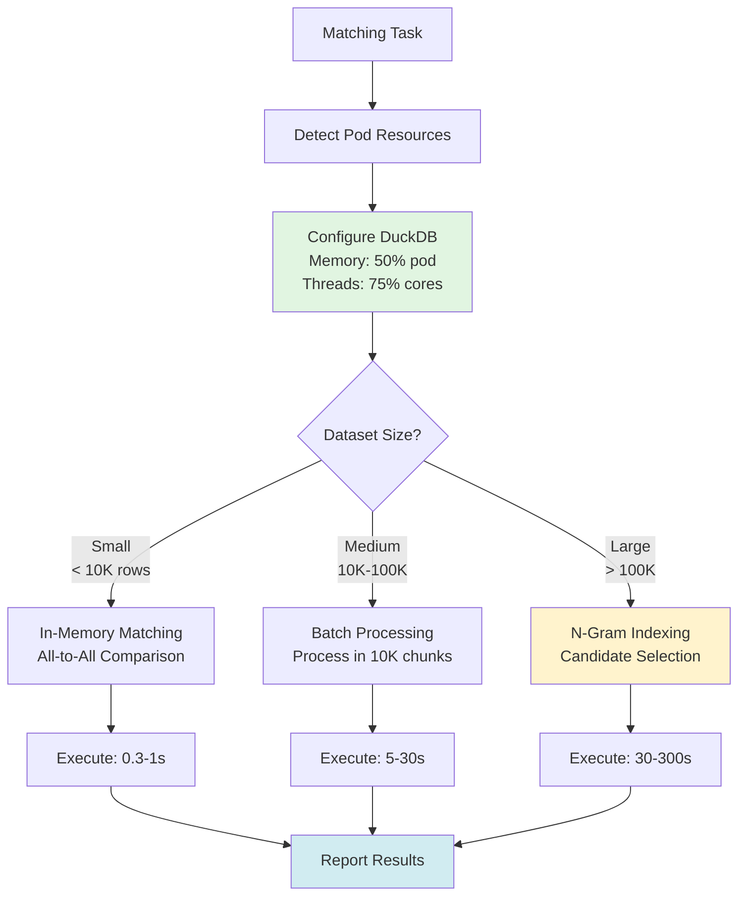

## Example: Customer Matching Workflow

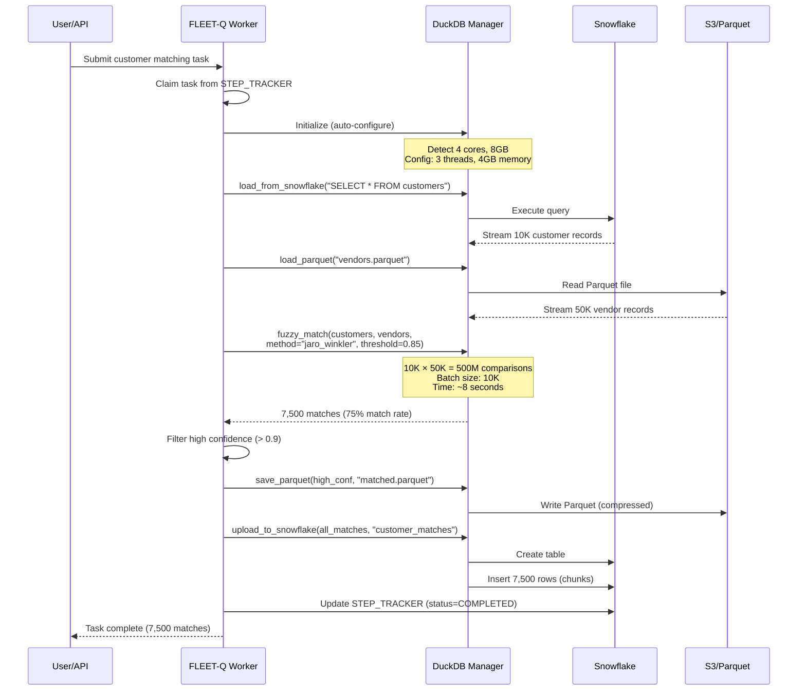

## Memory Management

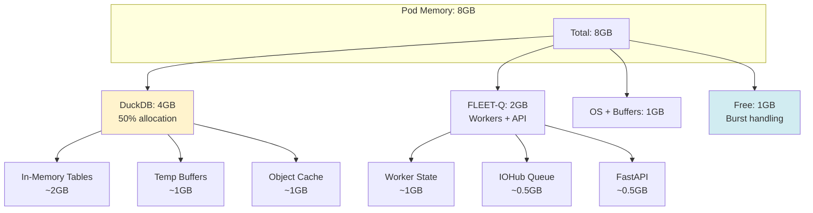

## Integration Points

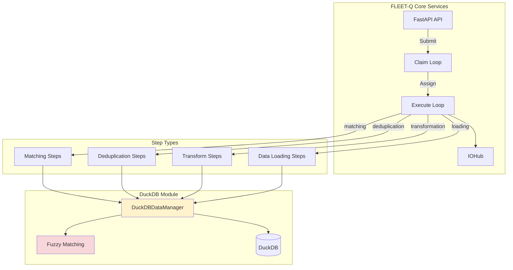

## End-to-End Example

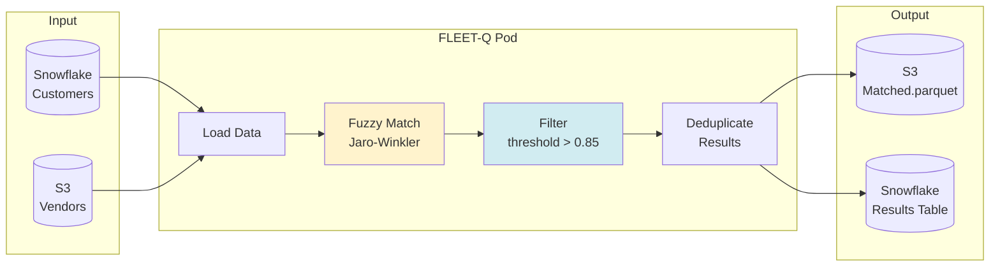

---

## Key Integration Benefits

1. **Seamless Data Flow**: Snowflake → DuckDB → Polars → Snowflake
2. **Pod-Aware Resources**: Auto-configures based on Kubernetes limits
3. **High Performance**: 3-12M comparisons/second for fuzzy matching
4. **Memory Efficient**: Streaming operations, lazy loading
5. **Format Flexibility**: Parquet, JSON, JSONL, Snowflake tables
6. **Algorithm Selection**: 7 fuzzy matching methods for different use cases
7. **Scalable**: N-gram indexing for large datasets (90%+ reduction)
8. **Robust**: Error handling, graceful degradation, retry logic

---

## Related Documentation

- [DuckDB Utils Guide](DUCKDB_UTILS_GUIDE.md) - Complete documentation
- [DuckDB Quick Reference](DUCKDB_QUICKREF.md) - Cheat sheet
- [Integration Summary](DUCKDB_INTEGRATION_SUMMARY.md) - Implementation details
- [Pod Resources Guide](POD_RESOURCES_GUIDE.md) - Resource detection
