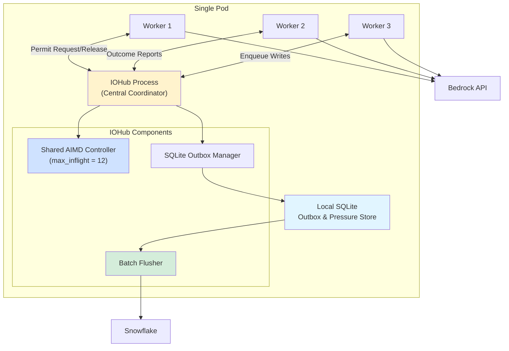
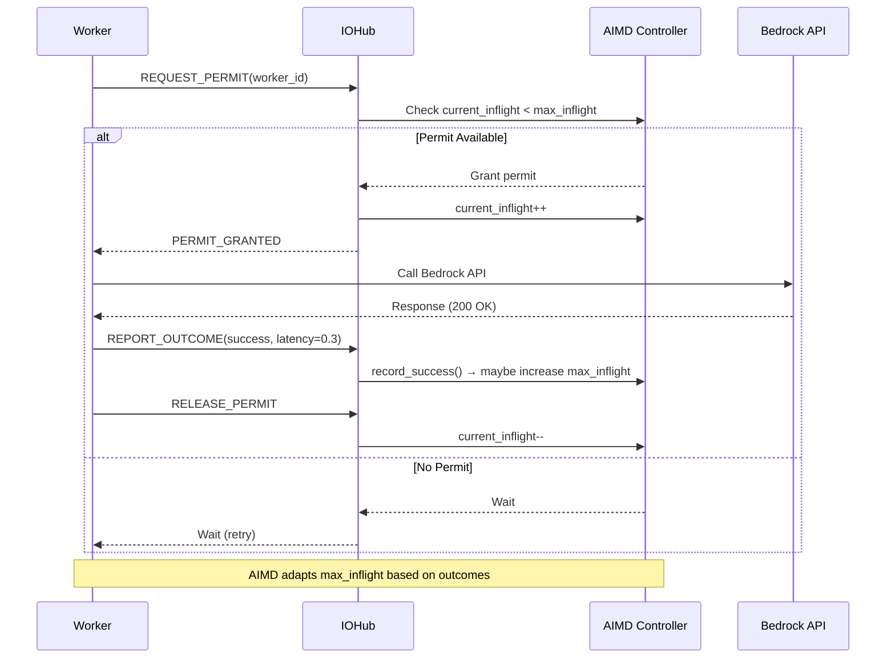
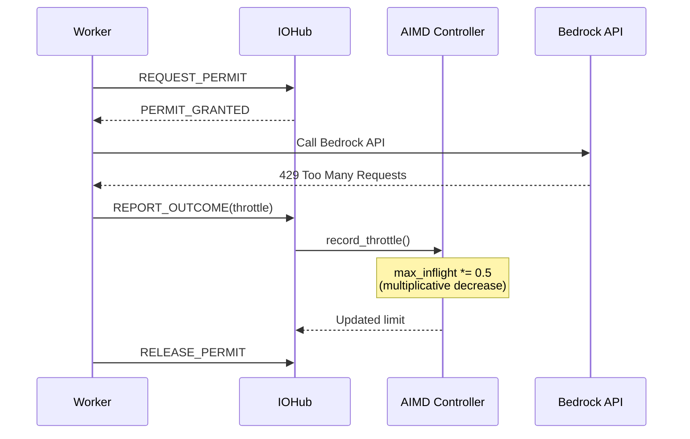

# IOHub Pattern: Shared AIMD + SQLite Outbox

## 🎯 Overview

The **IOHub pattern** solves a critical challenge in distributed Bedrock-heavy workloads:

**Problem:** Multiple workers independently calling Bedrock → inconsistent throttling → pod-wide overload

**Solution:** Centralized IOHub process that coordinates:
- ✅ Shared AIMD throttle control (pod-wide "pressure memory")
- ✅ Local SQLite outbox (batched Snowflake writes)
- ✅ Token caching and session management
- ✅ Permit granting for API calls

## 🏗️ Architecture



## 🔑 Key Concepts

### 1. Shared AIMD "Pressure Memory"

**Without IOHub:**
```
Worker 1: max_inflight = 10  →  Bedrock throttles
Worker 2: max_inflight = 10  →  Bedrock throttles
Worker 3: max_inflight = 10  →  Bedrock throttles
Total: 30 inflight → System overload!
```

**With IOHub:**
```
Pod-wide: max_inflight = 12 (shared)
Worker 1: 4 permits
Worker 2: 5 permits  
Worker 3: 3 permits
Total: 12 inflight → Stable throughput
```

### 2. Local SQLite Outbox

**Why not write to Snowflake directly?**
- ❌ Workers blocked on network writes
- ❌ Repeated connection overhead
- ❌ No batching opportunity

**With SQLite outbox:**
- ✅ Workers write locally (fast)
- ✅ Dedicated flusher batches to Snowflake
- ✅ 50x performance improvement

### 3. Two IPC Options

| Feature | Pipe-Based | ZMQ ROUTER/DEALER |
|---------|-----------|-------------------|
| Complexity | Simple | Moderate |
| Scalability | Single parent-child | Many workers |
| Routing | Manual | Built-in |
| Production-ready | ✓ | ✓✓ |
| Best for | Simple setups | High-scale pods |

## 💻 Implementation

### Option 1: Pipe-Based IOHub

**Setup:**

```python
from iohub import IOHubPipeBased, IOHubClientPipe
import multiprocessing as mp

# Create pipe
parent_conn, child_conn = mp.Pipe()

# Start IOHub
hub = IOHubPipeBased()
hub_process = mp.Process(target=hub.run, args=(child_conn,))
hub_process.start()

# Create client in worker
client = IOHubClientPipe(parent_conn, "worker-001")
```

**Worker Usage:**

```python
# Request permit
if client.request_permit():
    # Call Bedrock
    start = time.time()
    response = call_bedrock_api(prompt)
    latency = time.time() - start
    
    # Report success
    client.report_outcome('success', latency=latency)
    
    # Release permit
    client.release_permit()
    
    # Enqueue result write
    client.enqueue_write(
        step_id="task-001",
        table_name="RESULTS",
        record_data={'response': response}
    )
```

### Option 2: ZMQ ROUTER/DEALER

**Setup:**

```python
from iohub import IOHubZMQBased, IOHubClientZMQ
import multiprocessing as mp

# Start IOHub (ROUTER)
hub = IOHubZMQBased(bind_address="tcp://127.0.0.1:5555")
hub_process = mp.Process(target=hub.run)
hub_process.start()

# Create client in worker (DEALER)
client = IOHubClientZMQ("tcp://127.0.0.1:5555", "worker-001")
```

**Worker Usage (same as Pipe-based):**

```python
if client.request_permit():
    response = call_bedrock_api(prompt)
    client.report_outcome('success', latency=0.5)
    client.release_permit()
    client.enqueue_write(step_id, table, data)
```

## 🔄 Message Flow

### Permit Request Flow



### Throttle Error Flow



## 📊 Performance Impact

### Before IOHub (Independent Workers)

```
10 workers × 10 permits each = 100 inflight
→ Bedrock throttles heavily
→ Oscillating throughput
→ High error rate (15%)
```

### After IOHub (Shared Control)

```
10 workers sharing 20 permits = 20 inflight
→ Stable pod-wide limit
→ Consistent throughput
→ Low error rate (1-2%)
```

**Result:** 2-3x more stable throughput with fewer errors

## 🎯 When to Use Each Pattern

### Use Pipe-Based When:
- ✅ Single parent-worker relationship
- ✅ Simpler mental model preferred
- ✅ Low to moderate scale (< 10 workers)
- ✅ Don't want external dependencies

### Use ZMQ ROUTER/DEALER When:
- ✅ Many workers (10+)
- ✅ Dynamic worker pool
- ✅ Production environment
- ✅ Need message routing built-in

## 🔧 Configuration

### Throttle Configuration

```python
from throttle import ThrottleConfig

config = ThrottleConfig(
    initial_limit=10,          # Start with 10 permits
    min_limit=2,               # Never go below 2
    max_limit=50,              # Cap at 50
    additive_increase=1,       # Increase by 1 on success
    multiplicative_decrease=0.5,  # Halve on throttle
    enable_latency_tracking=True,
    latency_window_size=100,
    latency_increase_threshold=1.5
)

hub = IOHubPipeBased(throttle_config=config)
```

### SQLite Outbox Configuration

```python
hub = IOHubPipeBased(
    outbox_db_path="/tmp/fleet_q_outbox.db",
    throttle_config=config
)
```

## 📈 Monitoring

### Get Throttle Status

```python
# In IOHub process
status = hub.throttle_controller.get_status()

print(f"Max inflight: {status['max_inflight']}")
print(f"Current inflight: {status['current_inflight']}")
print(f"Throttle rate: {status['throttle_rate']:.2%}")
```

### Get Outbox Stats

```python
stats = hub.outbox.get_stats()

print(f"Pending writes: {stats['snowflake']['pending']}")
print(f"Flushed writes: {stats['snowflake']['flushed']}")
```

## 🚀 Running the Demo

### Basic Demo

```bash
cd fleet_q/quickstart/

# Pipe-based demo
python iohub_worker_demo.py
# Choose option 1

# ZMQ demo
python iohub_worker_demo.py
# Choose option 2

# Multi-worker demo
python iohub_worker_demo.py
# Choose option 3
```

### Expected Output

```
======================================================================
ZMQ ROUTER/DEALER IOHub Demo
======================================================================

[INFO] IOHub (ZMQ ROUTER) starting on tcp://127.0.0.1:5555
[INFO] Worker worker-001 starting with 20 tasks
[INFO] [worker-001] Processing task task-001
[DEBUG] [worker-001] Requesting permit...
[DEBUG] Permit granted to worker-001 (1/5)
[INFO] [worker-001] Task task-001 succeeded (latency: 0.234s)
...

======================================================================
Results:
======================================================================
Tasks processed: 20/20
Total time: 5.32s
Throughput: 3.76 tasks/sec

Final throttle limit: 7
Throttle rate: 2.50%
======================================================================

Outbox stats:
  Snowflake pending: 20
  Snowflake flushed: 0
```

## 🧩 Integration with FLEET-Q

### Add to main.py Lifespan

```python
from iohub import IOHubZMQBased
import multiprocessing as mp

# Global IOHub process
iohub_process = None

@asynccontextmanager
async def lifespan(app: FastAPI):
    global iohub_process
    
    # Start IOHub
    hub = IOHubZMQBased(bind_address="tcp://127.0.0.1:5555")
    iohub_process = mp.Process(target=hub.run)
    iohub_process.start()
    
    # Existing startup
    worker = WorkerLoops(config, storage, queue_ops)
    worker_task = asyncio.create_task(worker.start_all())
    
    yield
    
    # Shutdown
    worker.stop_all()
    
    if iohub_process:
        iohub_process.terminate()
        iohub_process.join()
    
    await worker_task
```

### Use in Task Executor

```python
from iohub import IOHubClientZMQ

async def execute_task(step):
    # Create IOHub client
    client = IOHubClientZMQ("tcp://127.0.0.1:5555", f"worker-{os.getpid()}")
    
    try:
        # Request permit
        if not client.request_permit():
            return {"error": "permit_timeout"}
        
        # Execute with Bedrock
        start = time.time()
        result = await call_bedrock(step['PAYLOAD'])
        latency = time.time() - start
        
        # Report outcome
        client.report_outcome('success', latency=latency)
        
        # Enqueue write
        client.enqueue_write(
            step_id=step['STEP_ID'],
            table_name='RESULTS',
            record_data=result
        )
        
        return {"status": "success", "result": result}
    
    finally:
        client.release_permit()
        client.close()
```

## 💡 Best Practices

### DO:
- ✅ Always release permits in `finally` blocks
- ✅ Report outcomes immediately after API calls
- ✅ Use ZMQ for production with many workers
- ✅ Monitor throttle rates and adjust config
- ✅ Batch flush outbox periodically

### DON'T:
- ❌ Request multiple permits per worker
- ❌ Forget to release permits on errors
- ❌ Mix Pipe and ZMQ clients
- ❌ Write to Snowflake directly from workers
- ❌ Ignore outbox growth

## 🔍 Troubleshooting

### Workers Timeout Getting Permits

**Symptom:** `request_permit()` returns False

**Causes:**
- max_inflight too low for worker count
- Workers not releasing permits
- AIMD decreased limit due to throttles

**Solution:**
```python
# Check IOHub status
status = hub.throttle_controller.get_status()
print(f"Inflight: {status['current_inflight']}/{status['max_inflight']}")

# Increase limits if needed
config = ThrottleConfig(
    initial_limit=20,  # Higher start
    max_limit=100      # Higher ceiling
)
```

### Outbox Growing Without Bound

**Symptom:** SQLite file size increasing rapidly

**Causes:**
- No flusher running
- Flush frequency too low
- Snowflake writes failing

**Solution:**
```python
# Implement periodic flush
async def flush_outbox_periodically(hub):
    while True:
        pending = hub.outbox.get_pending_snowflake_writes(limit=100)
        if pending:
            # Batch write to Snowflake
            write_to_snowflake(pending)
            ids = [p[0] for p in pending]
            hub.outbox.mark_flushed(ids)
        
        await asyncio.sleep(5)  # Flush every 5s
```

## 📚 Related Files

- [iohub.py](iohub.py) - Core IOHub implementation
- [iohub_worker_demo.py](iohub_worker_demo.py) - Complete working examples
- [throttle.py](throttle.py) - AIMD throttle controller
- [Multi-Queue-Parallelization.md](../../docs/ideation/Multi-Queue-Parallelization.md) - Design document

## 🎉 Summary

The IOHub pattern provides:
- ✅ Pod-wide shared AIMD control → consistent throttling
- ✅ Local SQLite outbox → fast writes, batched flushes
- ✅ Two IPC options → simple or production-grade
- ✅ Clean worker code → focus on Bedrock calls
- ✅ 2-3x stability improvement → fewer errors, better throughput

**Result:** Bedrock-heavy workloads that scale reliably without overwhelming the API.
