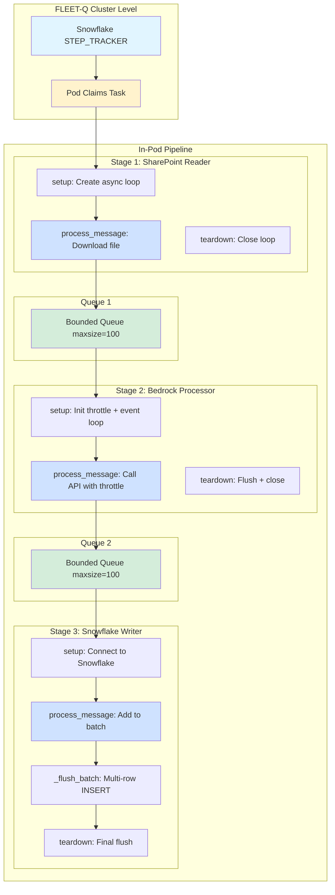
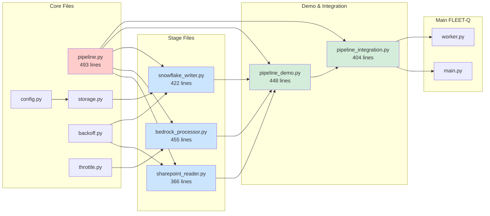
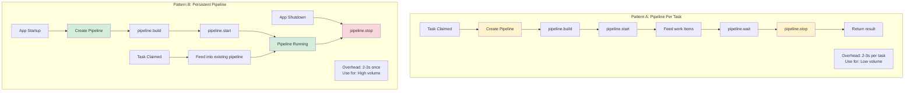
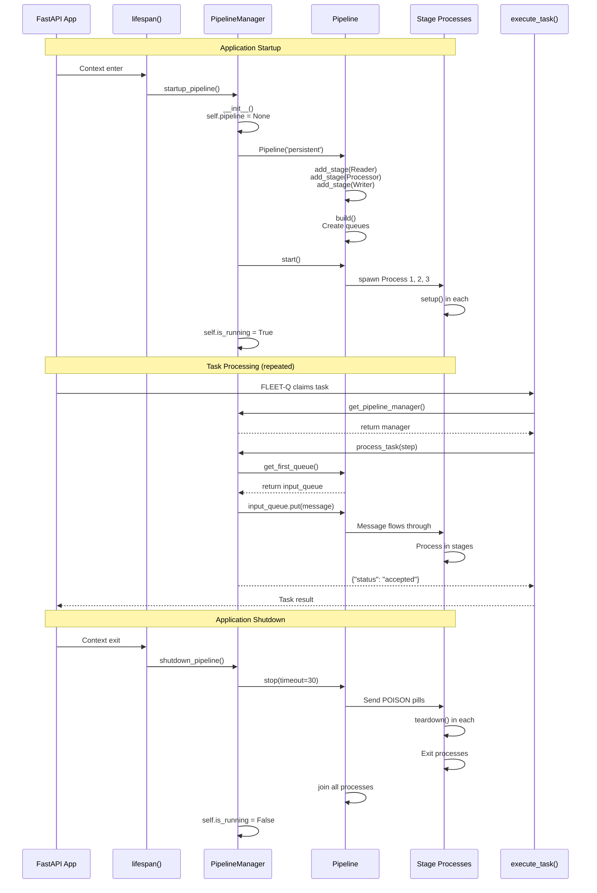
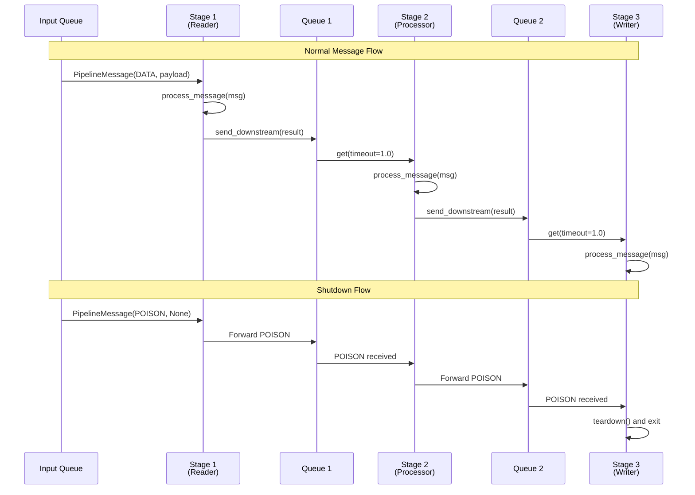
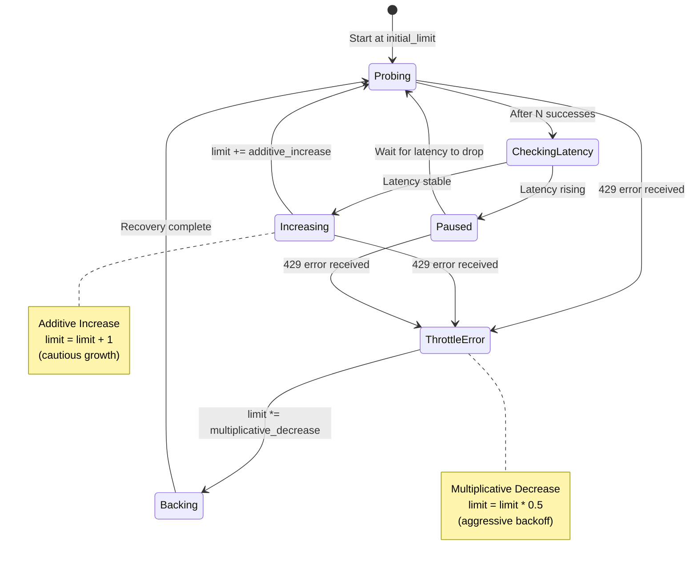
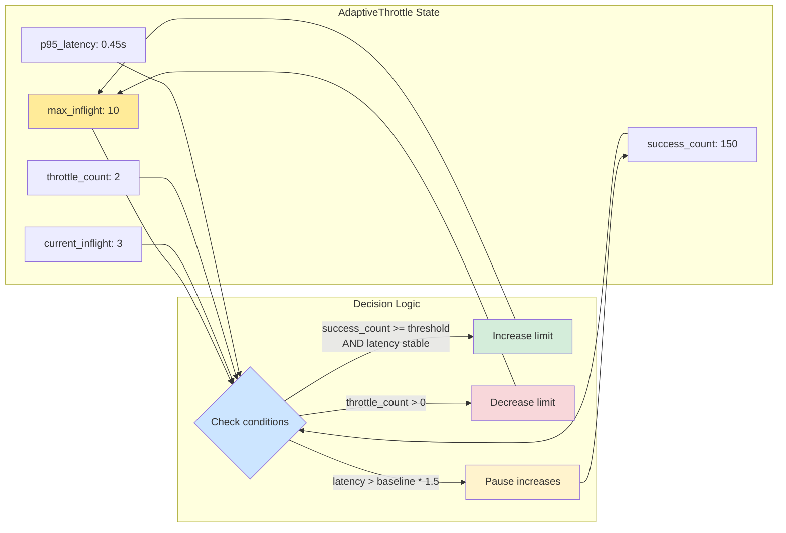
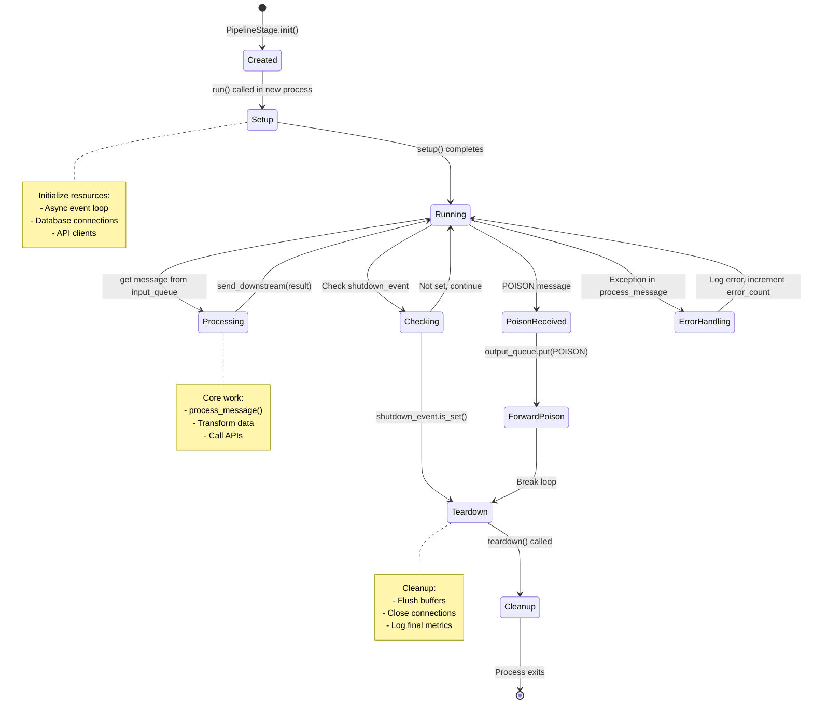
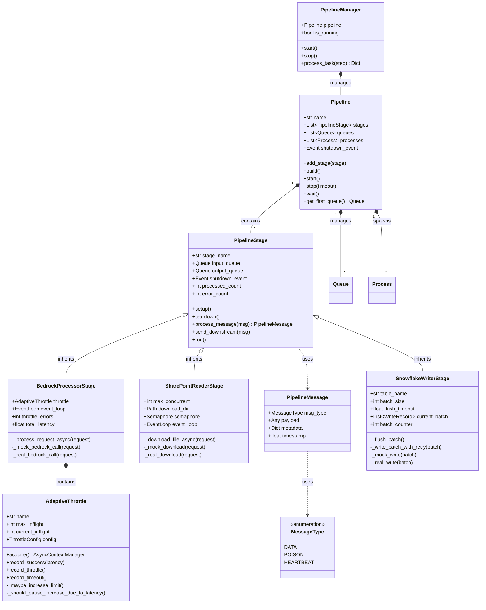
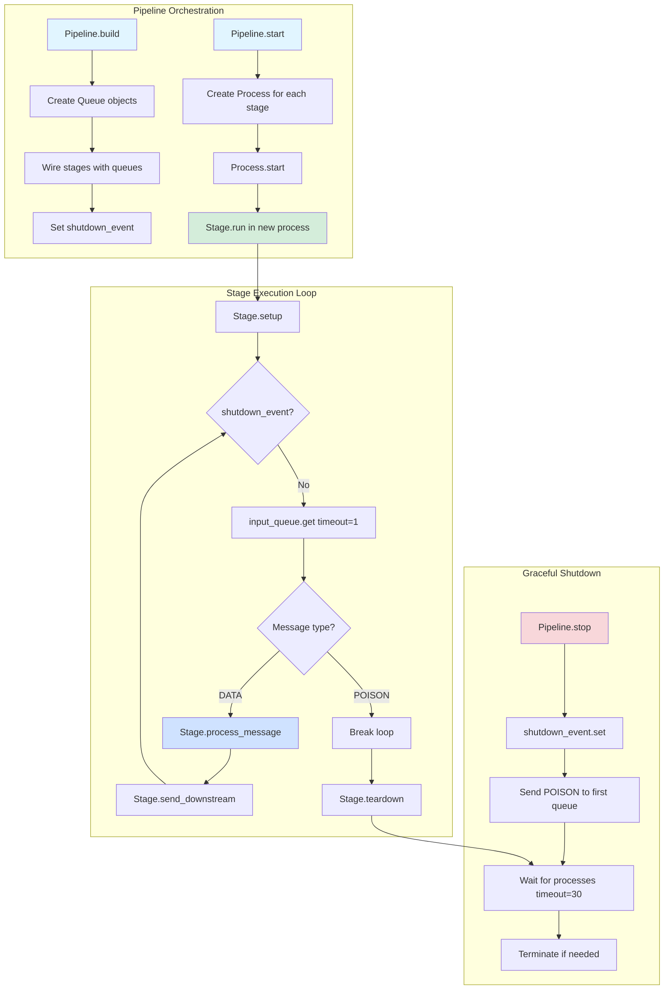

# FLEET-Q In-Pod Pipeline Quickstart

Get started with the FLEET-Q parallelization pipeline in 5 minutes.

## 🚀 Quick Start

### 1. Run the Demo

```bash
cd fleet_q/quickstart/

# Basic demo with 20 files (mock mode)
python pipeline_demo.py

# Process more files
python pipeline_demo.py --files 100

# Stress test for 60 seconds
python pipeline_demo.py --mode stress --duration 60
```

### 2. Understand the Output

```
======================================================================
FLEET-Q In-Pod Pipeline Demo
======================================================================

Pipeline stages:
  1. SharePoint Reader  (async downloads)
  2. Bedrock Processor  (async + AIMD throttling)
  3. Snowflake Writer   (batched writes)

[INFO] Downloaded file-001: 2,300 bytes in 0.15s (15.3 KB/s)
[INFO] Request req-001 completed in 0.23s (throttle limit: 6)
[INFO] Flushing batch batch-000001 with 10 records

Pipeline Complete!
Total time: 8.45s
Throughput: 2.37 files/sec
```

**Key metrics to watch:**
- `throttle limit: 6` - AIMD is adapting concurrency dynamically
- `Flushing batch batch-000001` - Batching is working
- Individual stage timing

## 📐 Pipeline Architecture

### System Overview



### File Structure & Dependencies



## 🏗️ Build Your Own Pipeline

### Minimal Example

```python
from pipeline import Pipeline, PipelineStage, PipelineMessage, MessageType

# Define a simple processing stage
class MyProcessor(PipelineStage):
    def process_message(self, message: PipelineMessage):
        # Your logic here
        result = process(message.payload)
        return PipelineMessage(MessageType.DATA, result)

# Create and run pipeline
pipeline = Pipeline("my-pipeline")
pipeline.add_stage(MyProcessor("processor"))
pipeline.build()
pipeline.start()

# Feed work
input_queue = pipeline.get_first_queue()
input_queue.put(PipelineMessage(MessageType.DATA, "work item"))

# Cleanup
pipeline.wait()
pipeline.stop()
```

### Three-Stage Pipeline

```python
from pipeline import Pipeline
from sharepoint_reader import SharePointReaderStage
from bedrock_processor import BedrockProcessorStage
from snowflake_writer import SnowflakeWriterStage

# Create pipeline
pipeline = Pipeline("document-processing")

# Stage 1: Download
pipeline.add_stage(SharePointReaderStage(
    stage_name="Download",
    max_concurrent=10
))

# Stage 2: Process with Bedrock
pipeline.add_stage(BedrockProcessorStage(
    stage_name="Analyze",
    throttle_config=ThrottleConfig(
        initial_limit=5,
        max_limit=20
    )
))

# Stage 3: Write to Snowflake
pipeline.add_stage(SnowflakeWriterStage(
    stage_name="Store",
    table_name="RESULTS",
    batch_size=50
))

# Build and start
pipeline.build()
pipeline.start()

# Your code to feed work...
# pipeline.wait()
# pipeline.stop()
```

## 🔧 Integration with FLEET-Q

### Integration Patterns Overview



### Function Call Flow: Persistent Pipeline



### Option A: Persistent Pipeline (Recommended)

Add to your `main.py`:

```python
from pipeline_integration import startup_pipeline, shutdown_pipeline, get_pipeline_manager

@asynccontextmanager
async def lifespan(app: FastAPI):
    # Existing startup
    worker = WorkerLoops(config, storage, queue_ops)
    worker_task = asyncio.create_task(worker.start_all())
    
    # Start persistent pipeline
    startup_pipeline()
    
    yield
    
    # Shutdown
    worker.stop_all()
    shutdown_pipeline()
    await worker_task

# In your execute_task function
async def execute_task(step):
    task_type = step['PAYLOAD']['task_type']
    
    if task_type == 'document_processing':
        # Use persistent pipeline
        manager = get_pipeline_manager()
        return manager.process_task(step)
    else:
        # Regular execution
        return await process_regular_task(step)
```

### Option B: Pipeline Per Task

```python
async def execute_task(step):
    if step['PAYLOAD']['task_type'] == 'large_batch':
        # Create dedicated pipeline
        pipeline = create_pipeline()
        pipeline.start()
        
        feed_work(pipeline, step['PAYLOAD']['items'])
        
        pipeline.wait()
        pipeline.stop()
        
        return {"status": "complete"}
```

## 📊 Monitoring

### Check Throttle Status

```bash
# Get throttle statistics
curl http://localhost:8000/admin/throttle

# Response:
{
  "throttles": {
    "bedrock": {
      "max_inflight": 15,
      "current_inflight": 8,
      "total_requests": 1000,
      "throttle_rate": 0.05
    }
  }
}
```

### Stage Metrics

```python
# After pipeline completes
for stage in pipeline.stages:
    print(f"{stage.stage_name}:")
    print(f"  Processed: {stage.processed_count}")
    print(f"  Errors: {stage.error_count}")
```

## 🎯 Key Concepts

### 1. Message-Driven

Stages communicate via messages:

```python
message = PipelineMessage(
    msg_type=MessageType.DATA,
    payload=your_data,
    metadata={'task_id': '123'}
)
```

#### Message Flow Diagram



### 2. Automatic Backpressure

When downstream stage is slow, upstream stage automatically throttles. No configuration needed.

### 3. AIMD Throttling

Bedrock processor adapts concurrency:
- Success → Slowly increase limit
- Throttle error → Quickly decrease limit
- Rising latency → Pause increases

#### AIMD Algorithm Flow



#### Throttle State Tracking



### 4. Graceful Shutdown

```python
# Poison pill signals completion
poison = PipelineMessage(MessageType.POISON, None)
input_queue.put(poison)

# All stages flush and cleanup
pipeline.wait()
```

## 🔍 Troubleshooting

### Stage Lifecycle



### Pipeline Hangs

**Symptom:** Pipeline doesn't complete

**Causes:**
1. Forgot to send poison pill
2. Stage raised unhandled exception
3. Queue is full (backpressure)

**Solution:**
```python
# Always send poison pill
poison = PipelineMessage(MessageType.POISON, None)
input_queue.put(poison)

# Use timeout
pipeline.wait()  # Blocks until complete
# or
pipeline.stop(timeout=30)  # Force stop after 30s
```

### High Error Rate

**Symptom:** Many errors in stage logs

**Check:**
```python
for stage in pipeline.stages:
    if stage.error_count > 0:
        print(f"{stage.stage_name}: {stage.error_count} errors")
```

**Common causes:**
- API credentials not configured
- Network issues
- Invalid payload format

### Throttle Limit Too Low

**Symptom:** Throttle stays at minimum

**Causes:**
1. Downstream API is actually throttling
2. Latency threshold too sensitive
3. Not enough successful requests

**Solution:**
```python
throttle_config = ThrottleConfig(
    initial_limit=10,  # Start higher
    min_limit=5,       # Increase minimum
    latency_increase_threshold=2.0,  # Less sensitive
    success_threshold=5  # Increase sooner
)
```

## 📚 Examples

### Custom Stage

```python
from pipeline import PipelineStage, PipelineMessage, MessageType

class EmailSenderStage(PipelineStage):
    def setup(self):
        self.smtp_client = create_smtp_client()
    
    def process_message(self, message: PipelineMessage):
        if message.msg_type != MessageType.DATA:
            return message
        
        email_data = message.payload
        self.smtp_client.send(
            to=email_data['recipient'],
            subject=email_data['subject'],
            body=email_data['body']
        )
        
        return PipelineMessage(
            MessageType.DATA,
            {"sent": True, "recipient": email_data['recipient']}
        )
    
    def teardown(self):
        self.smtp_client.close()
```

### Adapter Stage

Convert between formats:

```python
from pipeline import TransformStage

def adapt_format(message):
    if not isinstance(message, PipelineMessage):
        return message
    
    # Convert format
    old_data = message.payload
    new_data = {
        'id': old_data['legacy_id'],
        'value': transform(old_data['legacy_value'])
    }
    
    return PipelineMessage(
        MessageType.DATA,
        new_data,
        metadata=message.metadata
    )

adapter = TransformStage(
    stage_name="FormatAdapter",
    transform_fn=adapt_format
)
```

## 🎓 Next Steps

1. **Run the demo** - See it in action
2. **Read pipeline.py** - Understand base classes
3. **Check pipeline_integration.py** - See integration patterns
4. **Build custom stages** - For your specific workload
5. **Monitor metrics** - Watch AIMD adapt

## 💡 Tips

✅ **DO:**
- Use persistent pipeline for high-volume workloads
- Monitor throttle metrics
- Let AIMD adapt naturally
- Use batching for writes
- Send poison pill for graceful shutdown

❌ **DON'T:**
- Create pipeline per small task
- Hardcode concurrency limits
- Skip error handling in stages
- Forget to call teardown
- Block in async stages

## � Class Relationships

### Core Classes



### Key Method Interactions



## �🔗 References

- [Parallelization.md](../../docs/Parallelization.md) - Full design document
- [README.md](README.md) - Complete FLEET-Q documentation
- Individual stage files for implementation details

## ❓ Questions?

Common questions:

**Q: When should I use the pipeline?**  
A: When tasks involve multiple API calls, file I/O, or need adaptive throttling.

**Q: Pipeline vs regular execution?**  
A: Pipeline for HTTP-heavy, regular for CPU-heavy.

**Q: How many stages?**  
A: Typically 3-5. More stages = more isolation but more overhead.

**Q: Can I use real APIs in demo?**  
A: Yes, use `--real` flag and configure credentials.

**Q: How to tune throttle config?**  
A: Start conservative (low initial limit), let AIMD adapt. Monitor `/admin/throttle`.
